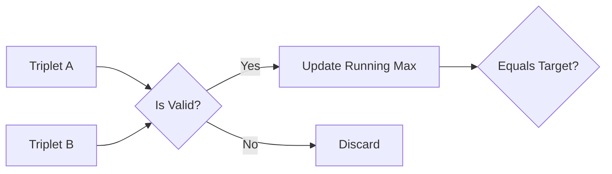

# 🧩 Greedy: Merge Triplets to Form Target Triplet

## 📝 Problem Description
Given a 2D integer array `triplets` and an integer array `target`, determine if you can obtain `target` by merging any number of triplets. A merge operation takes `[a1, b1, c1]` and `[a2, b2, c2]` to form `[max(a1, a2), max(b1, b2), max(c1, c2)]`.

!!! info "Real-World Application"
    This problem models scenarios where you need to aggregate resource constraints from multiple agents while ensuring no single constraint exceeds a threshold (e.g., merging job scheduling parameters).

## 🛠️ Constraints & Edge Cases
- $1 \le \text{triplets.length} \le 10^5$
- $\text{triplets}[i].length == 3$
- **Edge Cases to Watch:** 
    - No triplets provided.
    - No combination can reach the exact target values.
    - All triplet values are less than or equal to target values.

---

## 🧠 Approach & Intuition

!!! success "The Aha! Moment"
    We don't need to actually "merge" anything. Since the merge operation is simply a `max` function, we only care about triplets that don't violate the target. If a triplet has *any* value greater than the corresponding target value, it's useless. Otherwise, we collect the maximum possible value for each of the three positions. If the maximums match the target, we are good.

### 🐢 Brute Force (Naive)
Try all $2^N$ combinations of merging triplets. This is exponentially slow and will fail for large inputs.

### 🐇 Optimal Approach
1. Initialize `x = 0, y = 0, z = 0`.
2. Iterate through each `triplet = [a, b, c]` in `triplets`:
    - If `a <= target[0]` AND `b <= target[1]` AND `c <= target[2]`:
        - Update `x = max(x, a)`, `y = max(y, b)`, `z = max(z, c)`.
3. Return `x == target[0] AND y == target[1] AND z == target[2]`.

### 🧩 Visual Tracing


---

## 💻 Solution Implementation

```python
(Implementation details need to be added...)
```

### ⏱️ Complexity Analysis
- **Time Complexity:** $\mathcal{O}(N)$ — We iterate through the list of triplets exactly once.
- **Space Complexity:** $\mathcal{O}(1)$ — We only store three variables to track the current maximums.

---

## 🎤 Interview Toolkit

- **Harder Variant:** What if we had to find the *minimum* number of triplets needed?
- **Alternative Data Structures:** Not needed, as simple iteration suffices.

## 🔗 Related Problems
- [Partition Labels](../partition_labels/PROBLEM.md)
- [Jump Game](../jump_game/PROBLEM.md)
