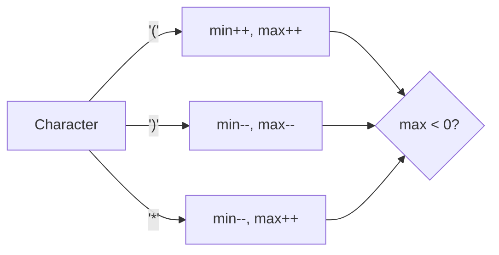

# 🧩 Greedy: Valid Parenthesis String

## 📝 Problem Description
Given a string `s` containing only three types of characters: '(', ')', and '*', write a function to check whether this string is valid. We define valid as:
1. Any left parenthesis '(' must have a corresponding right parenthesis ')'.
2. Left parenthesis '(' must go before the corresponding right parenthesis ')'.
3. '*' could be treated as a single right parenthesis ')' or a single left parenthesis '(' or an empty string "".

!!! info "Real-World Application"
    Used in template engine parsing, code analysis tools, or DSL (Domain Specific Language) parsers where certain tokens can act as wildcards.

## 🛠️ Constraints & Edge Cases
- $0 \le s.length \le 100$
- **Edge Cases to Watch:** 
    - Empty string is valid.
    - `*` at the beginning or end.
    - Sequence of `***` with mismatched `()` elsewhere.

---

## 🧠 Approach & Intuition

!!! success "The Aha! Moment"
    Instead of counting a single number for open parentheses, track a *range* of possible open parentheses: `[min_open, max_open]`. `*` expands the possible range, and closing parentheses contract it. If `max_open` drops below 0, it's invalid. If we finish and `min_open` is 0, it's valid.

### 🐢 Brute Force (Naive)
Trying every possible interpretation of `*` (as `(`, `)`, or `""`) is $\mathcal{O}(3^N)$, which is prohibitive.

### 🐇 Optimal Approach
1. Initialize `min_open = 0, max_open = 0`.
2. For each character:
    - If `(`: increment both.
    - If `)`: decrement both.
    - If `*`: `min_open` decreases (it could be `)`), `max_open` increases (it could be `(`).
3. Ensure `max_open` never drops below 0.
4. Ensure `min_open` stays at least 0.

### 🧩 Visual Tracing


---

## 💻 Solution Implementation

```python
(Implementation details need to be added...)
```

### ⏱️ Complexity Analysis
- **Time Complexity:** $\mathcal{O}(N)$ — One pass through the string.
- **Space Complexity:** $\mathcal{O}(1)$ — Only two integer counters used.

---

## 🎤 Interview Toolkit

- **Harder Variant:** What if you had to return the *number* of ways to make it valid? (Would require Dynamic Programming).
- **Alternative Data Structures:** Two stacks can also be used, but are $\mathcal{O}(N)$ space.

## 🔗 Related Problems
- [Valid Parentheses](../../04_stack/valid_parentheses/PROBLEM.md)
- [Generate Parentheses](../../04_stack/generate_parentheses/PROBLEM.md)
