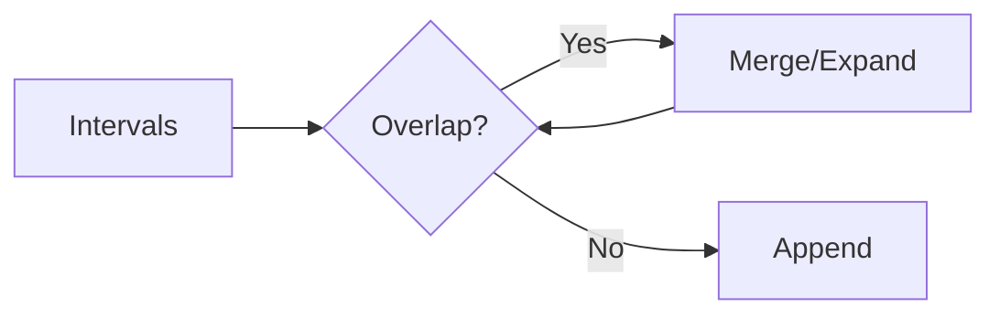

# 📥 Intervals: Insert Interval

## 📝 Problem Description
Given a sorted list of non-overlapping intervals, insert `newInterval` and merge if necessary, maintaining order and no overlaps.

!!! info "Real-World Application"
    Used in scheduling systems (like Google Calendar) where new events must be added to an existing timeline, merging overlaps into a single "busy" block.

## 🛠️ Constraints & Edge Cases
- $1 \le \text{intervals.length} \le 10^5$
- **Edge Cases:** Empty array input, `newInterval` outside, inside, or spanning all existing intervals.

---

## 🧠 Approach & Intuition

!!! success "The Aha! Moment"
    Since the intervals are sorted, we can process them in one pass. Anything ending before the `newInterval` starts is safe. Anything overlapping must be merged until we find the point to insert.

### 🐢 Brute Force (Naive)
Append and re-sort: $\mathcal{O}(N \log N)$. Inefficient as the list is pre-sorted.

### 🐇 Optimal Approach
1. Iterate through intervals.
2. If `newInterval` ends before current, append `newInterval` and the rest.
3. If `newInterval` starts after current ends, append current.
4. Otherwise, merge: `newInterval` = `[min(start), max(end)]`.
5. Append `newInterval` at the end.

### 🧩 Visual Tracing


---

## 💻 Solution Implementation

```python
(Implementation details need to be added...)
```

### ⏱️ Complexity Analysis
- **Time Complexity:** $\mathcal{O}(N)$ — We traverse the list once.
- **Space Complexity:** $\mathcal{O}(N)$ — To store the output list.

---

## 🎤 Interview Toolkit

- **Harder Variant:** Merging with a huge number of updates (use a Segment Tree).
- **Alternative Data Structures:** Not really applicable here, iteration is optimal.

## 🔗 Related Problems
- [Merge Intervals](../merge_intervals/PROBLEM.md)
