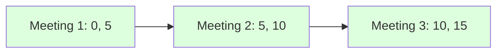

# 🤝 Intervals: Meeting Rooms

## 📝 Problem Description
Given an array of meeting time intervals `intervals` where `intervals[i] = [start_i, end_i]`, determine if a person could attend all meetings.

!!! info "Real-World Application"
    This algorithm is the foundation for calendar scheduling systems (like Google Calendar or Outlook) to check for conflicting meetings before allowing a booking to be confirmed.

## 🛠️ Constraints & Edge Cases
- $0 \le \text{intervals.length} \le 10^4$
- $\text{intervals[i].length} == 2$
- $0 \le \text{start}_i < \text{end}_i \le 10^6$
- **Edge Cases to Watch:** 
    - Empty list (should return true).
    - List with one interval (should return true).
    - Intervals that touch, e.g., `[1, 2]` and `[2, 3]` (not an overlap, should return true).

---

## 🧠 Approach & Intuition

!!! success "The Aha! Moment"
    If we sort the meetings by their start time, an overlap can only occur between adjacent meetings in the sorted list. If the end time of any meeting is greater than the start time of the next one, there's a conflict.

### 🐢 Brute Force (Naive)
Comparing every meeting with every other meeting results in $\mathcal{O}(N^2)$ complexity, which is inefficient for large datasets.

### 🐇 Optimal Approach
1. Sort the intervals based on the start time: $\mathcal{O}(N \log N)$.
2. Iterate through the sorted intervals from $i = 0$ to $N - 2$.
3. Check if `intervals[i][1] > intervals[i+1][0]`. If true, return `false`.
4. If the loop completes without conflicts, return `true`.

### 🧩 Visual Tracing


---

## 💻 Solution Implementation

```python
(Implementation details need to be added...)
```

### ⏱️ Complexity Analysis
- **Time Complexity:** $\mathcal{O}(N \log N)$ due to sorting the intervals.
- **Space Complexity:** $\mathcal{O}(1)$ or $\mathcal{O}(N)$ depending on the sorting algorithm implementation.

---

## 🎤 Interview Toolkit

- **Harder Variant:** What if you had to find how many meeting rooms are required to accommodate all meetings? (See: Meeting Rooms II).
- **Alternative Data Structures:** Sorting is optimal, but if ranges were small and fixed, could a boolean array (or timeline array) be used?

## 🔗 Related Problems
- [Meeting Rooms II](../meeting_rooms_ii/PROBLEM.md)
- [Merge Intervals](../merge_intervals/PROBLEM.md)
- [Non-overlapping Intervals](../non_overlapping_intervals/PROBLEM.md)
