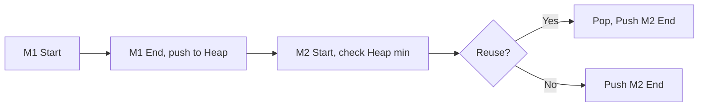

# 🏢 Intervals: Meeting Rooms II

## 📝 Problem Description
Given an array of meeting time intervals `intervals` where `intervals[i] = [start_i, end_i]`, return the minimum number of conference rooms required.

!!! info "Real-World Application"
    Essential for resource scheduling, task management in operating systems, and capacity planning in logistics and server cluster management.

## 🛠️ Constraints & Edge Cases
- $1 \le \text{intervals.length} \le 10^4$
- $0 \le \text{start}_i < \text{end}_i \le 10^6$
- **Edge Cases to Watch:** 
    - No intervals (return 0).
    - All non-overlapping intervals (return 1).
    - All overlapping intervals (return $N$).

---

## 🧠 Approach & Intuition

!!! success "The Aha! Moment"
    Instead of merging, we need to track how many meetings are active at any given time. A Min-Heap allows us to quickly identify the earliest free room (the one whose meeting ends soonest).

### 🐢 Brute Force (Naive)
Creating an array representing the timeline and incrementing/decrementing counters for each interval might work but can be inefficient if the range of values is very large ($10^6$ or more).

### 🐇 Optimal Approach
1. Sort all meetings by their start time.
2. Initialize a Min-Heap and push the end time of the first meeting.
3. For each subsequent meeting:
    - If the current meeting's start time $\ge$ the earliest end time in the heap (the top element): we can reuse that room; `pop` the heap.
    - `push` the current meeting's end time onto the heap.
4. The size of the heap at the end is the minimum number of rooms needed.

### 🧩 Visual Tracing


---

## 💻 Solution Implementation

```python
(Implementation details need to be added...)
```

### ⏱️ Complexity Analysis
- **Time Complexity:** $\mathcal{O}(N \log N)$ due to sorting and heap operations.
- **Space Complexity:** $\mathcal{O}(N)$ to store end times in the heap.

---

## 🎤 Interview Toolkit

- **Alternative Approach:** Sorting start times and end times separately (the "Two-Pointer Sweep") also achieves $\mathcal{O}(N \log N)$ time and $\mathcal{O}(N)$ space.
- **Harder Variant:** What if you had to return the *intervals* of free time instead of just the number of rooms?

## 🔗 Related Problems
- [Meeting Rooms](../meeting_rooms/PROBLEM.md)
- [Merge Intervals](../merge_intervals/PROBLEM.md)
- [Minimum Interval to Include Each Query](../minimum_interval_to_include_each_query/PROBLEM.md)
