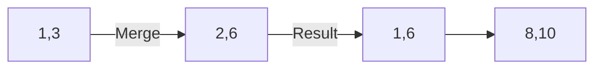

# ✂️ Intervals: Merge Intervals

## 📝 Problem Description
Given an array of intervals where `intervals[i] = [start_i, end_i]`, merge all overlapping intervals, and return an array of the non-overlapping intervals that cover all the intervals in the input.

!!! info "Real-World Application"
    Used in database indexing (e.g., merging free disk blocks), calendaring applications (to consolidate overlapping meeting requests), and network packet processing.

## 🛠️ Constraints & Edge Cases
- $1 \le \text{intervals.length} \le 10^4$
- $\text{intervals[i].length} == 2$
- $0 \le \text{start}_i < \text{end}_i \le 10^4$
- **Edge Cases to Watch:** 
    - Intervals fully contained within others, e.g., `[1, 5]` and `[2, 3]`.
    - Multiple overlapping intervals, e.g., `[1, 3], [2, 6], [8, 10], [15, 18]`.
    - Empty or single-interval input.

---

## 🧠 Approach & Intuition

!!! success "The Aha! Moment"
    Sorting by the start time ensures that if an interval can be merged, it must be with the "current" last interval in our result list. We just need to compare the current interval's start with the last interval's end.

### 🐢 Brute Force (Naive)
Compare every interval with every other one to check for overlaps and merge them. This would be $\mathcal{O}(N^2)$ and gets messy with multiple nested overlaps.

### 🐇 Optimal Approach
1. Sort the intervals based on the start time: $\mathcal{O}(N \log N)$.
2. Initialize an empty list `merged` and add the first interval.
3. For each subsequent interval:
    - If it overlaps (start $\le$ last `merged` end): merge by setting the last interval's end to `max(end, current_end)`.
    - Otherwise, append the interval as a new entry.

### 🧩 Visual Tracing


---

## 💻 Solution Implementation

```python
(Implementation details need to be added...)
```

### ⏱️ Complexity Analysis
- **Time Complexity:** $\mathcal{O}(N \log N)$ due to sorting. The linear scan takes $\mathcal{O}(N)$.
- **Space Complexity:** $\mathcal{O}(N)$ to store the result.

---

## 🎤 Interview Toolkit

- **Alternative Approach:** Disjoint Set Union (DSU) or a sweep-line algorithm could solve this but are often overkill for this specific variant.
- **Harder Variant:** What if you need to merge intervals in a streaming fashion as they arrive?

## 🔗 Related Problems
- [Meeting Rooms](../meeting_rooms/PROBLEM.md)
- [Meeting Rooms II](../meeting_rooms_ii/PROBLEM.md)
- [Non-overlapping Intervals](../non_overlapping_intervals/PROBLEM.md)
