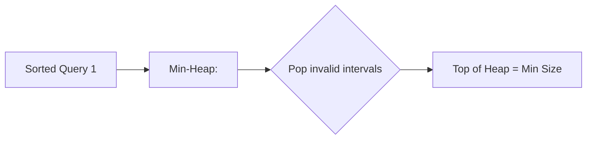

# 🔍 Intervals: Min Interval to Include Each Query

## 📝 Problem Description
Given a 2D integer array `intervals` where `intervals[i] = [left_i, right_i]`, and an integer array `queries`, find the minimum size of an interval that contains the query value $q$. If no such interval exists, return -1.

!!! info "Real-World Application"
    Common in range-based data retrieval (e.g., finding the smallest policy matching a specific timestamp, or finding the cheapest service coverage for a location).

## 🛠️ Constraints & Edge Cases
- $1 \le \text{intervals.length}, \text{queries.length} \le 10^5$
- $1 \le \text{left}_i \le \text{right}_i \le 10^7$
- $1 \le q_j \le 10^7$
- **Edge Cases to Watch:** 
    - No interval matches a query (return -1).
    - Intervals are very large or queries are outside all ranges.

---

## 🧠 Approach & Intuition

!!! success "The Aha! Moment"
    Sort both intervals and queries. As you iterate through the sorted queries, push all intervals that could possibly cover the query into a Min-Heap. The top of the heap (by size) will be the answer for that query.

### 🐢 Brute Force (Naive)
For each query, iterate through all $N$ intervals to find the one with the minimum size that covers it. Complexity $\mathcal{O}(N \times Q)$, which will time out.

### 🐇 Optimal Approach
1. Sort `intervals` by start time.
2. Sort `queries` while keeping track of their original indices.
3. Use a Min-Heap to store `(size, end_time)` of intervals that start at or before the current query.
4. For each query:
    - Add all eligible intervals to the heap.
    - Remove intervals from the heap whose end time is before the query.
    - The top of the heap is the smallest valid interval.

### 🧩 Visual Tracing


---

## 💻 Solution Implementation

```python
(Implementation details need to be added...)
```

### ⏱️ Complexity Analysis
- **Time Complexity:** $\mathcal{O}((N+Q) \log (N+Q))$ for sorting and heap operations.
- **Space Complexity:** $\mathcal{O}(N+Q)$ for storing intervals, queries, and the heap.

---

## 🎤 Interview Toolkit

- **Alternative Data Structures:** An Interval Tree or Segment Tree could also solve this, but they are significantly more complex to implement.
- **Harder Variant:** What if you had to return all valid intervals? What if the intervals were dynamic (updates)?

## 🔗 Related Problems
- [Merge Intervals](../merge_intervals/PROBLEM.md)
- [Meeting Rooms II](../meeting_rooms_ii/PROBLEM.md)
