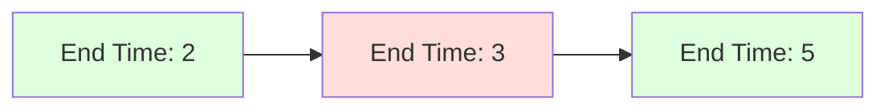

# 🚫 Intervals: Non-overlapping Intervals

## 📝 Problem Description
Given an array of intervals `intervals`, return the minimum number of intervals you need to remove to make the rest of the intervals non-overlapping.

!!! info "Real-World Application"
    Fundamental in job scheduling optimization, where you aim to fit the maximum number of non-conflicting tasks into a single resource.

## 🛠️ Constraints & Edge Cases
- $1 \le \text{intervals.length} \le 10^5$
- $\text{intervals[i].length} == 2$
- $-5 \times 10^4 \le \text{start}_i < \text{end}_i \le 5 \times 10^4$
- **Edge Cases to Watch:** 
    - Empty input list (0 removals needed).
    - Intervals that share boundaries, e.g., `[1, 2]` and `[2, 3]` are NOT overlapping.

---

## 🧠 Approach & Intuition

!!! success "The Aha! Moment"
    This is an Interval Scheduling problem. The greedy strategy is to always pick the interval that **finishes the earliest**, as it leaves the maximum amount of time for subsequent intervals.

### 🐢 Brute Force (Naive)
Try all possible subsets of intervals and check for overlaps. This would lead to an exponential $\mathcal{O}(2^N)$ time complexity.

### 🐇 Optimal Approach
1. Sort the intervals by their end time: $\mathcal{O}(N \log N)$.
2. Iterate through the intervals, keeping track of the `last_end` of the non-overlapping intervals selected.
3. If an interval starts after or at `last_end`, it's compatible; update `last_end`.
4. If it overlaps, it must be removed (increment counter).

### 🧩 Visual Tracing


---

## 💻 Solution Implementation

```python
(Implementation details need to be added...)
```

### ⏱️ Complexity Analysis
- **Time Complexity:** $\mathcal{O}(N \log N)$ for sorting. The scan is $\mathcal{O}(N)$.
- **Space Complexity:** $\mathcal{O}(1)$ (excluding sorting space).

---

## 🎤 Interview Toolkit

- **Alternative Approach:** This is equivalent to finding the maximum set of non-overlapping intervals. `Total intervals - Max Non-overlapping intervals = Min intervals to remove`.
- **Harder Variant:** What if you had to return the actual intervals to keep instead of the number of removals?

## 🔗 Related Problems
- [Merge Intervals](../merge_intervals/PROBLEM.md)
- [Meeting Rooms II](../meeting_rooms_ii/PROBLEM.md)
