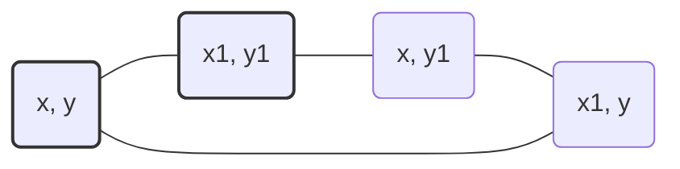

# 🟦 Math & Geometry: Detect Squares

## 📝 Problem Description
Given a stream of points on a 2D plane, design a data structure that can efficiently:
1. Add new points to the stream.
2. Count the number of squares (axis-aligned) that can be formed using the added points.

!!! info "Real-World Application"
    This is foundational for **computational geometry** in computer graphics, CAD tools, and object detection systems, where detecting shapes from coordinate data is essential for spatial analysis.

## 🛠️ Constraints & Edge Cases
- $0 \le x, y \le 1000$
- Adding many points
- Counting squares requires matching coordinates efficiently
- **Edge Cases:** Stream with fewer than 4 points, collinear points

---

## 🧠 Approach & Intuition

!!! success "The Aha! Moment"
    Store points in a `frequency map` (hash map). For any two points `(x1, y1)` and `(x2, y2)`, if they form a diagonal of a square, the other two points `(x1, y2)` and `(x2, y1)` must also exist in our map.

### 🐢 Brute Force (Naive)
Check every combination of 4 points in the collection. This is $\mathcal{O}(N^4)$, which is prohibitively slow for a large number of points.

### 🐇 Optimal Approach
1. Maintain a frequency map `points_map` to store counts of each coordinate pair.
2. For the `count` query with point `(x, y)`:
    - Iterate through all other points `(x1, y1)` in the map.
    - Check if `(x1, y1)` can form a diagonal with `(x, y)` (i.e., `abs(x - x1) == abs(y - y1)` and `x != x1`).
    - If valid, verify the existence of the other two corners `(x, y1)` and `(x1, y)` in the map.
    - Multiply their counts and add to the result.

### 🧩 Visual Tracing


---

## 💻 Solution Implementation

```python
(Implementation details need to be added...)
```

### ⏱️ Complexity Analysis
- **Time Complexity:** $\mathcal{O}(N)$ per query, where $N$ is the number of points in the stream, as we iterate through existing points once.
- **Space Complexity:** $\mathcal{O}(N)$ to store point frequencies.

---

## 🎤 Interview Toolkit

- **Harder Variant:** What if the squares don't have to be axis-aligned? (Requires rotation matrix/vector cross-product check).
- **Alternative Data Structures:** Could use a `defaultdict(list)` grouped by X-coordinate to reduce search space.

## 🔗 Related Problems
- `[Set Matrix Zeroes](#)` — Array manipulation
- `[Spiral Matrix](#)` — 2D Array traversal
