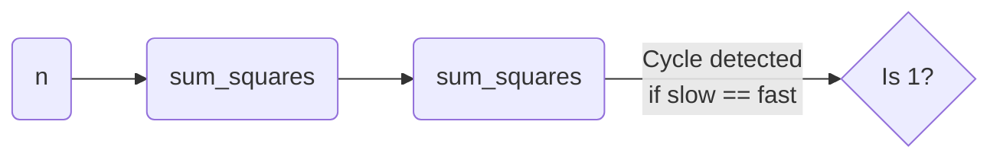

# 🟦 Math & Geometry: Happy Number

## 📝 Problem Description
A happy number is a number defined by the following process: Starting with any positive integer, replace the number by the sum of the squares of its digits. Repeat the process until the number equals 1 (where it will stay), or it loops endlessly in a cycle which does not include 1.

!!! info "Real-World Application"
    This algorithm is used in testing **cycle detection logic** and understanding iterative processes in sequence generation. It is similar to logic used in tracking hash collisions and state transitions.

## 🛠️ Constraints & Edge Cases
- $1 \le n \le 2^{31}-1$
- **Edge Cases:** Numbers that lead to the cycle including `[4, 16, 37, 58, 89, 145, 42, 20]`.

---

## 🧠 Approach & Intuition

!!! success "The Aha! Moment"
    The process either reaches 1 or falls into a known cycle. We can use Floyd's "Tortoise and Hare" (slow/fast pointers) to detect this cycle in space-efficient ways.

### 🐢 Brute Force (Naive)
Use a Hash Set to store every number encountered. If we see a number again, it's a cycle. This requires $O(S)$ space where $S$ is the number of intermediate states.

### 🐇 Optimal Approach
Use two pointers:
1. `slow` calculates the sum of squares once.
2. `fast` calculates it twice.
3. If they meet at 1, it's happy. If they meet at any other number, it's a cycle.

### 🧩 Visual Tracing


---

## 💻 Solution Implementation

```python
(Implementation details need to be added...)
```

### ⏱️ Complexity Analysis
- **Time Complexity:** $\mathcal{O}(\log N)$ as the number of states is bounded by the sum of squares logic.
- **Space Complexity:** $\mathcal{O}(1)$ as we use two pointers.

---

## 🎤 Interview Toolkit

- **Harder Variant:** What if the process changes (e.g., cube of digits)?
- **Alternative Data Structures:** Hash set is easier to implement but uses extra space.

## 🔗 Related Problems
- `[Linked List Cycle](#)` — Cycle detection using pointers.
