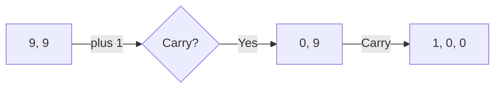

# 🟦 Math & Geometry: Plus One

## 📝 Problem Description
Given a non-empty array of digits representing a non-negative integer, increment the integer by one. The digits are stored such that the most significant digit is at the head of the list.

!!! info "Real-World Application"
    This problem simulates **basic overflow handling** in hardware and fixed-width integer arithmetic. It is essential for understanding how carries propagate through registers.

## 🛠️ Constraints & Edge Cases
- $1 \le digits.length \le 100$
- Digits are $0-9$.
- **Edge Cases:** All 9s (e.g., [9, 9] -> [1, 0, 0]).

---

## 🧠 Approach & Intuition

!!! success "The Aha! Moment"
    Start from the last element. If the digit is less than 9, increment it, and you're done. If it's 9, set it to 0 and continue to the next digit to propagate the carry.

### 🐢 Brute Force (Naive)
Convert array to an integer, increment, and convert back to array. This fails when the integer exceeds the capacity of standard numeric types (e.g., 64-bit).

### 🐇 Optimal Approach
1. Iterate backwards through the array.
2. If `digits[i] < 9`, increment it and return.
3. If `digits[i] == 9`, change it to 0 and continue.
4. If the loop completes, it means we had a carry at the most significant digit (e.g., [9,9]), so prepend a 1.

### 🧩 Visual Tracing


---

## 💻 Solution Implementation

```python
(Implementation details need to be added...)
```

### ⏱️ Complexity Analysis
- **Time Complexity:** $\mathcal{O}(N)$ in the worst case (all 9s).
- **Space Complexity:** $\mathcal{O}(1)$ (in-place modification).

---

## 🎤 Interview Toolkit

- **Harder Variant:** Increment by N instead of 1.
- **Alternative Data Structures:** Using a LinkedList if the number is too long (though array is efficient here).

## 🔗 Related Problems
- `[Multiply Strings](#)` — Complex big integer arithmetic.
- `[Sum of Two Integers](#)` — Bitwise arithmetic.
