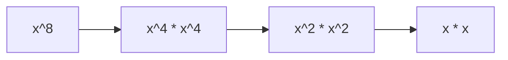

# 🟦 Math & Geometry: Pow(x, n)

## 📝 Problem Description
Implement `pow(x, n)`, which calculates `x` raised to the power `n` (i.e., $x^n$).

!!! info "Real-World Application"
    This algorithm is essential for **public-key cryptography** (RSA exponentiation), computational geometry (distance metrics), and scientific simulations where rapid power calculation is critical for performance.

## 🛠️ Constraints & Edge Cases
- $-100.0 < x < 100.0$
- $-2^{31} \le n \le 2^{31}-1$
- **Edge Cases:** $n = 0$, $n < 0$ (reciprocal).

---

## 🧠 Approach & Intuition

!!! success "The Aha! Moment"
    Exponentiation can be solved in logarithmic time using "Binary Exponentiation" (Exponentiation by Squaring): $x^n = (x^{n/2})^2$ if $n$ is even.

### 🐢 Brute Force (Naive)
Multiply $x$ by itself $n$ times. $\mathcal{O}(n)$, which will time out for large $n$.

### 🐇 Optimal Approach
Use recursive or iterative approach:
1. If $n$ is even, $x^n = (x^2)^{n/2}$.
2. If $n$ is odd, $x^n = x * (x^2)^{(n-1)/2}$.
3. Handle negative $n$ by $x^n = (1/x)^{-n}$.

### 🧩 Visual Tracing


---

## 💻 Solution Implementation

```python
(Implementation details need to be added...)
```

### ⏱️ Complexity Analysis
- **Time Complexity:** $\mathcal{O}(\log N)$ because the exponent is halved in each step.
- **Space Complexity:** $\mathcal{O}(\log N)$ (recursion stack) or $\mathcal{O}(1)$ (iterative).

---

## 🎤 Interview Toolkit

- **Harder Variant:** Implement modulo power `(x^n) % m`.
- **Alternative Data Structures:** Iterative version is preferred to avoid recursion depth issues.

## 🔗 Related Problems
- `[Missing Number](#)` — Using math to find values.
- `[Sqrt(x)](#)` — Other math optimization problems.
