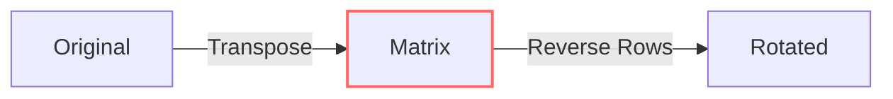

# 🟦 Math & Geometry: Rotate Image

## 📝 Problem Description
Given an $n \times n$ 2D matrix representing an image, rotate the image by 90 degrees (clockwise) in-place.

!!! info "Real-World Application"
    Essential for **image processing** and graphics manipulation where pixel arrays must be transformed in memory without extra storage to handle large images efficiently.

## 🛠️ Constraints & Edge Cases
- $n \times n$ matrix.
- In-place modification.
- **Edge Cases:** $1 \times 1$ matrix.

---

## 🧠 Approach & Intuition

!!! success "The Aha! Moment"
    Rotating 90 degrees clockwise is equivalent to:
    1. Transposing the matrix (swap $M[i][j]$ with $M[j][i]$).
    2. Reversing each row.

### 🐢 Brute Force (Naive)
Create a new matrix and copy elements to their new rotated positions. Requires $\mathcal{O}(N^2)$ space.

### 🐇 Optimal Approach
1. Transpose: For each $i < j$, swap `M[i][j]` with `M[j][i]`.
2. Reverse: For each row, reverse the order of elements.

### 🧩 Visual Tracing


---

## 💻 Solution Implementation

```python
(Implementation details need to be added...)
```

### ⏱️ Complexity Analysis
- **Time Complexity:** $\mathcal{O}(N^2)$ as we touch every cell.
- **Space Complexity:** $\mathcal{O}(1)$ since it's done in-place.

---

## 🎤 Interview Toolkit

- **Harder Variant:** Rotate 90 degrees counter-clockwise.
- **Alternative Data Structures:** Recursive layer-by-layer rotation is also possible.

## 🔗 Related Problems
- `[Spiral Matrix](#)` — 2D Array traversal.
- `[Set Matrix Zeroes](#)` — Matrix manipulation.
