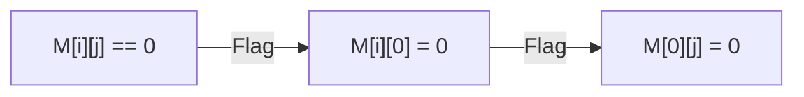

# 🟦 Math & Geometry: Set Matrix Zeroes

## 📝 Problem Description
Given an $m \times n$ matrix, if an element is 0, set its entire row and column to 0. Do it in-place.

!!! info "Real-World Application"
    Common in **image processing** (applying filters) and database systems where zeroing out specific rows/columns is a form of data masking or marking invalidated states.

## 🛠️ Constraints & Edge Cases
- $m, n \ge 1$.
- **Edge Cases:** Empty matrix, matrix with no zeros, matrix with only zeros.

---

## 🧠 Approach & Intuition

!!! success "The Aha! Moment"
    Use the first row and first column of the matrix itself to store flags. `M[i][0]` represents row `i` should be zeroed, `M[0][j]` represents column `j` should be zeroed.

### 🐢 Brute Force (Naive)
When encountering a zero, traverse row and column and set elements to a special value (e.g., -1). Later, convert -1 to 0. Fails if -1 is a valid input. $\mathcal{O}(MN(M+N))$.

### 🐇 Optimal Approach
1. Use two boolean variables to track if the first row and first column need zeroing.
2. Iterate through the matrix (excluding first row/col) to flag the row and column.
3. Use flags to zero out marked rows and columns.
4. Finally, zero out the first row/col if needed.

### 🧩 Visual Tracing


---

## 💻 Solution Implementation

```python
(Implementation details need to be added...)
```

### ⏱️ Complexity Analysis
- **Time Complexity:** $\mathcal{O}(MN)$ as we traverse twice.
- **Space Complexity:** $\mathcal{O}(1)$ since we use the matrix space.

---

## 🎤 Interview Toolkit

- **Harder Variant:** Use $\mathcal{O}(M+N)$ extra space to simplify logic.
- **Alternative Data Structures:** Using bit-vectors for very large matrices.

## 🔗 Related Problems
- `[Spiral Matrix](#)` — 2D Array traversal.
- `[Rotate Image](#)` — Matrix manipulation.
