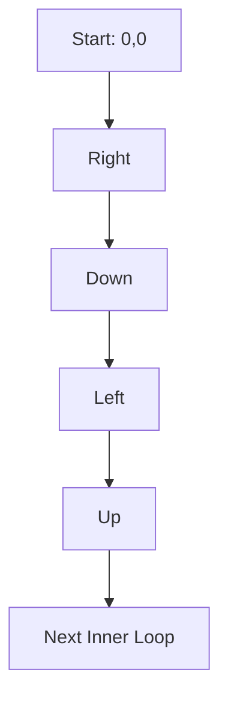

# 🟦 Math & Geometry: Spiral Matrix

## 📝 Problem Description
Given an $m \times n$ matrix, return all elements of the matrix in spiral order.

!!! info "Real-World Application"
    Spiral traversal is used in **computer vision** for searching patterns, and in **data storage indexing** where spatially correlated data needs to be retrieved in a sequence.

## 🛠️ Constraints & Edge Cases
- $m \times n$ matrix.
- **Edge Cases:** Matrix with one row or one column.

---

## 🧠 Approach & Intuition

!!! success "The Aha! Moment"
    Use four boundaries (top, bottom, left, right) to represent the current layer of the spiral, and contract these boundaries as you visit elements.

### 🐢 Brute Force (Naive)
Creating a visited matrix is $\mathcal{O}(MN)$ space.

### 🐇 Optimal Approach
1. Initialize `top=0`, `bottom=m-1`, `left=0`, `right=n-1`.
2. While boundaries do not cross:
    - Traverse top row (increment `top`).
    - Traverse right column (decrement `right`).
    - Traverse bottom row if `top <= bottom` (decrement `bottom`).
    - Traverse left column if `left <= right` (increment `left`).

### 🧩 Visual Tracing


---

## 💻 Solution Implementation

```python
(Implementation details need to be added...)
```

### ⏱️ Complexity Analysis
- **Time Complexity:** $\mathcal{O}(MN)$ as we visit each cell once.
- **Space Complexity:** $\mathcal{O}(1)$ (excluding output storage).

---

## 🎤 Interview Toolkit

- **Harder Variant:** Generate a spiral matrix given a size.
- **Alternative Data Structures:** Using recursion to process layers.

## 🔗 Related Problems
- `[Rotate Image](#)` — Matrix manipulation.
- `[Set Matrix Zeroes](#)` — Matrix manipulation.
