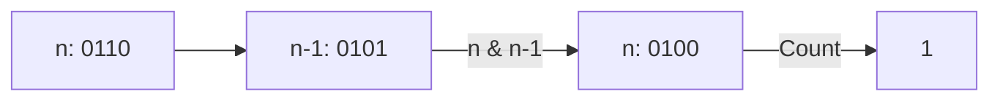

# 🧩 Bit Manipulation: Number of 1 Bits

## 📝 Problem Description
Write a function that takes an unsigned integer and returns the number of `1` bits it has (also known as the Hamming weight).

!!! info "Real-World Application"
    This is essential in **cryptographic protocols** (e.g., parity checks), data integrity validation, and calculating bit densities in compressed formats.

## 🛠️ Constraints & Edge Cases
- Input is 32-bit unsigned integer.
- **Edge Cases:** `0`, `0xFFFFFFFF` (all 1s).

---

## 🧠 Approach & Intuition

!!! success "The Aha! Moment"
    `n & (n - 1)` clears the least significant bit that is set to `1`. Repeating this until `n == 0` counts exactly the number of set bits.

### 🐢 Brute Force (Naive)
Loop 32 times, check `n & 1`, then `n >>= 1`. Always $\mathcal{O}(32)$ iterations.

### 🐇 Optimal Approach
Use Brian Kernighan's Algorithm:
1. `count = 0`
2. While `n > 0`: `n = n & (n - 1)`, `count += 1`.
3. Returns `count`. This runs in $\mathcal{O}(K)$ where $K$ is the number of 1s.

### 🧩 Visual Tracing


---

## 💻 Solution Implementation

```python
(Implementation details need to be added...)
```

### ⏱️ Complexity Analysis
- **Time Complexity:** $\mathcal{O}(K)$ where $K$ is the number of set bits.
- **Space Complexity:** $\mathcal{O}(1)$.

---

## 🎤 Interview Toolkit

- **Harder Variant:** Hamming distance between two integers.
- **Alternative Data Structures:** Using look-up table (for 8-bit chunks) for even faster counting.

## 🔗 Related Problems
- `[Counting Bits](#)` — DP approach for range.
- `[Reverse Bits](#)` — Flipping/reversing bits.
