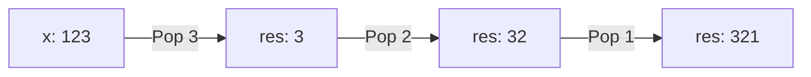

# 🧩 Bit Manipulation: Reverse Integer

## 📝 Problem Description
Given a signed 32-bit integer `x`, return `x` with its digits reversed. If reversing `x` causes the value to go outside the signed 32-bit integer range `[-2^31, 2^31 - 1]`, then return 0.

!!! info "Real-World Application"
    This is common in **input sanitization** and testing integer overflow handling in API inputs or calculator implementations.

## 🛠️ Constraints & Edge Cases
- Signed 32-bit integer range.
- **Edge Cases:** Negative numbers, trailing zeros, overflow (e.g., reversing 1,534,236,469).

---

## 🧠 Approach & Intuition

!!! success "The Aha! Moment"
    Pop the last digit using `x % 10` and push it into a new integer `res = res * 10 + digit`. Before pushing, check if `res` will overflow.

### 🐢 Brute Force (Naive)
Convert to string, reverse, convert to int. Inefficient and makes overflow checking string-based.

### 🐇 Optimal Approach
1. `res = 0`.
2. While `x != 0`:
    - `digit = x % 10` (handle negative sign correctly).
    - `x //= 10`.
    - Check if `res` will overflow when multiplied by 10 and adding `digit`.
    - `res = res * 10 + digit`.

### 🧩 Visual Tracing


---

## 💻 Solution Implementation

```python
(Implementation details need to be added...)
```

### ⏱️ Complexity Analysis
- **Time Complexity:** $\mathcal{O}(\log_{10} N)$ where $N$ is the number.
- **Space Complexity:** $\mathcal{O}(1)$.

---

## 🎤 Interview Toolkit

- **Harder Variant:** Handle integers of arbitrary size (BigInt).
- **Alternative Data Structures:** Using arrays to store digits before reversal.

## 🔗 Related Problems
- `[Reverse Bits](#)` — Reversing bits.
- `[Palindrome Number](#)` — Checking digit properties.
