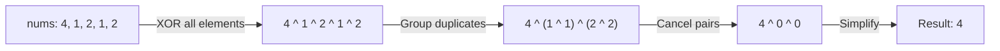

# 🧩 Bit Manipulation: Single Number

## 📝 Problem Description
Given a non-empty array of integers, every element appears twice except for one. Find that single one.

!!! info "Real-World Application"
    Fundamental in **resource tracking** where resources are allocated/released in pairs, and identifying orphan entries (single instances) in logs or hardware device status.

## 🛠️ Constraints & Edge Cases
- $1 \le nums.length \le 3 \times 10^4$.
- Each element appears twice except one.
- **Edge Cases:** Single element array.

---

## 🧠 Approach & Intuition

!!! success "The Aha! Moment"
    XORing a number with itself results in 0, and XORing with 0 leaves the number unchanged ($A \oplus A = 0$ and $A \oplus 0 = A$). XORing all numbers together will leave only the single element.

### 🐢 Brute Force (Naive)
Using a Hash Map to count frequencies. $\mathcal{O}(N)$ time and $\mathcal{O}(N)$ space.

### 🐇 Optimal Approach
Initialize `res = 0`. Iterate through the array and `res ^= nums[i]`. `res` will hold the single number.

### 🧩 Visual Tracing


---

## 💻 Solution Implementation

```python
(Implementation details need to be added...)
```

### ⏱️ Complexity Analysis
- **Time Complexity:** $\mathcal{O}(N)$.
- **Space Complexity:** $\mathcal{O}(1)$.

---

## 🎤 Interview Toolkit

- **Harder Variant:** Find elements appearing once when others appear 3 times.
- **Alternative Data Structures:** Hash set can be used to track if elements were already seen.

## 🔗 Related Problems
- `[Missing Number](#)` — Using XOR.
- `[Find the Duplicate Number](#)` — Using Floyd's cycle.
