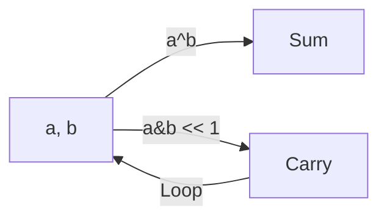

# 🧩 Bit Manipulation: Sum of Two Integers

## 📝 Problem Description
Calculate the sum of two integers `a` and `b`, but you are not allowed to use the operators `+` and `-`.

!!! info "Real-World Application"
    This mimics **CPU ALU (Arithmetic Logic Unit)** design. It is fundamental for understanding how hardware implements addition using logic gates (Half-Adders and Full-Adders).

## 🛠️ Constraints & Edge Cases
- Integers are 32-bit.
- **Edge Cases:** Negative numbers (handled by 2's complement).

---

## 🧠 Approach & Intuition

!!! success "The Aha! Moment"
    Binary addition can be broken down:
    1. `XOR (^)` calculates the sum *without* carrying.
    2. `AND (&)` followed by a left shift `(<< 1)` calculates the carry.
    3. Repeat until carry is 0.

### 🐢 Brute Force (Naive)
Increment `a` by `b` times. $\mathcal{O}(N)$, which fails for large `b`.

### 🐇 Optimal Approach
Use bitwise operations:
1. `while b != 0`:
    - `carry = (a & b) << 1`.
    - `a = a ^ b`.
    - `b = carry`.
2. Return `a`. (Python-specific note: Needs mask to handle negative numbers in 32-bit).

### 🧩 Visual Tracing


---

## 💻 Solution Implementation

```python
(Implementation details need to be added...)
```

### ⏱️ Complexity Analysis
- **Time Complexity:** $\mathcal{O}(1)$ (fixed 32 bits).
- **Space Complexity:** $\mathcal{O}(1)$.

---

## 🎤 Interview Toolkit

- **Harder Variant:** Subtraction without operators.
- **Alternative Data Structures:** Simulating a Full-Adder circuit.

## 🔗 Related Problems
- `[Multiply Strings](#)` — Big int arithmetic.
- `[Plus One](#)` — Basic arithmetic simulation.
