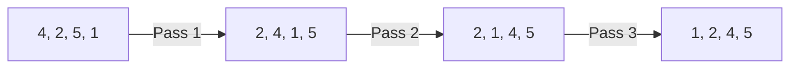

# 📊 Sorting: Bubble Sort

## 📝 Problem Description
Implement Bubble Sort: A simple sorting algorithm that repeatedly steps through the input list, compares adjacent elements, and swaps them if they are in the wrong order.

!!! info "Real-World Application"
    Bubble sort is rarely used in high-performance production code but is an excellent educational tool for understanding **algorithmic stability** and the cost of swapping. Occasionally used in embedded systems or GPU kernels for small, nearly sorted datasets.

## 🛠️ Constraints & Edge Cases
- $N$ elements.
- **Edge Cases:** Empty array, single element array, already sorted array.

---

## 🧠 Approach & Intuition

!!! success "The Aha! Moment"
    In each full pass, the largest element "bubbles up" to its correct position at the end of the array.

### 🐢 Brute Force (Naive)
Standard implementation is $O(N^2)$. Optimization: add a `swapped` flag to exit early if the array is already sorted.

### 🐇 Optimal Approach
1. For $i$ from 0 to $N-1$:
    - For $j$ from 0 to $N-i-1$:
        - If `arr[j] > arr[j+1]`, swap.
2. If no swaps in a pass, break.

### 🧩 Visual Tracing


---

## 💻 Solution Implementation

```python
(Implementation details need to be added...)
```

### ⏱️ Complexity Analysis
- **Time Complexity:** $\mathcal{O}(N^2)$. Best case $\mathcal{O}(N)$ (with flag).
- **Space Complexity:** $\mathcal{O}(1)$.

---

## 🎤 Interview Toolkit

- **Harder Variant:** Cocktail Shaker Sort (bidirectional Bubble Sort).
- **Alternative Data Structures:** Linked Lists (swapping nodes is $O(1)$).

## 🔗 Related Problems
- `[Insertion Sort](#)` — Another $O(N^2)$ algorithm.
- `[Merge Sort](#)` — Efficient sorting.
