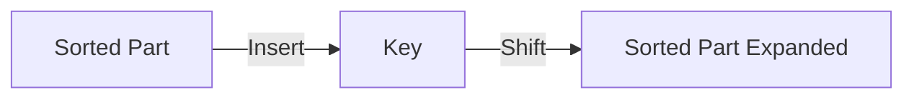

# 📊 Sorting: Insertion Sort

## 📝 Problem Description
Implement Insertion Sort: An algorithm that builds the final sorted array one item at a time. It is much less efficient on large lists than more advanced algorithms.

!!! info "Real-World Application"
    Excellent for **nearly sorted data** and small arrays (often used as the base case in hybrid algorithms like Timsort/Python's `sort` for small subarrays).

## 🛠️ Constraints & Edge Cases
- $N$ elements.
- **Edge Cases:** Already sorted (best case), reverse sorted (worst case).

---

## 🧠 Approach & Intuition

!!! success "The Aha! Moment"
    Take the next unsorted element and "insert" it into its correct position among the already-sorted elements by shifting them to the right.

### 🐢 Brute Force (Naive)
Simple nested loops.

### 🐇 Optimal Approach
1. For $i$ from 1 to $N-1$:
    - Key = `arr[i]`
    - $j = i - 1$
    - While $j \ge 0$ and `arr[j] > key`:
        - `arr[j+1] = arr[j]`
        - $j = j - 1$
    - `arr[j+1] = key`

### 🧩 Visual Tracing


---

## 💻 Solution Implementation

```python
(Implementation details need to be added...)
```

### ⏱️ Complexity Analysis
- **Time Complexity:** $\mathcal{O}(N^2)$ average, $\mathcal{O}(N)$ best.
- **Space Complexity:** $\mathcal{O}(1)$.

---

## 🎤 Interview Toolkit

- **Harder Variant:** Binary Insertion Sort (using Binary Search to find the position).
- **Alternative Data Structures:** Linked Lists.

## 🔗 Related Problems
- `[Bubble Sort](#)` — Simple sort.
- `[Merge Sort](#)` — Efficient divide-and-conquer.
