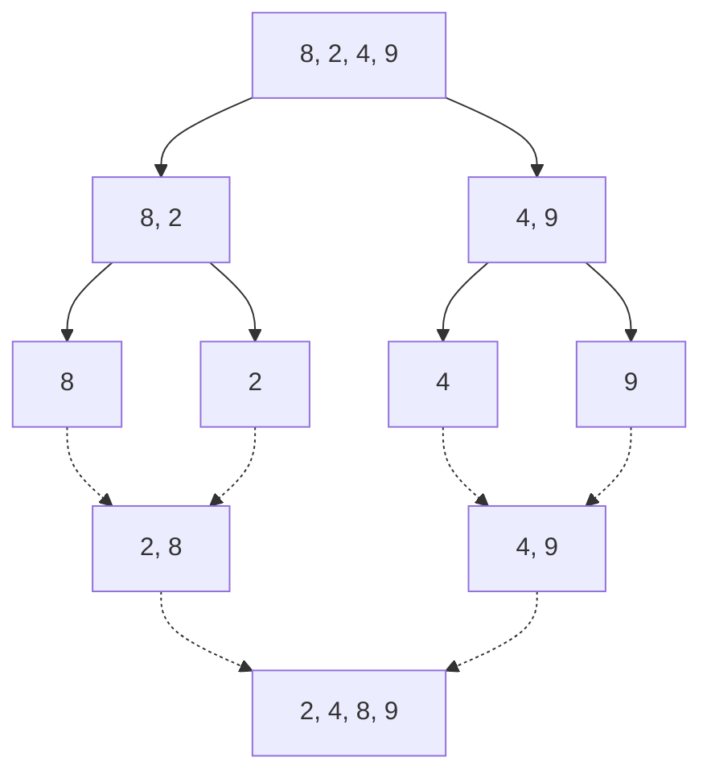

# 🧶 Sorting: Merge Sort

## 📝 Problem Description
Implement Merge Sort to sort an array of integers in ascending order.

!!! info "Real-World Application"
    Merge sort is used in external sorting (when data is larger than RAM) and is the basis for Timsort (used in Python and Java's `sort()`), which combines Merge Sort and Insertion Sort for optimized performance on real-world data.

## 🛠️ Constraints & Edge Cases
- $0 \le N \le 10^5$
- **Edge Cases to Watch:** 
    - Empty array or array with one element (already sorted).
    - Arrays with negative numbers or duplicates.

---

## 🧠 Approach & Intuition

!!! success "The Aha! Moment"
    Sorting two already-sorted lists is linear $O(N)$ work. By recursively splitting the array down to single elements—which are inherently sorted—we can build back up to a fully sorted array using only efficient linear merges.

### 🐢 Brute Force (Naive)
Bubble sort or Selection sort ($O(N^2)$) are too slow for large datasets ($N > 10^4$). They perform redundant comparisons and swaps, leading to performance degradation as $N$ grows.

### 🐇 Optimal Approach
Use the Divide and Conquer paradigm:
1. **Divide:** Recursively split the array in half until base cases (size 1) are reached.
2. **Conquer:** The base case (size 1) is already sorted.
3. **Combine (Merge):** Merge two sorted subarrays by comparing elements using two pointers and building a new sorted array.

### 🧩 Visual Tracing


---

## 💻 Solution Implementation

```python
(Implementation details need to be added...)
```

### ⏱️ Complexity Analysis
- **Time Complexity:** $\mathcal{O}(N \log N)$ — The array is divided $\log N$ times, and merging at each level takes linear $O(N)$ time.
- **Space Complexity:** $\mathcal{O}(N)$ — Requires $O(N)$ auxiliary space for the temporary arrays during the merge process.

---

## 🎤 Interview Toolkit

- **Harder Variant:** Can you perform this merge in-place? (Generally no, without sacrificing $O(N \log N)$ time). What about External Merge Sort for data larger than RAM?
- **Alternative Data Structures:** Why not use a Min-Heap? (Heap sort uses $O(1)$ space but is generally slower in practice due to constant factors and cache locality).

## 🔗 Related Problems
- `[Quick Sort](../quick_sort/PROBLEM.md)` — Efficient in-place alternative.
- `[Selection Sort](../selection_sort/PROBLEM.md)` — Simpler, less efficient.
