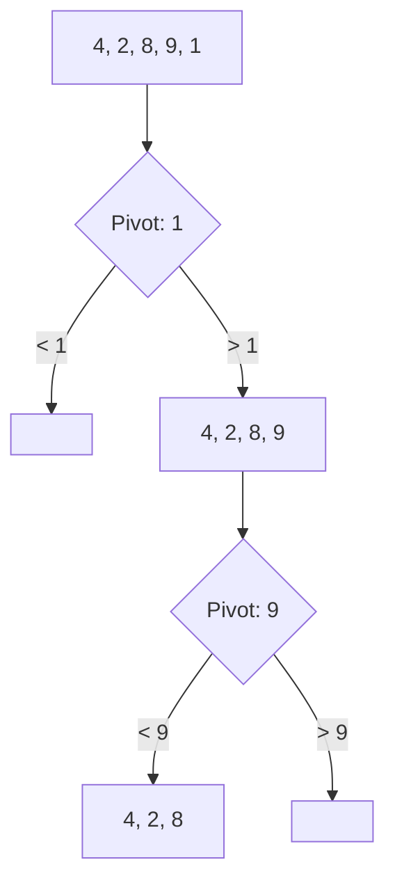

# ⚡ Sorting: Quick Sort

## 📝 Problem Description
Implement Quick Sort to sort an array of integers in ascending order, focusing on efficient partitioning schemes.

!!! info "Real-World Application"
    Quick sort is highly efficient in practice due to good cache locality and being in-place. It is widely used in systems libraries (e.g., C's `qsort`) and serves as the foundation for the QuickSelect algorithm used to find the K-th smallest element.

## 🛠️ Constraints & Edge Cases
- $1 \le N \le 10^5$
- **Edge Cases to Watch:** 
    - Arrays already sorted or reverse-sorted (can lead to $O(N^2)$ if pivot is poorly chosen).
    - Arrays with all duplicate elements.

---

## 🧠 Approach & Intuition

!!! success "The Aha! Moment"
    By picking a pivot and partitioning the array such that all elements smaller than the pivot come before it and all larger elements come after, the array is partially sorted. Recursively doing this reduces the problem space exponentially.

### 🐢 Brute Force (Naive)
Using an $O(N^2)$ algorithm like Bubble sort or Insertion sort is naive for large $N$. These algorithms do redundant work and do not scale to $10^5$ elements.

### 🐇 Optimal Approach
1. **Choose a Pivot:** Pick an element (e.g., last, middle, or random).
2. **Partition:** Reorder the array so elements $< pivot$ are to its left and elements $> pivot$ are to its right.
3. **Recurse:** Recursively apply the process to the left and right subarrays.

### 🧩 Visual Tracing


---

## 💻 Solution Implementation

```python
(Implementation details need to be added...)
```

### ⏱️ Complexity Analysis
- **Time Complexity:** $\mathcal{O}(N \log N)$ (average), $\mathcal{O}(N^2)$ (worst case with bad pivot).
- **Space Complexity:** $\mathcal{O}(\log N)$ — Due to the recursion stack.

---

## 🎤 Interview Toolkit

- **Harder Variant:** Implement `QuickSelect` to find the $K$-th largest element in $O(N)$ average time.
- **Pivot Optimization:** Use "Median-of-Three" or random pivot selection to avoid the $O(N^2)$ worst-case on sorted data.

## 🔗 Related Problems
- `[Merge Sort](../merge_sort/PROBLEM.md)` — Consistent $O(N \log N)$ but not in-place.
- `[Kth Largest Element](../../09_heap_priority_queue/kth_largest_element_in_an_array/PROBLEM.md)` — Can be solved with QuickSelect.
