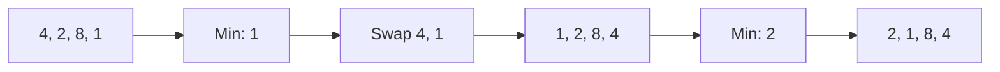

# 🎯 Sorting: Selection Sort

## 📝 Problem Description
Implement Selection Sort to sort an array of integers in ascending order.

!!! info "Real-World Application"
    Selection sort is rarely used in production due to its $O(N^2)$ complexity. However, it is useful in scenarios where memory write operations are extremely expensive, as it makes the minimum number of swaps ($O(N)$).

## 🛠️ Constraints & Edge Cases
- $1 \le N \le 10^3$ (Usually only suitable for very small datasets)
- **Edge Cases to Watch:** 
    - Arrays with already sorted elements (it will still scan).
    - Arrays with all duplicate elements.

---

## 🧠 Approach & Intuition

!!! success "The Aha! Moment"
    By repeatedly scanning the unsorted portion of the array for the minimum element and placing it at the beginning, we effectively "grow" a sorted partition one element at a time.

### 🐢 Brute Force (Naive)
This *is* the brute force approach. It compares every element with every other element, leading to $O(N^2)$ comparisons regardless of the input's initial order.

### 🐇 Optimal Approach
(For Selection Sort, the approach *is* the brute force). 
1. Maintain a sorted partition at the start.
2. In each iteration, find the minimum element in the remaining unsorted partition.
3. Swap it with the first element of the unsorted partition and include it in the sorted partition.

### 🧩 Visual Tracing


---

## 💻 Solution Implementation

```python
(Implementation details need to be added...)
```

### ⏱️ Complexity Analysis
- **Time Complexity:** $\mathcal{O}(N^2)$ — Two nested loops iterate over the array.
- **Space Complexity:** $\mathcal{O}(1)$ — Performs sorting in-place.

---

## 🎤 Interview Toolkit

- **Harder Variant:** Can this be made stable? (Only if we use extra memory or insert the element instead of swapping).
- **Comparison:** Why is Insertion Sort usually preferred over Selection Sort? (Insertion Sort is stable and performs better on partially sorted data).

## 🔗 Related Problems
- `[Merge Sort](../merge_sort/PROBLEM.md)` — Efficient $O(N \log N)$ algorithm.
- `[Insertion Sort](../insertion_sort/PROBLEM.md)` — More efficient $O(N^2)$ algorithm.
