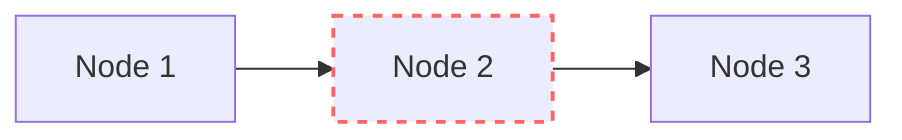

# (Icon) (Topic): (Problem Name)

## 📝 Problem Description
(Include the standard problem description here. Keep it concise.)

!!! info "Real-World Application"
    **(Briefly explain where this algorithm is actually used in software engineering. e.g., "LRU Cache is used in Redis and database paging," or "Graph traversal is used in network routing.")**

## 🛠️ Constraints & Edge Cases
- (Constraint 1, e.g., $1 \le N \le 10^5$)
- **Edge Cases to Watch:** - (e.g., Empty array input)
    - (e.g., Negative numbers present)

---

## 🧠 Approach & Intuition

!!! success "The Aha! Moment"
    (The core trick to solving this. e.g., "Use a slow and fast pointer to find the cycle," or "Sort the array first to use Binary Search.")

### 🐢 Brute Force (Naive)
(Briefly explain the naive $O(N^2)$ or $O(2^N)$ approach and why it results in a Time Limit Exceeded error.)

### 🐇 Optimal Approach
(Explain the step-by-step logic of the optimal solution.)
1. (Step 1)
2. (Step 2)
...

### 🧩 Visual Tracing
*(Use a simple Mermaid graph or flowchart to show pointer movement or state changes)*


---

## 💻 Solution Implementation

```python
--8<-- "(Link to your Python solution file)"
```

### ⏱️ Complexity Analysis
- **Time Complexity:** $\mathcal{O}(N)$ — (Explain why. e.g., "We iterate through the array exactly once.")
- **Space Complexity:** $\mathcal{O}(1)$ — (Explain why. e.g., "We only use two pointers, no extra memory.")

---

## 🎤 Interview Toolkit

- **Harder Variant:** (What if the array is unsorted? What if we have millions of queries?)
- **Alternative Data Structures:** (Could we have solved this using a Heap instead of sorting?)

## 🔗 Related Problems
- `[Related Problem 1](#)` — (Explain relation, e.g., "Uses the same sliding window template")
...
