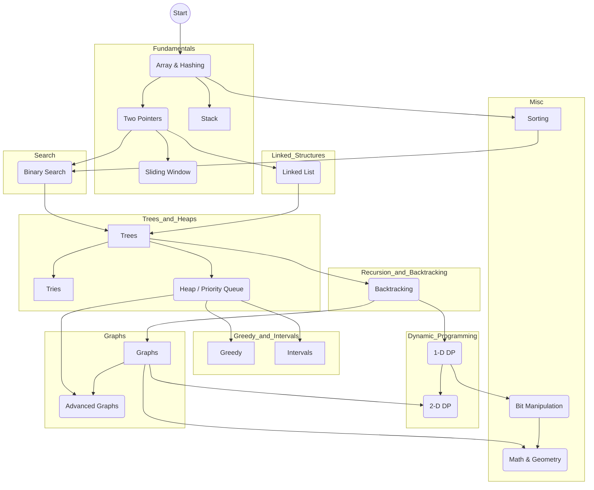

# 🗺️ DSA Learning Roadmap

## 📊 Topic Progress

1.  [Arrays & Hashing](./01_arrays_hashing/contains_duplicate/PROBLEM.md)
2.  [Two Pointers](./02_two_pointers/valid_palindrome/PROBLEM.md)
3.  [Sliding Window](./03_sliding_window/best_time_to_buy_sell_stock/PROBLEM.md)
4.  [Stack](./04_stack/valid_parentheses/PROBLEM.md)
5.  [Binary Search](./05_binary_search/binary_search/PROBLEM.md)
6.  [Linked List](./06_linked_list/reverse_list/PROBLEM.md)
7.  [Trees](./07_trees/invert_binary_tree/PROBLEM.md)
8.  [Tries](./08_tries/implement_trie/PROBLEM.md)
9.  [Heap / Priority Queue](./09_heap_priority_queue/kth_largest_element_in_a_stream/PROBLEM.md)
10. [Backtracking](./10_backtracking/subsets/PROBLEM.md)
11. [Graphs](./11_graphs/number_of_islands/PROBLEM.md)
12. [Advanced Graphs](./12_advanced_graphs/reconstruct_itinerary/PROBLEM.md)
13. [1-D Dynamic Programming](./13_1d_dynamic_programming/climbing_stairs/PROBLEM.md)
14. [2-D Dynamic Programming](./14_2d_dynamic_programming/unique_paths/PROBLEM.md)
15. [Greedy](./15_greedy/maximum_subarray/PROBLEM.md)
16. [Intervals](./16_intervals/insert_interval/PROBLEM.md)
17. [Math & Geometry](./17_math_geometry/rotate_image/PROBLEM.md)
18. [Bit Manipulation](./18_bit_manipulation/single_number/PROBLEM.md)
19. [Sorting](./19_sorting/bubble_sort/PROBLEM.md)
