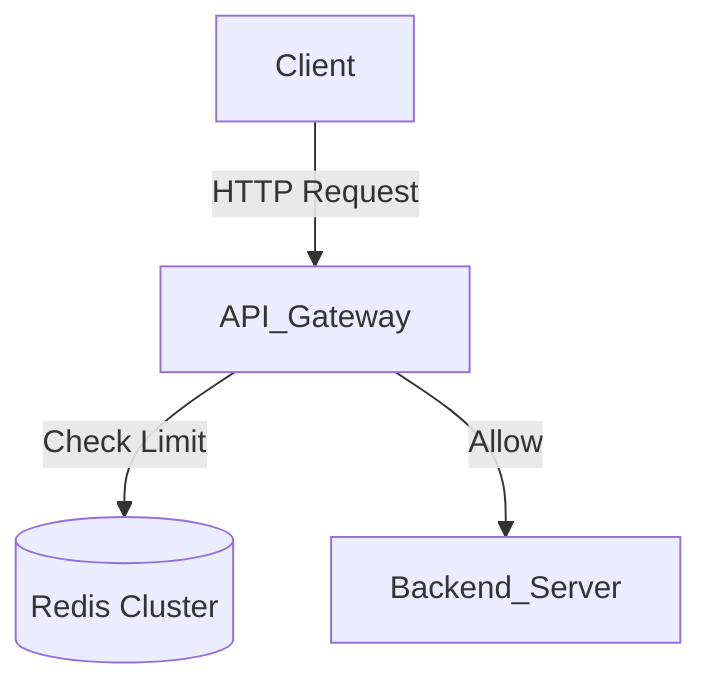

# (Icon) Infrastructure: (Subtitle)

## 📝 Overview
(Brief description of the infrastructure setup. e.g., "A distributed rate limiter using Redis and Python.")

!!! abstract "Core Concepts"
    - **(Concept 1):** (e.g., Token Bucket Algorithm)
    - **(Concept 2):** (e.g., Redis Lua Scripting for Atomicity)
    ...

---

## 🏭 The Scenario & Requirements

### 😡 The Bottleneck (The Villain)
(Describe the failure state. e.g., "Our API is getting DDOSed by bad actors, causing the database to crash.")

### 🦸 The Architecture (The Hero)
(How our infrastructure solves this. e.g., "Deploying an in-memory Redis cache to track IP requests in real-time and block overages instantly.")

### 📜 Requirements & Constraints
1.  **(Functional):** (e.g., Must limit users to 100 requests per minute.)
2.  **(Technical):** (e.g., Distributed state—must work across 5 different API server instances.)
...

---

## 🏗️ Architecture Blueprint

### Network / Topology Diagram
*(Visualizing the nodes, ports, and data flow)*


### 🧠 Thinking Process & Approach
(Explain *why* you chose this specific tech stack. Why Redis over Memcached? Why Docker Compose?)

---

## 💻 Infrastructure Implementation

*(Use MkDocs tabs to separate configuration files from application logic)*

=== "docker-compose.yml"
    ```yaml
    --8<-- "(Link to docker-compose.yml)"
    ```

=== "app.py"
    ```python
    --8<-- "(Link to python app file)"
    ```

---

## 🚀 Deployment & Execution

!!! tip "How to run this locally"
    ```bash
    # 1. Start the infrastructure
    docker-compose up -d

    # 2. Run the test script
    python test_rate_limiter.py
    ```

### 🔬 Why This Works
(Explain the magic. e.g., "By using a Redis Lua script, we guarantee that reading the current count and incrementing it happens atomically, preventing race conditions across distributed nodes.")

---

## 🎤 Interview Toolkit

- **Scaling Probe:** (What happens if Redis runs out of memory?)
- **Fault Tolerance:** (What if the Redis node dies? Do we fail open or fail closed?)
- **Observability:** (How do we monitor how many users are getting rate-limited in production?)

## 🔗 Related Challenges
- [Related Challenge 1](#) — (Explain relation)
...
