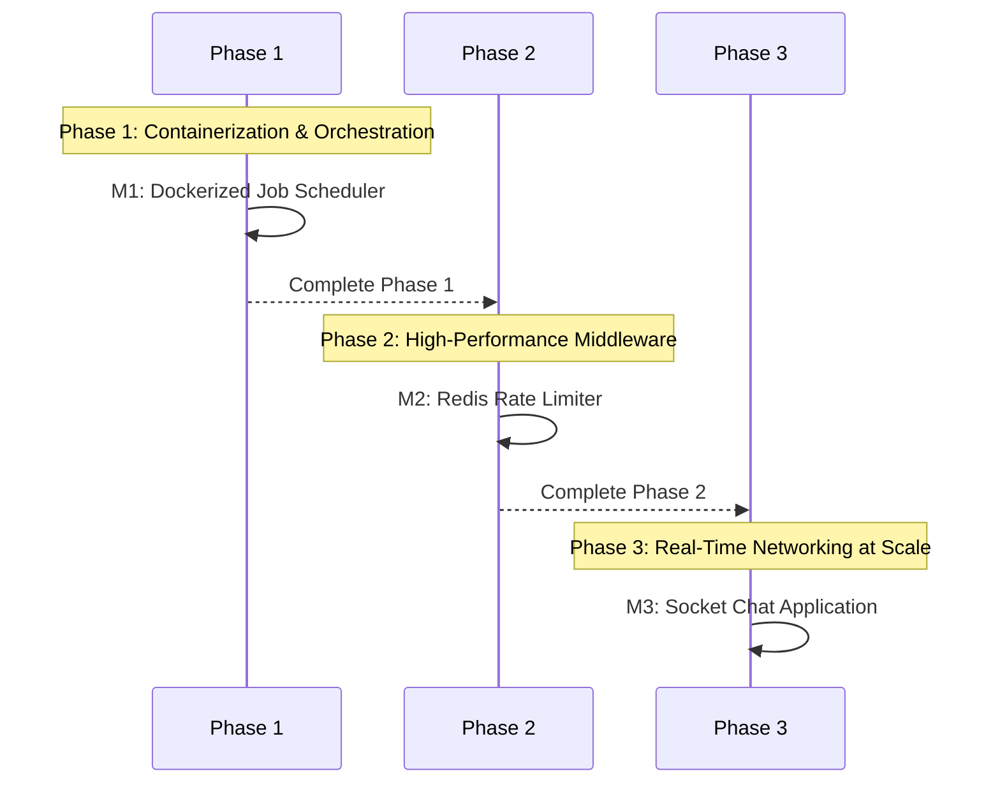

# 🎓 Infrastructure Mastery Program
### Target: SRE, DevOps & Infrastructure Engineers

A deep dive into building reliable, scalable, and high-performance **Middleware**, **Networking Layer**, and **Distributed Orchestration** systems.

---

## 📋 Program Roadmap

---

## 🚀 Phase 1: Containerization & Orchestration
**Focus:** Immutable infrastructure, environment parity, and multi-service orchestration.

### 🧠 The Engineering Story
**The Villain:** "The Dependency Hell." A Python job scheduler that works on macOS but fails on Linux because of a missing `libpq` version.
**The Hero:** "The Immutable Container Image." Packaging the OS, runtimes, and code into a single, portable layer that runs everywhere.
**The Twist:** "The Bloated Image." A 2GB container image that takes 10 minutes to pull, causing auto-scaling events to lag and fail.

### 📦 Modules
*   **M1: [Dockerized Job Scheduler](./dockerized_job_scheduler/PROBLEM.md)** — Use Docker Compose to orchestrate a Master node, Redis queue, and multiple Worker nodes.

---

## 🚀 Phase 2: High-Performance Middleware
**Focus:** Traffic control, distributed state management, and atomicity.

### 🧠 The Engineering Story
**The Villain:** "The Noisy Neighbor." A single user scripts 10,000 requests per second, taking down the entire API for everyone else.
**The Hero:** "The Distributed Rate Limiter." Using Redis and Lua scripting to enforce limits across multiple application nodes atomically.
**The Twist:** "The Race Condition." If you check a counter and then increment it in two separate steps, multiple users can bypass your limits simultaneously.

### 📦 Modules
*   **M2: [Redis Rate Limiter](./redis_rate_limiter/PROBLEM.md)** — Implement Token Bucket and Sliding Window algorithms using Redis for high-throughput traffic control.

---

## 🚀 Phase 3: Real-Time Networking at Scale
**Focus:** Persistent connections, bi-directional communication, and state management.

### 🧠 The Engineering Story
**The Villain:** "The Ghost Connection." A user loses Wi-Fi in a tunnel, but your server still thinks they are "Online," wasting threads and memory.
**The Hero:** "The WebSocket Heartbeat." Using low-level PING/PONG frames and TTL-based state stores to purge stale connections.
**The Twist:** "The Thundering Herd." 100,000 clients all trying to reconnect at the exact same millisecond after a transient network failure.

### 📦 Modules
*   **M3: [Socket Chat Application](./socket_chat_app/PROBLEM.md)** — Build a real-time server using raw TCP sockets, handling presence tracking and message delivery.

---

### 🛠️ Core Infrastructure Principles
1. **Immutable Infrastructure:** Containers and images should never change once built.
2. **Atomicity:** Always use distributed locks or atomic scripts (like Redis Lua) for shared state.
3. **Observability:** If you can't measure it (latency, throughput, resource usage), you can't fix it.
4. **Resilience:** Design for "Failure as a First-Class Citizen." What happens when Redis goes down?
