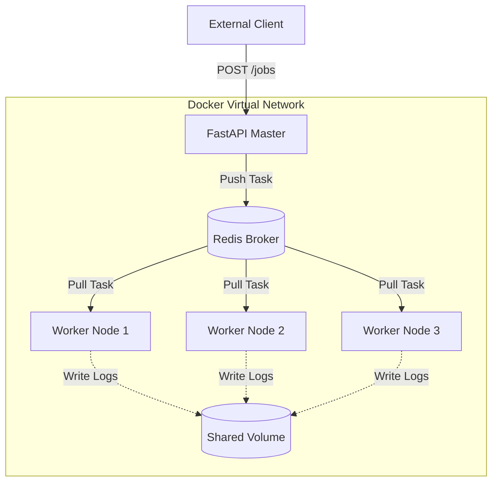

# 🐳 Infrastructure: Dockerized Distributed Job Scheduler

## 📝 Overview
**Containerization** is the gold standard for deploying distributed systems. This challenge involves orchestrating a multi-service job scheduling cluster—comprising a Master API, multiple Worker nodes, and a Redis message broker—using **Docker Compose** to simulate a production environment on a local machine.

!!! abstract "Core Concepts"
    - **Container Orchestration:** Managing the lifecycle and networking of interdependent services.
    - **Service Discovery:** Allowing containers to communicate via internal DNS names (e.g., `redis:6379`) instead of static IPs.
    - **Distributed Task Queues:** Decoupling job submission from execution via a shared message broker.
    - **Environment Isolation:** Ensuring "it works on my machine" translates perfectly to production.

---

## 🏭 The Scenario & Requirements

### 😡 The Bottleneck (The Villain)
**"The Configuration Hell."** Your Python scheduler works on macOS but fails on Linux because of a missing `libpq` version. Your teammate can't even run it because they have Python 3.12 and you used 3.9. Deployment is a manual nightmare of installing dependencies and configuring environment variables on every new server.

### 🦸 The Architecture (The Hero)
**"The Immutable Container Fleet."** We package the entire stack—code, runtime, and OS dependencies—into portable Docker images. **Docker Compose** acts as the conductor, spinning up a virtual network where the Master, Workers, and Redis can collaborate seamlessly regardless of the host OS.

### 📜 Requirements & Constraints
1.  **Functional:**
    -   **Master Node:** A FastAPI service that accepts job submissions and pushes them to Redis.
    -   **Worker Nodes:** At least 3 independent worker containers that pull and process jobs.
    -   **Persistence:** A shared volume to ensure job logs survive container restarts.
2.  **Technical:**
    -   **Networking:** All services must reside on a custom bridge network.
    -   **Resource Limits:** Each worker must be capped at 0.5 CPU and 128MB RAM to simulate a constrained cluster.
    -   **Fault Tolerance:** If a worker container is killed, other workers must continue processing without data loss.

---

## 🏗️ Architecture Blueprint

### Network / Topology Diagram


### 🧠 Thinking Process & Approach
We chose **Docker Compose** because it provides a declarative way to define multi-container applications. By separating the **Master** (API/Producer) from the **Workers** (Consumers), we achieve horizontal scalability. **Redis** is used as the broker because of its high throughput and native support for list/queue primitives. This decoupled architecture allows us to scale workers up or down independently of the API.

---

## 💻 Infrastructure Implementation

=== "docker-compose.yml"
    ```yaml
    --8<-- "infrastructure_challenges/dockerized_job_scheduler/docker_compose.yml"
    ```

---

## 🚀 Deployment & Execution

!!! tip "How to run this locally"
    ```bash
    # 1. Build and start the entire cluster in the background
    docker-compose up --build -d

    # 2. Check the status of your services
    docker-compose ps

    # 3. Follow the logs of a specific worker to see job processing
    docker-compose logs -f worker

    # 4. Scale up to 5 workers dynamically
    docker-compose up -d --scale worker=5
    ```

### 🔬 Why This Works
Docker Compose abstracts away the complexity of networking and resource allocation. By defining `depends_on`, we ensure Redis is ready before the workers start. The internal DNS allows the Master to reach Redis simply by using the hostname `redis`, mirroring how service discovery works in Kubernetes or AWS ECS.

---

## 🎤 Interview Toolkit

- **Scaling Probe:** How would you implement an "Auto-scaler" that monitors Redis queue depth and automatically adds more worker containers?
- **Fault Tolerance:** What happens to a job if a worker container crashes *while* processing it? How do you implement "At-Least-Once" delivery?
- **Observability:** How would you integrate a monitoring tool like Prometheus to track the CPU usage of your worker fleet?

## 🔗 Related Challenges
- [Redis Rate Limiter](../redis_rate_limiter/PROBLEM.md) — Learn how to handle distributed state within a containerized environment.
- [Socket Chat App](../socket_chat_app/PROBLEM.md) — Deep dive into persistent TCP connections vs. stateless API requests.
