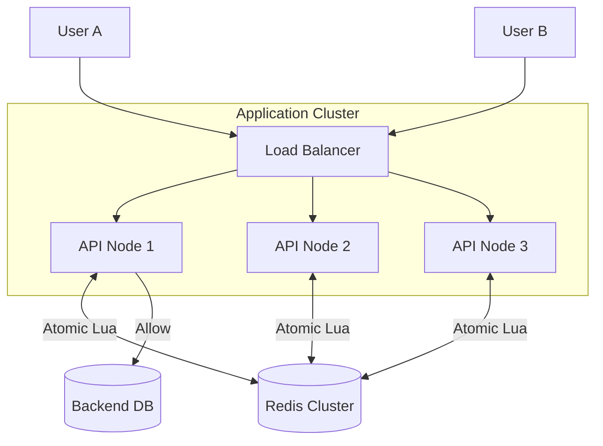

# 📦 Infrastructure: Redis-Backed Distributed Rate Limiter

## 📝 Overview
While an in-memory rate limiter works for a single instance, a **Distributed Rate Limiter** is essential for clusters. This infrastructure setup uses **Redis** as a centralized, high-performance store to maintain consistent request counts across multiple independent application nodes, protecting your services from abuse and overloading.

!!! abstract "Core Concepts"
    - **Atomic Operations:** Utilizing Redis `INCR` and `EXPIRE` commands to manage counters without race conditions.
    - **Lua Scripting:** Offloading logic to Redis to ensure atomicity and minimize network round-trips ("Check-and-Set" in one step).
    - **Sliding Window Algorithm:** A more accurate method than "Fixed Window" for tracking request frequency over time.
    - **High-Throughput State:** Using an in-memory database to keep latency sub-millisecond.

---

## 🏭 The Scenario & Requirements

### 😡 The Bottleneck (The Villain)
**"The Noisy Neighbor."** A single user or a malicious actor scripts 10,000 requests per second. Local rate limiting (in-memory) fails because you have 5 different server nodes behind a load balancer. Each node only sees a fraction of the traffic, allowing the attacker to bypass the global limit and crash your backend database.

### 🦸 The Architecture (The Hero)
**"The Centralized Arbiter."** We deploy a high-speed Redis cluster as the "Source of Truth" for traffic metrics. Every app server queries Redis before processing a request. If the global limit for a user ID or IP is reached, the request is rejected immediately at the edge.

### 📜 Requirements & Constraints
1.  **Functional:**
    -   **Global Enforcement:** Limits must be enforced across all API server instances.
    -   **Atomicity:** The "increment and check" operation must be atomic.
    -   **Flexibility:** Support for different limits per user or per API endpoint.
2.  **Technical:**
    -   **Performance:** The rate-limiting check must add < 2ms of overhead.
    -   **Resilience:** If Redis is unreachable, the system should "fail-open" (allow requests) to prevent a total outage.
    -   **Concurrency:** Must handle thousands of concurrent requests without locking bottlenecks.

---

## 🏗️ Architecture Blueprint

### Network / Topology Diagram


### 🧠 Thinking Process & Approach
We chose **Redis** over a traditional database because of its low latency and native support for atomic counters. Using **Lua scripting** is critical here; it allows us to bundle the `GET`, `INCR`, and `EXPIRE` logic into a single command that is executed as a single unit on the Redis server, eliminating the "Time of Check to Time of Use" (TOCTOU) race conditions that occur with multiple network round-trips.

---

## 💻 Infrastructure Implementation

=== "redis_rate_limiter.py"
    ```python
    --8<-- "infrastructure_challenges/redis_rate_limiter/redis_rate_limiter.py"
    ```

---

## 🚀 Deployment & Execution

!!! tip "How to run this locally"
    ```bash
    # 1. Start a local Redis instance
    docker run -d -p 6379:6379 --name rate-limiter-redis redis:alpine

    # 2. Run the rate limiter test script (simulate concurrent requests)
    python redis_rate_limiter.py

    # 3. Observe the logs to see requests being blocked after the limit
    # "Request allowed: True, Remaining: 4"
    # "Request allowed: False, Error: Limit Exceeded"
    ```

### 🔬 Why This Works
The magic lies in the Redis `INCR` command combined with a `TTL`. By using a Lua script, we ensure that if a key doesn't exist, we both create it *and* set an expiry in one atomic operation. This prevents "Leaky Keys"—counters that never reset because a crash happened between incrementing and setting the expiry.

---

## 🎤 Interview Toolkit

- **Hard vs Soft Limits:** How would you implement a "Burst" mode that allows a user to temporarily exceed their limit for 5 seconds?
- **Fault Tolerance:** What happens if the Redis node dies? Do we fail-open (prioritize availability) or fail-closed (prioritize protection)?
- **Scalability:** If a single Redis node becomes a bottleneck, how would you partition/shard the rate-limiting keys across a Redis Cluster?

## 🔗 Related Challenges
- [Dockerized Job Scheduler](../dockerized_job_scheduler/PROBLEM.md) — Orchestrate your Redis instance alongside your app nodes.
- [Socket Chat App](../socket_chat_app/PROBLEM.md) — Apply rate limiting to real-time socket messages to prevent chat spam.
