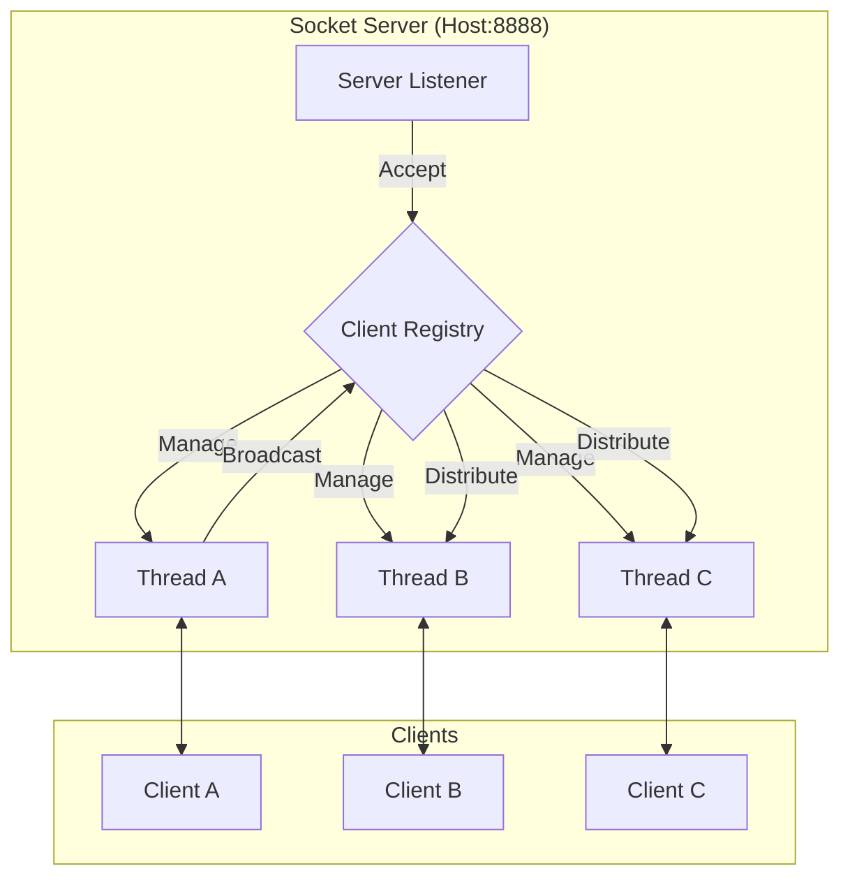

# 💬 Infrastructure: Real-Time Socket Chat Application

## 📝 Overview
Modern real-time communication relies on **TCP Sockets** for persistent, bi-directional data flow. This challenge focuses on low-level network programming, moving away from high-level abstractions like HTTP to understand how servers manage multiple simultaneous connections and broadcast messages in real-time.

!!! abstract "Core Concepts"
    - **TCP Handshake:** Establishing and maintaining reliable full-duplex connections.
    - **Socket Buffers:** Managing the low-level flow of raw bytes over the network wire.
    - **Concurrency Models:** Using multi-threading or Non-blocking I/O (`select`/`epoll`) to handle thousands of users.
    - **Heartbeats & Keep-Alive:** Detecting and purging "ghost" connections when clients drop off unexpectedly.

---

## 🏭 The Scenario & Requirements

### 😡 The Bottleneck (The Villain)
**"The Ghost Connection."** A user loses Wi-Fi while in a tunnel. Your server still thinks they are "Online," wasting a thread and memory until the OS eventually times out the socket hours later. In a high-traffic environment, these stale connections pile up, eventually leading to a `SocketException` and a complete server crash.

### 🦸 The Architecture (The Hero)
**"The Multi-threaded Registry."** We implement a robust TCP server that maintains a registry of active, verified connections. By implementing a lightweight "Heartbeat" protocol, the server proactively pings clients and cleans up resources immediately if a connection becomes unresponsive.

### 📜 Requirements & Constraints
1.  **Functional:**
    -   **Multi-Client Support:** Listen on a high-numbered port (e.g., `8888`) and handle concurrent connections.
    -   **Real-Time Broadcast:** RELAY messages from one client to all other connected peers instantly.
    -   **Asynchronous Client:** A CLI tool that can both send messages and listen for incoming ones simultaneously.
2.  **Technical:**
    -   **Protocol Design:** A simple text-based format for JOIN, MSG, and QUIT events.
    -   **Concurrency:** Use a `Thread-per-Connection` or `Select` model to avoid blocking the main server loop.
    -   **Resource Cleanup:** Graceful handling of `ConnectionResetError` and "Dirty Disconnects."

---

## 🏗️ Architecture Blueprint

### Network / Topology Diagram


### 🧠 Thinking Process & Approach
We chose a **Multi-threaded approach** for this challenge to clearly demonstrate the "One Thread per Connection" model, which is common in legacy or low-concurrency systems. Each thread manages the blocking `recv()` call for a single client. When a message is received, it triggers a broadcast event where the server iterates through the registry and writes the payload to all other active sockets.

---

## 💻 Infrastructure Implementation

=== "socket_chat.py"
    ```python
    --8<-- "infrastructure_challenges/socket_chat_app/socket_chat.py"
    ```

---

## 🚀 Deployment & Execution

!!! tip "How to run this locally"
    ```bash
    # 1. Start the Chat Server in one terminal
    python socket_chat.py --server

    # 2. Open another terminal and start Client A
    python socket_chat.py --client --name "Alice"

    # 3. Open a third terminal and start Client B
    python socket_chat.py --client --name "Bob"

    # 4. Type a message in Alice's terminal and watch it appear in Bob's!
    ```

### 🔬 Why This Works
By using raw TCP sockets instead of HTTP, we eliminate the overhead of repeated headers and handshakes for every message. The connection remains open, allowing for true push-based communication from the server to the client with minimal latency.

---

## 🎤 Interview Toolkit

- **Scalability:** How would you scale this to 100,000 concurrent users? (Hint: Discuss Event Loops like `asyncio` or `epoll` vs Threads).
- **Security:** How would you implement TLS/SSL to encrypt the raw socket stream?
- **Delivery Guarantees:** What happens if a client is temporarily disconnected while a message is sent? How would you implement a "Retry Queue"?

## 🔗 Related Challenges
- [Dockerized Job Scheduler](../dockerized_job_scheduler/PROBLEM.md) — Containerize your chat server for easier deployment.
- [Redis Rate Limiter](../redis_rate_limiter/PROBLEM.md) — Prevent users from spamming the chat using a distributed rate limiter.
