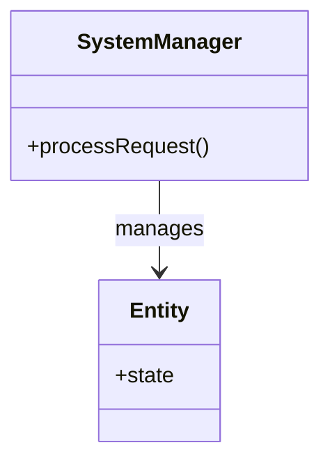

# (Icon) Machine Coding: (Subtitle)

## 📝 Overview
(Brief, 2-sentence description of the system you are building and its primary use case.)

!!! info "Why This Challenge?"
    - **(Skill 1):** (e.g., Tests your ability to handle concurrency and race conditions.)
    - **(Skill 2):** (e.g., Evaluates state machine design.)
    ...

---

## 🏭 The Scenario & Requirements

### 😡 The Problem (The Villain)
(Describe the messy real-world problem. e.g., "A parking lot where cars are double-parking, payment is chaotic, and finding a free spot takes 20 minutes.")

### 🦸 The System (The Hero)
(How our system will solve this conceptually. e.g., "An automated parking management engine that tracks spots, issues tickets, and calculates fees seamlessly.")

### 📜 Requirements & Constraints
1.  **(Functional):** (e.g., System must assign the nearest available parking spot.)
2.  **(Technical):** (e.g., Must handle concurrent entry/exit requests without double-booking.)
...

---

## 🏗️ Design & Architecture

### 🧠 Thinking Process
(Explain the step-by-step approach taken to transform the requirements into objects. Which entities exist? e.g., `ParkingLot`, `Vehicle`, `Ticket`.)

### 🧩 Class Diagram
*(The Object-Oriented Blueprint. Who owns what?)*


### ⚙️ Design Patterns Applied
- **[Pattern 1]**: (How it's used - e.g., *Strategy Pattern* for calculating different parking fees based on vehicle type.)
- **[Pattern 2]**: (How it's used - e.g., *Singleton* for the central DB connection.)
...

---

## 💻 Solution Implementation

???+ success "The Code"
    ```python
    --8<-- "(Link to your Python implementation file)"
    ```

### 🔬 Why This Works (Evaluation)
(Explain the core logic. How did you solve the hardest constraint? e.g., "We used threading locks on the `assign_spot` method to prevent race conditions.")

---

## ⚖️ Trade-offs & Limitations

| Decision | Pros | Cons / Limitations |
| :--- | :--- | :--- |
| (e.g., In-memory list for spots) | Super fast access ($O(1)$) | Data lost on system crash |

---

## 🎤 Interview Toolkit

- **Concurrency Probe:** (How would you handle 10,000 simultaneous requests?)
- **Extensibility:** (How easily can we add a new vehicle type, like 'Electric Scooter'?)
- **Data Persistence:** (If we move from in-memory to a Database, what changes?)

## 🔗 Related Challenges
- [Related Challenge 1](#) — (Explain relation)
...
