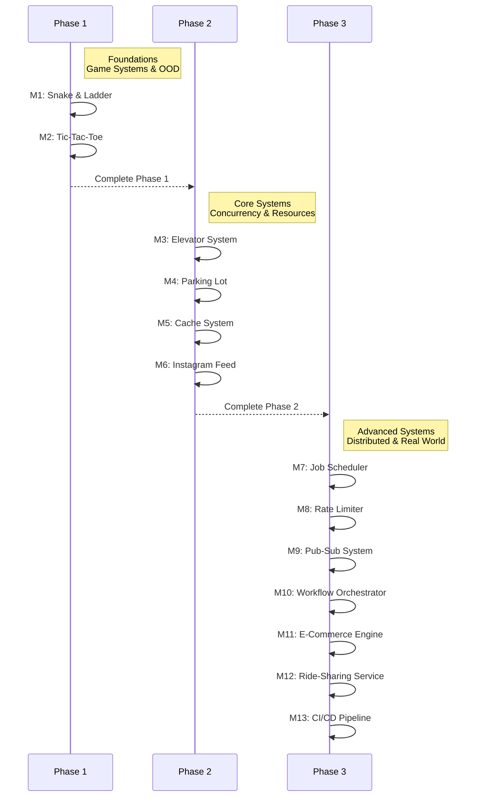

# 🎓 Machine Coding Mastery Program
### Target: Senior & Staff Software Engineers

A comprehensive guide to mastering **Object-Oriented Design (OOD)**, **Concurrency**, **State Machines**, and **Distributed Component Design**. This program moves from simple entities to complex, real-world engines.

---

## 📋 Program Roadmap

---

## 🚀 Phase 1: Game Systems & Basic OOD
**Focus:** Entity modeling, separation of concerns, and clean interfaces.

### 🧠 The Engineering Story
**The Villain:** "The God Class." Mixing board logic, player state, and game rules into a single 2,000-line file.
**The Hero:** "The Entity-Component Separation." Decoupling the physical board from the game rules and player actions.
**The Twist:** "The Infinite Loop." A snake leading to a ladder that leads back to the same snake—testing your validation logic.

### 📦 Modules
*   **M1: [Snake & Ladder](./games/snake_ladder/PROBLEM.md)** — Focus on board representation and jump logic.
*   **M2: [Tic-Tac-Toe](./games/tic_tac_toe/PROBLEM.md)** — Focus on win-condition algorithms ($O(1)$ vs $O(N^2)$) and extensible board sizes.

---

## 🚀 Phase 2: Concurrency & Resource Management
**Focus:** Thread safety, state machines, and scheduling algorithms.

### 🧠 The Engineering Story
**The Villain:** "The Race Condition." Two users calling the same elevator or booking the same parking spot at the exact same millisecond.
**The Hero:** "The Thread-Safe State Machine." Using locks, semaphores, and atomic operations to manage shared resources.
**The Twist:** "The Starvation." An elevator algorithm that serves the middle floors but leaves the penthouse waiting forever.

### 📦 Modules
*   **M3: [Elevator System](./systems/elevator/PROBLEM.md)** — Master the SCAN algorithm and thread-safe request queues.
*   **M4: [Parking Lot](./systems/parking_lot/PROBLEM.md)** — Design for multiple vehicle types and various spot allocation strategies.
*   **M5: [Cache System](./systems/cache_system/PROBLEM.md)** — Implement LRU/LFU eviction policies with $O(1)$ access and update.
*   **M6: [Instagram Feed](./systems/instagram/PROBLEM.md)** — Handle "Fan-out on Load" vs "Fan-out on Write" for social graphs.

---

## 🚀 Phase 3: Distributed Components & Real-World Engines
**Focus:** Distributed state, reliability, and complex business workflows.

### 🧠 The Engineering Story
**The Villain:** "The Double Execution." Two workers picking up the same job from the database simultaneously in a distributed cluster.
**The Hero:** "The Distributed Lock & Idempotency." Using Redis/Zookeeper for synchronization and ensuring actions can be safely retried.
**The Twist:** "The Zombie Job." A worker crashes after claiming a job but before releasing the lock, blocking the system until a timeout occurs.

### 📦 Modules
*   **M7: [Job Scheduler](./distributed/job_scheduler/PROBLEM.md)** — Design for "at-least-once" delivery and recurring schedules.
*   **M8: [Rate Limiter](./distributed/rate_limiter/PROBLEM.md)** — Implement Token Bucket and Sliding Window algorithms at scale.
*   **M9: [Pub-Sub System](./distributed/pub_sub/PROBLEM.md)** — Design a message broker with topic-based filtering and consumer groups.
*   **M10: [Workflow Orchestrator](./distributed/workflow_orchestrator/PROBLEM.md)** — Manage complex, multi-step state machines with error handling and retries.
*   **M11: [E-Commerce Engine](./real_world_systems/e_commerce_order_system/PROBLEM.md)** — Handle inventory, payments, and order state transitions.
*   **M12: [Ride-Sharing Service](./real_world_systems/ride_sharing_service/PROBLEM.md)** — Match drivers to riders using spatial indexing and dynamic pricing.
*   **M13: [CI/CD Pipeline](./real_world_systems/ci_cd_pipeline/PROBLEM.md)** — Orchestrate build, test, and deploy stages with parallel execution.

---

### 📚 Core Mastery Principles
1. **SOLID Principles:** Every class should have one reason to change.
2. **Design Patterns:** Use Strategy for algorithms, Observer for notifications, and Factory for entity creation.
3. **Concurrency:** Always assume multiple threads are accessing your data.
4. **Extensibility:** Can you add a new "Vehicle Type" or "Game Rule" without modifying existing code?
