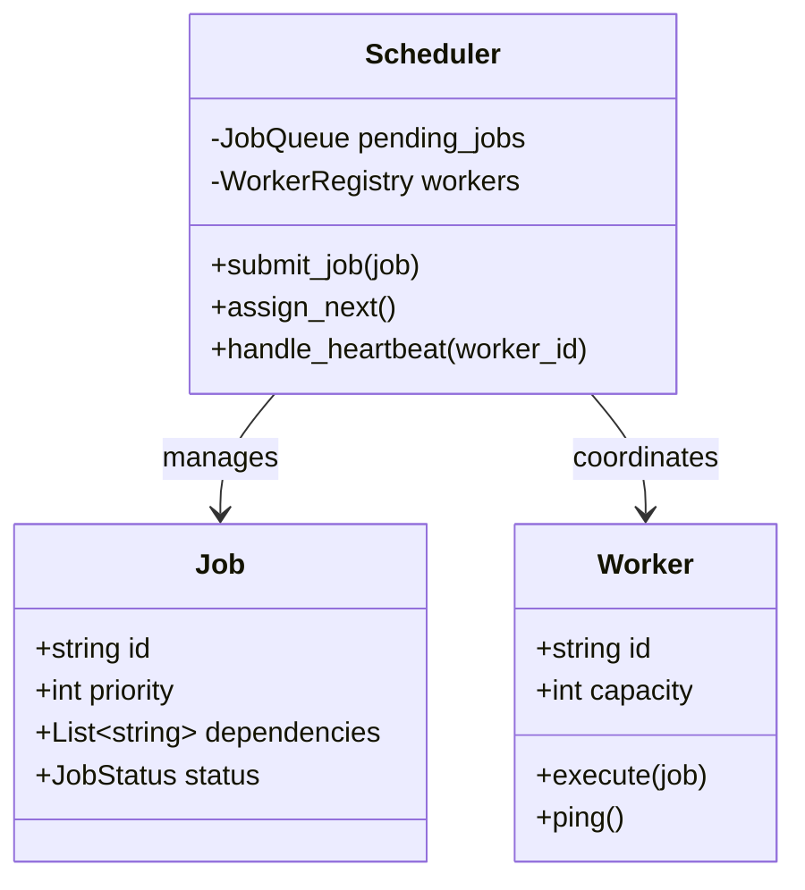

# ⏲️ Machine Coding: Distributed Job Scheduler

## 📝 Overview
A **Distributed Job Scheduler** is a system responsible for managing the execution of tasks across a cluster of machines. It optimizes resource utilization by matching job requirements (priority, dependencies) with available worker capacity while ensuring fault tolerance.

!!! info "Why This Challenge?"
    - **Distributed Systems Mastery:** Building a scheduler requires handling node failures, heartbeats, and consistency across a cluster.
    - **DAG Processing:** Evaluates your ability to implement dependency resolution via topological sorting for complex workflows.
    - **Fault Tolerance:** Tests your design for job retries, "At-Least-Once" execution, and handling "zombie" worker nodes.

---

## 🏭 The Scenario & Requirements

### 😡 The Problem (The Villain)
**"The Double Billing."** A poorly coordinated scheduler sends the same "Process Invoice" job to two different workers. Both execute it simultaneously, resulting in a customer being charged twice. Meanwhile, other critical "Ship Product" jobs are stuck in a queue because the workers are idling or crashed without notifying the system.

### 🦸 The System (The Hero)
**"The Distributed Orchestrator."** A centralized brain that uses **Atomic Locks** to ensure every job is assigned exactly once. It maintains a **State Machine** for every job (PENDING $\rightarrow$ RUNNING $\rightarrow$ COMPLETED) and uses **Heartbeats** to detect worker failures, automatically re-queuing jobs from dead nodes.

### 📜 Requirements & Constraints
1.  **Functional:**
    -   **Job Submission:** Accept jobs with varying priorities and optional DAG-based dependencies.
    -   **Multi-Worker Distribution:** Load balance tasks across a pool of $N$ worker nodes.
    -   **Status Monitoring:** Provide real-time visibility into job progress and worker health.
    -   **Retries:** Support configurable retry counts with exponential backoff for failed jobs.
2.  **Technical:**
    -   **Idempotency:** Prevent duplicate job execution through a distributed consistency layer.
    -   **Throughput:** Minimize scheduling latency to handle up to 1 million daily jobs.
    -   **Reliability:** The scheduler must be able to reclaim "orphaned" jobs from crashed workers.

---

## 🏗️ Design & Architecture

### 🧠 Thinking Process
To build a scalable scheduler, we decouple the **Scheduler** (the Brain) from the **Worker** (the Brawn):   
1.  **Job Store:** A persistent database (or Redis) to track job state and priorities.  
2.  **Topological Sorter:** A module to resolve job dependencies, ensuring parents finish before children.  
3.  **Heartbeat Monitor:** A background process that marks workers as "Timed Out" if they don't ping within $X$ seconds.    
4.  **State Machine:** Strictly manages transitions to prevent illegal states (e.g., re-running a completed job).

### 🧩 Class Diagram


### ⚙️ Design Patterns Applied
- **State Pattern**: To manage the lifecycle of a job (PENDING, QUEUED, RUNNING, SUCCESS, FAILED).
- **Command Pattern**: Encapsulating "What to do" as a job object that can be moved across the network.
- **Observer Pattern**: To notify the scheduler when a worker completes its task or goes offline.
- **Strategy Pattern**: For switching between scheduling algorithms (FIFO, Priority, Round-robin).

---

## 💻 Solution Implementation

???+ success "The Code"
    ```python
    --8<-- "machine_coding/distributed/job_scheduler/job_scheduling_system.py"
    ```

### 🔬 Why This Works (Evaluation)
The system uses a **Centralized State Repository** as the source of truth. By using a `Topological Sort` on the job dependency graph, we ensure that complex workflows execute in the correct order. The heartbeat mechanism provides self-healing capabilities—if a worker crashes, its assigned jobs are transitioned back to `PENDING` automatically.

---

## ⚖️ Trade-offs & Limitations

| Decision | Pros | Cons / Limitations |
| :--- | :--- | :--- |
| **Centralized Brain** | Simple to maintain consistency and global priorities. | Scaling the brain itself becomes a bottleneck at extremely high volumes. |
| **Pull-based Workers** | Workers only take what they can handle; prevents overloading. | Latency between a job becoming available and a worker "polling" for it. |
| **Persistent State** | Survives system crashes. | Database IO overhead on every state transition. |

---

## 🎤 Interview Toolkit

- **Consistency Probe:** How do you ensure two workers don't pick up the same job? (Use an **Atomic CAS** (Compare-and-Swap) operation: `update status=RUNNING where id=JOB_ID and status=PENDING`).
- **Resource Isolation:** How would you prevent "Heavy" jobs from starving "Light" jobs? (Implement **Multi-Queue Priority** or specific worker pools for different job types).
- **Infinite Loops:** How would you handle a job that keeps failing and retrying? (Implement a **Dead Letter Queue** after $N$ attempts).

## 🔗 Related Challenges
- [Workflow Orchestrator](../workflow_orchestrator/PROBLEM.md) — For more complex, branching multi-step workflows.
- [Distributed Rate Limiter](../rate_limiter/PROBLEM.md) — To control the volume of job submissions and prevent API overload.
