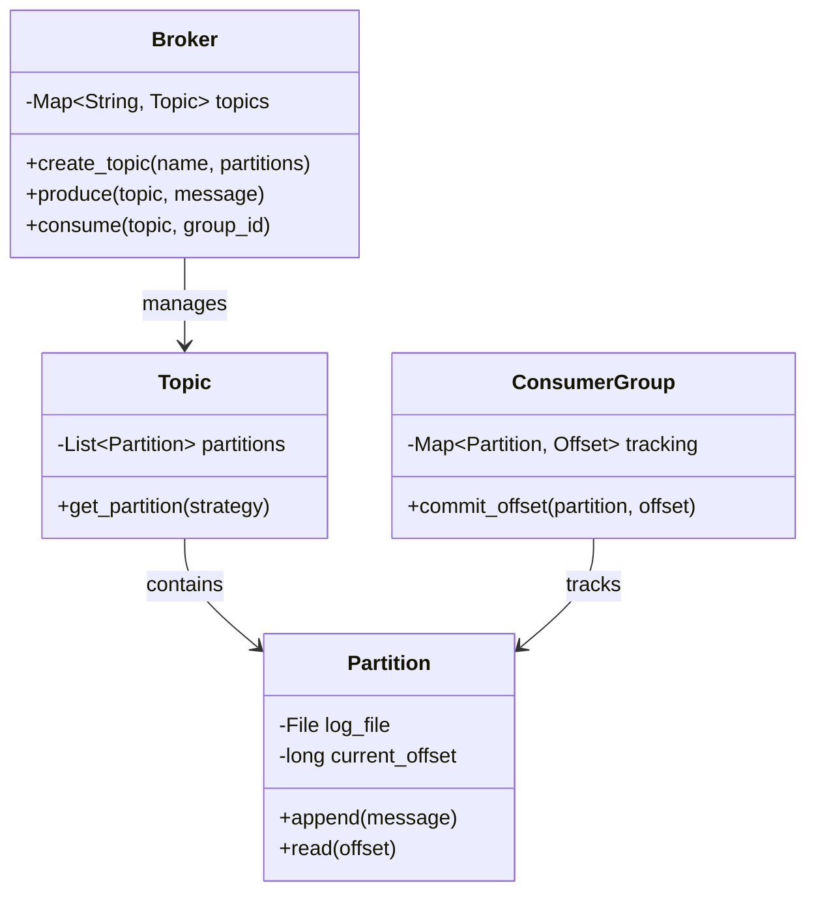

# 📡 Machine Coding: Persistent Pub-Sub (Kafka Lite)

## 📝 Overview
A **Pub-Sub (Publisher-Subscriber) System** is a distributed messaging pattern that decouples message senders from receivers. This challenge focuses on building a "Kafka-Lite" broker that supports topic-based partitioning, persistent disk-based storage, and consumer groups for horizontal scaling.

!!! info "Why This Challenge?"
    - **Persistence & Durability:** Evaluates your ability to design systems that survive restarts using append-only logs and disk-based offset tracking.
    - **Scalability through Partitioning:** Tests your understanding of parallelizing message streams across multiple independent partitions.
    - **Consumer Group Semantics:** Challenges you to implement load balancing where each message in a partition is delivered to exactly one member of a consumer group.

---

## 🏭 The Scenario & Requirements

### 😡 The Problem (The Villain)
**"The Memory Overflow Crash."** An in-memory messaging system that stores every pending message in a Python list. When a subscriber goes offline for 5 minutes, the list grows indefinitely, consumes all RAM, and crashes the entire broker. All historical messages are lost forever because they were never written to disk.

### 🦸 The System (The Hero)
**"The Durable Log."** A persistent message broker that treats every topic as a **Durable, Append-Only Log**. Messages are instantly flushed to disk, allowing consumers to "Replay" history by resetting their **Offsets**. By partitioning topics, multiple consumers can process data in parallel without blocking each other.

### 📜 Requirements & Constraints
1.  **Functional:**
    -   **Topics & Partitions:** Support creating topics divided into $N$ independent partitions.
    -   **Durability:** Every message must be written to disk before being acknowledged to the producer.
    -   **Consumer Groups:** Multiple consumers can join a group to share the load of a single topic.
    -   **Offset Tracking:** Allow consumers to read from a specific position (earliest, latest, or custom).
2.  **Technical:**
    -   **High Throughput:** Use sequential disk IO (Append-Only) for performance.
    -   **Concurrency:** Support multiple producers sending to different partitions of the same topic simultaneously.
    -   **Consistency:** Guarantee strict message ordering within a single partition.

---

## 🏗️ Design & Architecture

### 🧠 Thinking Process
To achieve scalability and durability, we model the system around the **Log** abstraction:
1.  **Partition:** The unit of storage. Each partition is a file where messages are appended.
2.  **Producer:** Writes messages to a partition based on a key or round-robin strategy.
3.  **Consumer Group:** Tracks its current "Read Offset" per partition in a separate persistent store.
4.  **Broker:** The orchestrator that handles metadata (Topic $\rightarrow$ Partition mappings).

### 🧩 Class Diagram


### ⚙️ Design Patterns Applied
- **Observer Pattern**: To handle the broadcasting of messages to multiple consumer groups.
- **Iterator Pattern**: Providing a stream-like interface for consumers to pull messages from partitions.
- **Singleton/Factory Pattern**: For managing the centralized Broker and Topic lifecycle.
- **Strategy Pattern**: For implementing different partitioning strategies (Round-Robin, Key-Hashing).

---

## 💻 Solution Implementation

!!! success "The Code"
    ```python
    --8<-- "machine_coding/distributed/pub_sub/kafka_lite.py"
    ```

### 🔬 Why This Works (Evaluation)
The system achieves persistence by mapping every **Partition** to a physical file on disk. By using an **Offset-based pull model**, the broker doesn't need to know if a consumer is fast or slow; it only stores the data. Consumers are responsible for tracking their own progress, which allows for effortless "Time Travel" (replaying old messages) simply by resetting the offset in the `ConsumerGroup` registry.

---

## ⚖️ Trade-offs & Limitations

| Decision | Pros | Cons / Limitations |
| :--- | :--- | :--- |
| **Append-Only Log** | Sequential IO is extremely fast; provides $O(1)$ writes. | Files grow indefinitely; requires a "Retention Policy" (Cleanup) logic. |
| **Pull-based Consumption** | Prevents overwhelming slow consumers. | Consumers must poll the broker, adding a small amount of "Idle" latency. |
| **Partitioning** | Allows horizontal scaling of consumers. | Ordering is only guaranteed *within* a partition, not across the whole topic. |

---

## 🎤 Interview Toolkit

- **Throughput Optimization:** how would you handle 1 million messages/sec? (Mention **Batching**, **Compression**, and **Zero-Copy** file transfers).
- **Fault Tolerance:** What if the broker crashes while writing? (Discuss **Write-Ahead Logging** and **Check-summing** to detect corrupted logs).
- **Consumer Balancing:** How do you reassign partitions if a consumer in a group dies? (Mention **Rebalancing** protocols and heartbeat monitoring).

## 🔗 Related Challenges
- [Distributed Job Scheduler](../job_scheduler/PROBLEM.md) — Uses a Pub-Sub model to trigger tasks.
- [Distributed Rate Limiter](../rate_limiter/PROBLEM.md) — To prevent a single producer from flooding the message broker.
