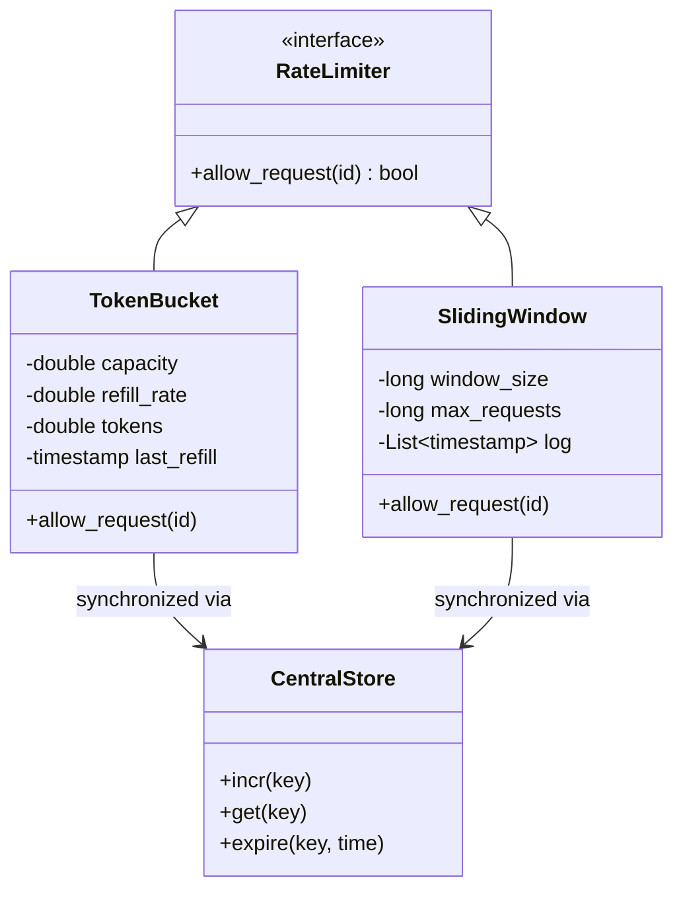

# 🚦 Machine Coding: Distributed Rate Limiter

## 📝 Overview
A **Distributed Rate Limiter** controls the rate of traffic allowed into a service from a user or client. In a cluster environment, this limit must be enforced across multiple server nodes using a centralized, high-performance store to prevent individual nodes from being overwhelmed by a distributed surge.

!!! info "Why This Challenge?"
    - **Shared State Synchronization:** Mastery of synchronizing counters across a cluster using Redis or Atomic Shared Memory.
    - **Race Condition Prevention:** Evaluates your use of atomic operations (INCR/GET) or Lua scripts to ensure consistency.
    - **Algorithm Implementation:** Deep dive into high-performance traffic control (Token Bucket vs. Sliding Window).

---

## 🏭 The Scenario & Requirements

### 😡 The Problem (The Villain)
**"The Noisy Neighbor."** A single user scripts a malicious tool that sends 10,000 requests per second. Local (in-memory) rate limiting fails because you have 10 server nodes. Each node only sees 1,000 requests and allows them through, but the downstream database only handles 2,000 total and crashes, taking down the entire system for everyone else.

### 🦸 The System (The Hero)
**"The Centralized Arbiter."** A high-speed, thread-safe traffic controller that maintains a global "Ticket Counter" in a central store. Before any node processes a request, it must "Check-and-Increment" a shared key. If the user has exhausted their global quota, the request is rejected immediately at the edge.

### 📜 Requirements & Constraints
1.  **Functional:**
    -   **Algorithm Support:** Implement "Sliding Window" or "Token Bucket" for accurate tracking.
    -   **Multi-tenant Limits:** Different quotas for different users (API keys) or tiers (Free vs. Premium).
    -   **Atomic Checks:** The "Check and Increment" operation must be atomic.
2.  **Technical:**
    -   **Distributed Consistency:** Limits must be enforced across multiple server instances.
    -   **Low Overhead:** The check must add < 1ms of latency to the request lifecycle.
    -   **Resilience:** If the central store is down, the system should "Fail Open" (allow) to avoid total denial of service.

---

## 🏗️ Design & Architecture

### 🧠 Thinking Process
Rate limiting requires a global source of truth. We use a **Key-Value Store** (like Redis) and assign keys based on user/API identifiers.
1.  **Token Bucket:** Maintains a bucket of tokens that refills at a fixed rate.
2.  **Sliding Window:** Maintains a timestamp log of requests within the last $T$ seconds.
3.  **Atomicity:** We use **Atomic Increments** or **Lua Scripts** to ensure the counter doesn't suffer from "Read-Modify-Write" race conditions.

### 🧩 Class Diagram


### ⚙️ Design Patterns Applied
- **Strategy Pattern**: For switching between different algorithms based on the use case.
- **Decorator Pattern**: To wrap existing API controllers with the rate-limiting logic.
- **Singleton Pattern**: For the connection pool to the central data store.
- **Factory Pattern**: For creating rate limiter instances with custom configurations.

---

## 💻 Solution Implementation

!!! success "The Code"
    ```python
    --8<-- "machine_coding/distributed/rate_limiter/rate_limiter.py"
    ```

### 🔬 Why This Works (Evaluation)
This implementation uses the **Sliding Window Log** algorithm. By keeping a log of timestamps in a shared store, we can count exactly how many requests occurred in the last $X$ seconds. Using an atomic operation (like `MULTI/EXEC` in Redis or `Lua scripts`) ensures that the "is it allowed?" check and the "add new timestamp" action happen as a single indivisible unit, preventing double-counting.

---

## ⚖️ Trade-offs & Limitations

| Decision | Pros | Cons / Limitations |
| :--- | :--- | :--- |
| **Centralized Store** | Perfect global accuracy across any number of nodes. | Adds a network round-trip to every request (latency). |
| **Sliding Window** | Most accurate; no "window reset" edge cases. | Memory-intensive for very high traffic (storing every timestamp). |
| **Token Bucket** | Efficient memory usage; allows for "bursting." | Slightly less accurate in terms of strict per-second windowing. |

---

## 🎤 Interview Toolkit

- **Latency Probe:** How would you handle the latency of checking Redis on every request? (Mention **Local Caching** or **Striped Counters** to reduce network pressure).
- **Failure Mode:** What if the central Redis node dies? (Discuss **Fail-Open** logic where the system defaults to "Allow" to preserve availability).
- **Algorithm Choice:** Why choose Token Bucket over Fixed Window? (Fixed Window allows double the quota if two requests land on the edge of the window; Token Bucket smooths this out).

## 🔗 Related Challenges
- [Persistent Pub-Sub](../pub_sub/PROBLEM.md) — To throttle message production or consumption rates.
- [Scalable Job Scheduler](../job_scheduler/PROBLEM.md) — To limit the rate of job submissions and prevent backend flooding.
