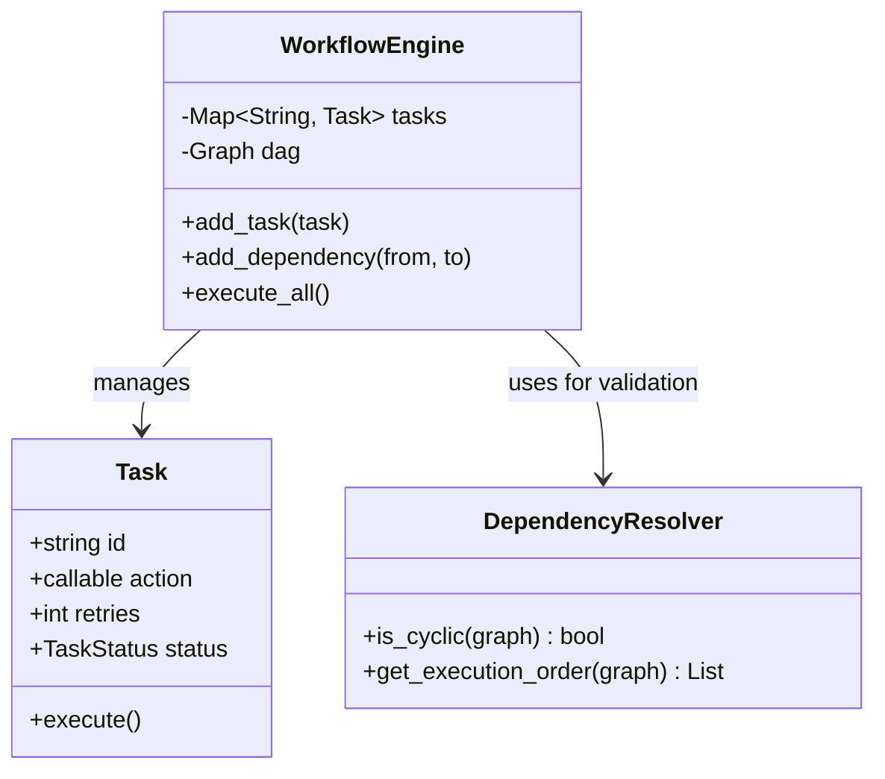

# ⛓️ Machine Coding: Enterprise Workflow Orchestrator (DAG Engine)

## 📝 Overview
An **Enterprise Workflow Orchestrator** is a system that manages the execution of complex, interdependent tasks defined as a **Directed Acyclic Graph (DAG)**. It handles dependency resolution, parallel execution of independent branches, and robust fault tolerance for business-critical processes.

!!! info "Why This Challenge?"
    - **Advanced Data Structures:** Mastery of Directed Acyclic Graphs (DAGs) to represent and traverse complex business workflows.
    - **Parallel Execution Management:** Evaluates your ability to identify and execute independent task branches concurrently to minimize total runtime.
    - **Robust Error Handling:** Tests your implementation of automated retries, failure recovery, and state persistence at the engine level.

---

## 🏭 The Scenario & Requirements

### 😡 The Problem (The Villain)
**"The Spaghetti Workflow."** A messy system where business logic is hardcoded into a linear script. If "Task B" fails, the entire script crashes, leaving "Task A" finished but "Task C" (which didn't depend on B) unexecuted. Adding a new dependency requires rewriting the core execution loop, and circular dependencies go undetected, causing infinite hangs.

### 🦸 The System (The Hero)
**"The DAG Engine."** A decoupled orchestration layer that separates "What to do" (the Task) from "When to do it" (the Dependency). It uses **Topological Sorting** to resolve the execution order, detects cycles instantly, and uses a thread pool to run independent branches in parallel, ensuring maximum efficiency and reliability.

### 📜 Requirements & Constraints
1.  **Functional:**
    -   **Graph Definition:** Support defining tasks and their directed dependencies.
    -   **Cycle Detection:** Automatically reject graphs with circular dependencies (A $\rightarrow$ B $\rightarrow$ A).
    -   **Parallel Execution:** Execute tasks simultaneously if they have no mutual dependencies.
    -   **State Tracking:** Maintain the lifecycle of every task (PENDING, RUNNING, COMPLETED, FAILED).
2.  **Technical:**
    -   **Topological Resolution:** Ensure a task only starts after ALL its parents have successfully completed.
    -   **Retry Logic:** Support configurable retries with exponential backoff for individual task failures.
    -   **Audit Logging:** Detailed execution logs for every node in the graph.

---

## 🏗️ Design & Architecture

### 🧠 Thinking Process
To orchestrate complex workflows, we use a graph-based approach:
1.  **Node/Task:** Encapsulates the actual work to be done.
2.  **DAG Manager:** Validates the graph for cycles and maintains the in-degree of every node.
3.  **Executor:** A thread-pool based worker that picks up nodes with an in-degree of 0 (all dependencies met) and executes them.
4.  **State Machine:** Updates the graph state as tasks finish, triggering the next set of available nodes.

### 🧩 Class Diagram


### ⚙️ Design Patterns Applied
- **Command Pattern**: Encapsulating each workflow task as a command object that the engine can execute.
- **Composite Pattern**: (Potential) Treating a sub-graph as a single task node for nested workflows.
- **State Pattern**: Strictly managing transitions between `READY`, `RUNNING`, `SUCCESS`, and `FAILED`.
- **Observer Pattern**: For monitoring task progress and triggering downstream nodes on completion.

---

## 💻 Solution Implementation

!!! success "The Code"
    ```python
    --8<-- "machine_coding/distributed/workflow_orchestrator/dag_engine.py"
    ```

### 🔬 Why This Works (Evaluation)
The engine uses a **Kahn's Algorithm** (Topological Sort) variation. It maintains a "Ready Queue" of tasks whose dependencies are satisfied. As each task completes, the engine decrements the dependency count of its children. This naturally allows for **Maximum Parallelism**—if 5 tasks have no dependencies, they are all pushed to the executor pool at once.

---

## ⚖️ Trade-offs & Limitations

| Decision | Pros | Cons / Limitations |
| :--- | :--- | :--- |
| **In-Memory Graph** | Extremely fast traversal and state updates. | State is lost if the engine crashes mid-workflow; requires external persistence for long-running DAGs. |
| **Centralized Scheduler** | Simple to detect cycles and manage global parallelism. | The scheduler can become a bottleneck if the DAG has millions of nodes. |
| **Dynamic Branching** | (Not supported) Simplifies cycle detection and validation. | Cannot handle workflows where the graph structure changes based on runtime data. |

---

## 🎤 Interview Toolkit

- **Cycle Detection:** How do you detect a loop in $O(V+E)$ time? (Use **DFS** to find back-edges or **Kahn's Algorithm** to see if all nodes were processed).
- **Failure Recovery:** What if the engine crashes after Task 5 of 10? (Mention **Checkpointing**—saving the set of `COMPLETED` task IDs to a database).
- **Resource Constraints:** How would you limit the number of parallel tasks to 5? (Use a **Semaphore** or a fixed-size `ThreadPoolExecutor`).

## 🔗 Related Challenges
- [Scalable Job Scheduler](../job_scheduler/PROBLEM.md) — For the low-level execution of individual tasks in the workflow.
- [Persistent Pub-Sub](../pub_sub/PROBLEM.md) — To trigger workflows automatically based on incoming event streams.
