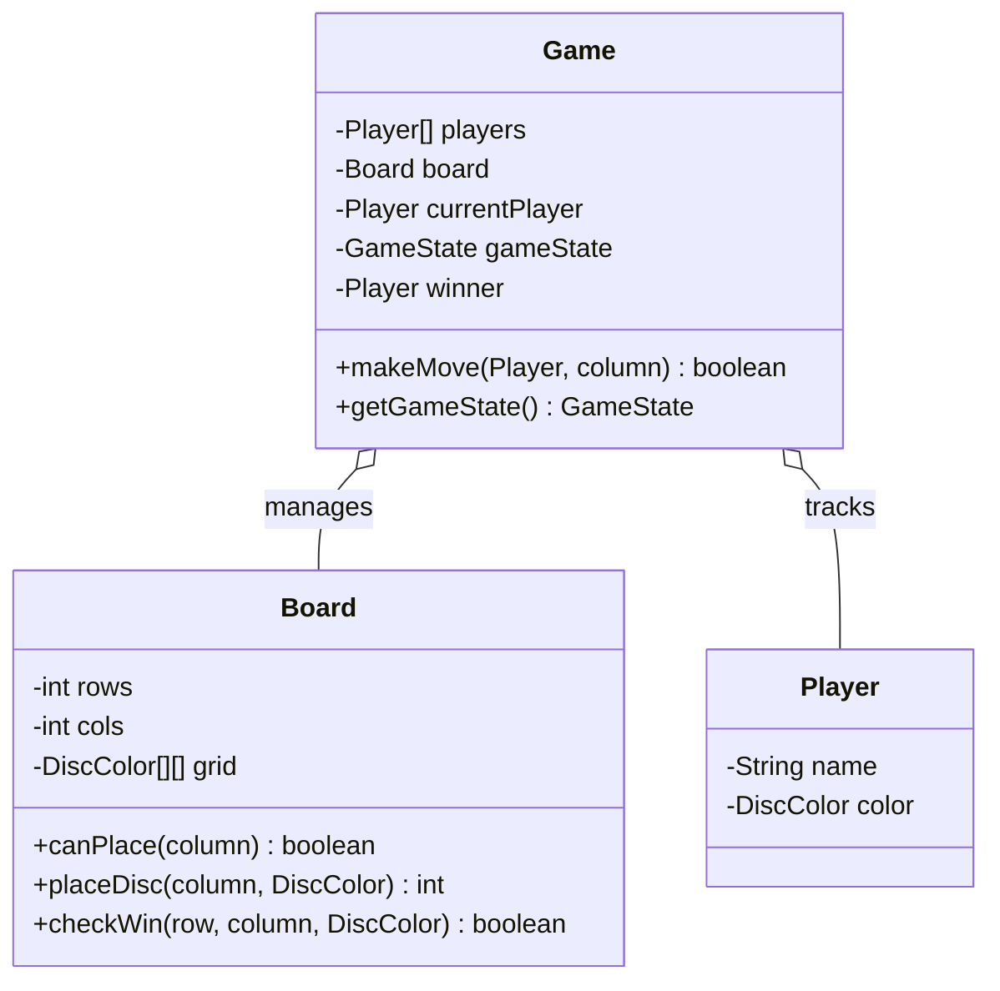

# 🎮 Machine Coding: Connect Four Low-Level Design

## 📝 Overview
Connect Four is a classic two-player connection game where participants take turns dropping discs into a 7-column, 6-row grid, aiming to align four pieces vertically, horizontally, or diagonally. This system design models the backend engine to orchestrate turns, enforce board mechanics, and detect win/draw states efficiently without coupling the rules to a user interface.

!!! info "Why This Challenge?"
    - **Separation of Concerns:** Evaluates your ability to separate game orchestration (turns, state) from physical board mechanics (grid boundaries, disc dropping).
    - **Algorithm Design:** Tests your ability to efficiently scan a 2D grid for contiguous patterns using directional vectors.
    - **Extensibility:** Assesses how easily your design can accommodate new features like an AI opponent or an "undo" mechanism without modifying core rules.

---

## 🏭 The Scenario & Requirements

### 😡 The Problem (The Villain)
Managing board games in software often leads to bloated "god classes" where turn validation, grid manipulation, and win-condition checking are all tangled together. When this happens, adding a simple feature like a computer opponent or changing the board dimensions requires rewriting the entire game engine.

### 🦸 The System (The Hero)
A cleanly decoupled object-oriented game engine. We will introduce dedicated entities for the `Board`, the `Game` flow, and the `Player`, ensuring that physical grid rules are completely isolated from turn-based orchestration.

### 📜 Requirements & Constraints
1. **(Functional):** Players must choose a column (0-6), and their disc must fall to the lowest available row in that column.
2. **(Functional):** The game must end when a player aligns four discs (vertically, horizontally, or diagonally) or when the board fills up (a draw).
3. **(Functional):** The system must reject invalid moves (e.g., moving out of turn, or placing a disc in a full column) without corrupting the game state.
4. **(Technical):** The design must focus strictly on backend logic (no UI rendering) and support one active game per instance.

---

## 🏗️ Design & Architecture

### 🧠 Thinking Process
To prevent the system from ballooning into a monolithic structure, we filter the nouns from our requirements into three distinct entities with strict responsibilities:
1.  **`Game` (Orchestrator):** Controls the lifecycle. It tracks whose turn it is, manages the overall game state (in progress, won, draw), and delegates the actual disc placement to the board.
2.  **`Board` (Grid Owner):** Manages the 7x6 grid array. It is responsible for calculating where a disc lands, checking if a column is full, and detecting if four discs connect. It has no concept of "turns" or "players".
3.  **`Player` (Data Holder):** A simple data class containing the player's identity and their assigned disc color. It contains no game logic.

### 🧩 Class Diagram
*(The Object-Oriented Blueprint. Who owns what?)*


### ⚙️ Design Patterns Applied
- **Information Expert / Tell, Don't Ask:** `Game` does not ask `Board` for the grid array to check for a win itself; instead, it tells `Board` to check for a win and return a boolean result. This keeps the 2D array encapsulated inside `Board`.
- **Value Object:** By representing `DiscColor` as a simple Enum inside the grid rather than storing `Player` references, we make the `Board` independently testable without needing to mock `Player` objects.

---

## 💻 Solution Implementation

???+ success "The Code Outline"
    ```python
    class Game:
        def makeMove(self, player, column):
            if self.gameState != GameState.IN_PROGRESS or player != self.currentPlayer:
                return False
            
            # Delegate to board
            row = self.board.placeDisc(column, player.getColor())
            if row == -1: # Invalid move
                return False
                
            if self.board.checkWin(row, column, player.getColor()):
                self.gameState = GameState.WON
                self.winner = player
            elif self.board.isFull():
                self.gameState = GameState.DRAW
            else:
                self.switchTurn()
                
            return True
            
    class Board:
        def checkWin(self, row, col, color):
            # Direction vectors: Horizontal, Vertical, Diagonal Right, Diagonal Left
            directions = [(0,1), (1,0), (1,1), (-1,1)]
            for dr, dc in directions:
                # Count contiguous discs in both positive and negative directions
                count = 1 + self.countInDirection(row, col, dr, dc, color) + \
                            self.countInDirection(row, col, -dr, -dc, color)
                if count >= 4:
                    return True
            return False
    ```

### 🔬 Why This Works (Evaluation)
The most complex part of Connect Four is the win detection. Instead of writing massive `if-else` blocks for every possible line combination, we use a **directional vector approach**. When a piece is placed, the `Board` checks the four intersecting axes passing through that specific `(row, col)` coordinate by counting matching adjacent discs. 

Furthermore, validation is properly layered. The `Game` class rejects out-of-turn moves, while the `Board` rejects out-of-bounds columns or full columns. Because `makeMove` returns `-1` on a failed placement, `Game` simply aborts the turn switch without corrupting the state.

---

## ⚖️ Trade-offs & Limitations

| Decision | Pros | Cons / Limitations |
| :--- | :--- | :--- |
| **Returning `boolean` for `makeMove`** | Simple to implement and keeps flow logic clean in an interview setting. | Less descriptive than throwing specific Exceptions (e.g., `ColumnFullException`, `NotYourTurnException`). |
| **Storing `DiscColor` instead of `Player` on Board** | Decouples the `Board` from `Player` dependencies, allowing for easier unit testing. | Requires mapping the color back to the player at the `Game` level to determine the winner. |
| **Fixed 7x6 array** | Fast ($O(1)$ access) and highly memory-efficient. | Less flexible than dynamic sizing, though passing `rows` and `cols` in the constructor can easily fix this. |

---

## 🎤 Interview Toolkit

- **Concurrency Probe:** *How would you handle multiple concurrent games?* 
  Since the `Game` class completely encapsulates its own `Board` and `Players`, it is inherently safe to instantiate thousands of `Game` objects in memory. You would manage them using a `GameManager` or a `ConcurrentHashMap` mapping `GameId` to `Game` instances.
- **Extensibility (Undo Move):** *How would you add move history/undo?*
  Because all state transitions flow through `Game.makeMove()`, you can introduce a `moveHistory` stack. Each successful turn pushes a `Move(player, row, col)` record. `undo()` pops the stack, tells the `Board` to clear the specific cell, and restores the previous turn state.
- **Extensibility (AI Opponent):** *How would you add a computer bot?*
  Do not change the `Game` or `Board` rules. Create a separate `BotEngine` component that analyzes the `Board` and returns a column integer. To the `Game` orchestrator, this just looks like a regular call to `makeMove(currentPlayer, chosenColumn)`.

## 🔗 Related Challenges
- [Tic-Tac-Toe LLD](../tic_tac_toe/PROBLEM.md) — Shares the same Orchestrator/Board/Player separation, but with a simpler 3x3 win-detection algorithm.
- [Amazon Locker LLD](../../systems/amazon_locker/PROBLEM.md) — Another matrix/grid allocation problem, emphasizing state management for occupied vs. unoccupied spaces.
