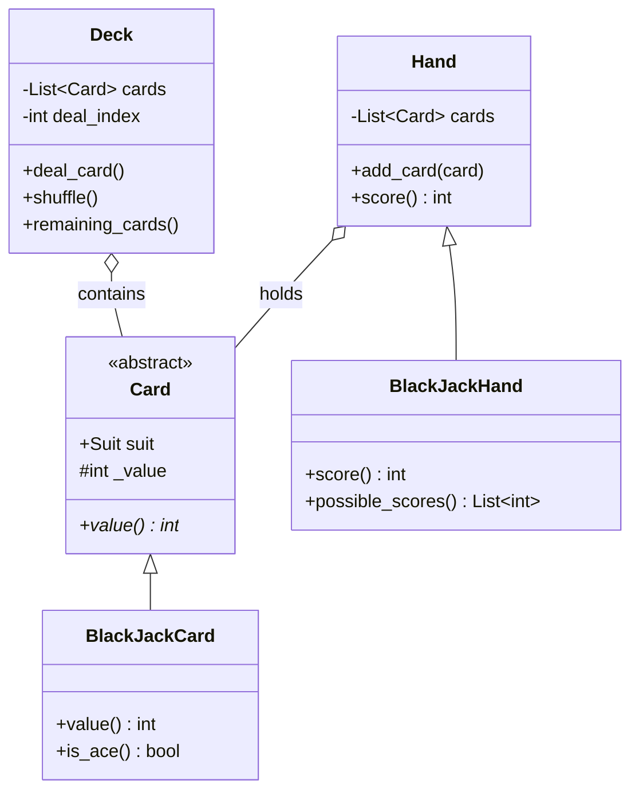

# 🃏 Machine Coding: Deck of Cards (Blackjack)

## 📝 Overview
A flexible, object-oriented framework for a standard deck of cards, specifically extended to handle the complex, dynamic scoring rules of Blackjack. 

!!! info "Why This Challenge?"
    - **Inheritance & Polymorphism:** Tests your ability to design abstract base classes (`Card`, `Hand`) that safely delegate game-specific logic to concrete subclasses.
    - **Algorithmic Edge Cases:** Evaluates how you handle dynamic state changes—specifically, the dual-value nature of the "Ace" in Blackjack (1 or 11).
    - **Extensibility:** Ensures your architecture can easily support other games (like Poker or Rummy) without rewriting the core `Deck` mechanics.

---

## 🏭 The Scenario & Requirements

### 😡 The Problem (The Villain)
Building a generic card game engine is inherently difficult because every game calculates values differently. Blackjack is notoriously messy because an "Ace" isn't just one static value—it's a quantum state of 1 or 11. If you hardcode this logic directly into a `Card` object, the system breaks the moment you want to use the same deck for a game of Poker. 

### 🦸 The System (The Hero)
An extensible object-oriented framework. Base classes (`Deck`, `Hand`, `Card`) strictly handle generic mechanics: holding cards, shuffling, and dealing. Subclasses (`BlackJackCard`, `BlackJackHand`) inject game-specific domain logic, cleanly isolating the complex, branching math required to score multiple Aces.

### 📜 Requirements & Constraints
1.  **(Functional):** Must simulate a standard 52-card deck with 4 suits.
2.  **(Functional):** The deck must support dealing cards one by one and shuffling only the remaining, undealt cards.
3.  **(Functional):** Blackjack scoring must correctly handle face cards (J, Q, K = 10) and the Ace duality.
4.  **(Technical):** A hand with multiple Aces (e.g., `Ace, Ace, 9`) must automatically calculate the highest possible score without busting (21).

---

## 🏗️ Design & Architecture

### 🧠 Thinking Process
To enforce the **Single Responsibility Principle**, we separate the *physical* representation of a card from its *game-specific* value:     
1.  **Card (Abstract):** Holds the raw state (e.g., Suit: Heart, Face Value: 1).    
2.  **BlackJackCard:** Overrides the abstract `value` property. Translates raw face values (11, 12, 13) into Blackjack values (10).     
3.  **Hand & BlackJackHand:** `Hand` is a generic container. `BlackJackHand` contains the complex evaluation logic to sum the cards, dynamically branching whenever it encounters an Ace.   
4.  **Deck:** Acts as the dealer's shoe. Ignorant of the game being played.

### 🧩 Class Diagram
*(The Object-Oriented Blueprint. Who owns what?)*


### ⚙️ Design Patterns Applied

  - **Template Method (Concept):** The `Card` base class defines the structure, but forces subclasses to implement the actual `value` retrieval logic via `@abstractmethod`.
  - **Strategy Pattern (via Subclassing):** `BlackJackHand` provides a specific scoring strategy that overrides the basic cumulative summation found in the generic `Hand` class.

-----

## 💻 Solution Implementation

???+ success "The Code"
    ```python
    --8<-- "machine_coding/games/deck_of_cards/deck_of_cards.py"
    ```

### 🔬 Why This Works (Evaluation)

The hardest algorithmic constraint is scoring multiple Aces. Instead of writing messy, deeply nested `if/else` chains, `BlackJackHand.possible_scores()` utilizes a **BFS-like branching array**.

Every time it iterates over an Ace, it duplicates the current running totals—one branch adding `1`, the other adding `11`. The `score()` method then simply filters this array, selecting the highest valid total $\le 21$, or the lowest busted total if a bust is unavoidable.

-----

## ⚖️ Trade-offs & Limitations

| Decision | Pros | Cons / Limitations |
| :--- | :--- | :--- |
| **BFS Branching for Aces** | 100% accurate for any edge case involving multiple Aces. | $O(2^N)$ complexity where N is the number of Aces. |
| **Index-based Dealing** | `deal_index += 1` is $O(1)$ and preserves the deck's history. | The underlying array is never shrunk; keeps dealt cards in memory. |
| **Strong Typing (`BlackJackCard`)** | Prevents generic cards from being scored in a Blackjack hand. | Requires creating parallel classes for every new game added to the system. |

-----

## 🎤 Interview Toolkit

  - **Algorithmic Probe:** "Your BFS Ace calculation is $O(2^N)$. What if we played a variant where a hand could have 1,000 Aces? How do you optimize it?" -\> *(Instead of branching, use a mathematical approach: Count the total number of Aces. Add them all as `1`s. Then, if the total sum is $\le 11$, upgrade exactly one Ace to `11` (adding 10). This reduces the time and space complexity to $O(N)$).*
  - **Extensibility:** "How would you add Texas Hold'em Poker to this system?" -\> *(Create a `PokerCard` mapping suits/faces, and a `PokerHand` that overrides `score()` to evaluate combinations like Flushes, Straights, and Pairs, leaving `Deck` completely untouched).*
  - **State Management:** "How do you handle a multi-deck 'shoe' commonly used in casinos?" -\> *(Simply instantiate the `Deck` class by passing in $N \times 52$ cards into its constructor list. The `deal_index` and `shuffle()` logic will scale natively).*

## 🔗 Related Challenges

  - [Tic-Tac-Toe Game](../tic_tac_toe/PROBLEM.md) — Another classic OOP game design focusing on rule validation and state matrices.
  - [Snake and Ladder](../snake_ladder/PROBLEM.md) — For modeling turn-based game progression and board entities.
