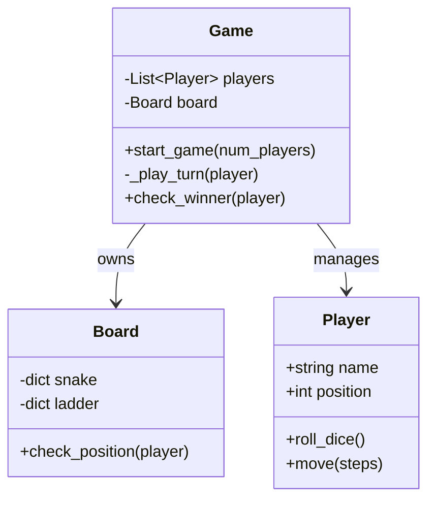

# 🐍 Machine Coding: Modular Snake & Ladder Game

## 📝 Overview
Design and implement a robust **Snake & Ladder** game engine. This challenge focuses on creating a modular, turn-based system that handles multiple players, dynamic board configurations with "jumps" (snakes and ladders), and fair dice mechanics.

!!! info "Why This Challenge?"
    - **Entity Modeling Mastery:** Tests your ability to represent real-world game components (Board, Players, Snakes, Ladders) as interacting objects.
    - **State Machine Logic:** Evaluates your management of turn-based transitions and game states until a victory condition is met.
    - **Extensibility:** Challenges you to design a system where new rules (e.g., special squares, multiple dice) can be added without refactoring core logic.

---

## 🏭 The Scenario & Requirements

### 😡 The Problem (The Villain)
**"The God Class."** A messy implementation where board layout, player turns, and dice logic are all crammed into one giant 500-line `while True` loop. Adding a simple "Special Booster" square or a second die requires rewriting half the codebase, and the game is prone to infinite loops between snakes and ladders.

### 🦸 The System (The Hero)
**"The Decoupled Engine."** An automated game manager that separates the **Board** (the physical layout) from the **Game Controller** (the turn logic). By treating snakes and ladders as generic "jumps" and using a strict player queue, the system ensures fairness, prevents infinite loops, and scales easily.

### 📜 Requirements & Constraints
1.  **Functional:**
    -   **Dynamic Board:** Support for a configurable grid (default 10x10) with custom snake and ladder positions.
    -   **Multi-Player:** Handle $N$ players with unique identifiers and a persistent turn order.
    -   **Dice Mechanics:** Implement a standard 6-sided die with an option for configurable $K$-sided dice.
    -   **Victory Logic:** Detect and announce the winner exactly when they reach the final square.
2.  **Technical:**
    -   **Exact Finish:** A player must roll the exact number required to land on square 100; otherwise, they remain in place.
    -   **Fairness:** Maintain a strict queue of players to ensure turn integrity.
    -   **Encapsulation:** Players should not be able to modify board state directly.

---

## 🏗️ Design & Architecture

### 🧠 Thinking Process
To transform these requirements into a clean system, we identify four core entities:    
1.  **Player:** Tracks identity and current position on the board.  
2.  **Board:** Acts as a data structure containing the "jump" mappings (Snakes/Ladders).    
3.  **Dice:** A utility for generating random movements.    
4.  **Game:** The orchestrator that manages the loop, turn transitions, and win conditions.

### 🧩 Class Diagram


### ⚙️ Design Patterns Applied
- **Strategy Pattern**: Used for the dice mechanics (easily swap a `StandardDie` for a `LoadedDie` or `MultiDie`).
- **State Pattern**: (Implicitly) Managing the game flow through states: `Initialization`, `Running`, and `Finished`.
- **Command Pattern**: Moves are encapsulated, allowing for future "Undo" functionality or move logging.

---

## 💻 Solution Implementation

???+ success "The Code"
    ```python
    --8<-- "machine_coding/games/snake_ladder/snake_ladder_full.py"
    ```

### 🔬 Why This Works (Evaluation)
The implementation separates **movement logic** from **board constraints**. When a player moves, the `Game` first updates their position and then asks the `Board` to "validate" it. If the player lands on a snake or ladder, the `Board` updates the player's position internally. This decoupling ensures that the `Game` loop doesn't need to know *why* a player moved from square 14 to 45—it only cares that the move was processed.

---

## ⚖️ Trade-offs & Limitations

| Decision | Pros | Cons / Limitations |
| :--- | :--- | :--- |
| **Dictionary-based Jumps** | $O(1)$ lookups for snakes and ladders. | Harder to implement complex "conditional" squares (e.g., move back 2 spots only on your first turn). |
| **Simple Integer Position** | Easy to calculate and compare. | Doesn't natively support 2D grid coordinates for UI visualization. |
| **Blocking `input()` loop** | Simple to implement for a CLI. | Cannot be easily converted to a real-time multiplayer web app without refactoring to an event-driven model. |

---

## 🎤 Interview Toolkit

- **Concurrency Probe:** How would you handle 4 players playing simultaneously from different computers? (Focus on a central game server and state synchronization).
- **Extensibility:** How would you add a "Booster" square that gives an extra turn? (Implement as a special jump type that returns a flag to the `Game` loop).
- **Data Persistence:** If the game crashes mid-way, how do we resume? (Serialize the `Game` state, including player queue and positions, to a JSON file).

## 🔗 Related Challenges
- [Scalable Tic-Tac-Toe](../tic_tac_toe/PROBLEM.md) — Another grid-based game focusing on $O(1)$ win detection.
- [Elevator System](../../systems/elevator/PROBLEM.md) — Focuses on state transitions and request queuing.
