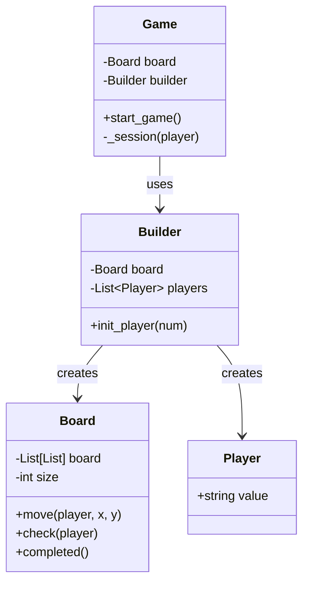

# ❌ Machine Coding: Scalable Tic-Tac-Toe

## 📝 Overview
Implement a standard **Tic-Tac-Toe** game designed for extensibility and efficiency. This challenge emphasizes clean object-oriented design, separation of concerns between board state and game rules, and an optimized win-detection algorithm that scales beyond the traditional 3x3 grid.

!!! info "Why This Challenge?"
    - **Algorithm Optimization:** Evaluates your ability to optimize win detection from $O(N^2)$ to $O(N)$ (or even $O(1)$ with pre-computation).
    - **Clean State Management:** Mastering the separation of the physical board (data) from the win/draw logic (rules).
    - **Input Validation & Safety:** Ensuring a robust interaction layer that prevents illegal moves and invalid user input.

---

## 🏭 The Scenario & Requirements

### 😡 The Problem (The Villain)
**"The $O(N^2)$ Scanner."** A naive implementation that scans the entire $N \times N$ board for a winner after every single move using nested loops. As the board grows to $100 \times 100$ (e.g., in Gomoku/Five-in-a-row), the game lags significantly, and the code becomes a "Bowl of Spaghetti" where win logic is coupled with input handling.

### 🦸 The System (The Hero)
**"The Incremental Validator."** An optimized game engine that maintains state-per-player and checks for win conditions only along the row, column, and diagonals of the *last move made*. This ensures high performance even for large board sizes.

### 📜 Requirements & Constraints
1.  **Functional:**
    -   **Configurable Grid:** Support for an $N \times N$ board (minimum 3x3).
    -   **Multi-Player:** Alternating turns for $M$ players (default 2: X and O).
    -   **Move Validation:** Block moves on occupied cells or out-of-bounds coordinates.
    -   **Win/Draw Detection:** Correct identification of row, column, and both diagonals.
2.  **Technical:**
    -   **Scalability:** The design should adapt to larger grids without changing core classes.
    -   **Input Safety:** Graceful handling of invalid inputs (non-integers, out-of-range).
    -   **Separation of Concerns:** Distinct classes for `Board`, `Player`, `Game`, and `Builder`.

---

## 🏗️ Design & Architecture

### 🧠 Thinking Process
To ensure the system is "Scalable," we use the **Builder Pattern** for game initialization. We represent the `Board` as a grid of cells, and the `Game` as a controller that manages the flow. We assign each player a unique symbol/value and use the board to check if that value forms a complete line.

### 🧩 Class Diagram


### ⚙️ Design Patterns Applied
- **Builder Pattern**: Decoupling the complex initialization of players and board size from the `Game` execution logic.
- **Strategy Pattern**: (Potential) Swapping different win-check algorithms (e.g., $O(N)$ row-scan vs $O(1)$ counter-scan).
- **Iterator Pattern**: (Via `itertools.cycle`) Managing player turns in a circular, infinite loop until a terminal state is reached.

---

## 💻 Solution Implementation

!!! success "The Code"
    ```python
    --8<-- "machine_coding/games/tic_tac_toe/tic_tac_toe_game.py"
    ```

### 🔬 Why This Works (Evaluation)
The implementation uses a **modular check system**. Instead of one giant function, it breaks down win detection into `Horizontal`, `Vertical`, and `Diagonal` checks. By taking the player's value as input, the same logic works for $N$ players without modification. The use of `cycle(players)` makes the turn-switching logic elegant and bug-free.

---

## ⚖️ Trade-offs & Limitations

| Decision | Pros | Cons / Limitations |
| :--- | :--- | :--- |
| **2D List Grid** | Highly intuitive to visualize and debug. | Slightly more memory usage than a bitboard for very large grids. |
| **Row/Col Scan** | Simple logic that works for any $N \times N$ size. | Currently $O(N)$ per move; could be $O(1)$ by storing counters for each row/col. |
| **CLI Input** | Zero dependencies, works in any terminal. | Not suitable for high-concurrency or low-latency network play. |

---

## 🎤 Interview Toolkit

- **Concurrency Probe:** If two players clicked a square at the exact same time on a server, how would you prevent a race condition? (Focus on using a Mutex/Lock on the `board.move` operation).
- **Extensibility:** How would you handle a 3D Tic-Tac-Toe (Cube)? (Update `Board` to 3D array and add checks for 4 new "space diagonals").
- **AI Integration:** How would you implement an "Expert" CPU opponent? (Mention the **Minimax Algorithm** with Alpha-Beta pruning).

## 🔗 Related Challenges
- [Snake & Ladder](../snake_ladder/PROBLEM.md) — For another turn-based grid game using different movement mechanics.
- [Parking Lot](../../systems/parking_lot/PROBLEM.md) — For advanced entity modeling and complex state management.
