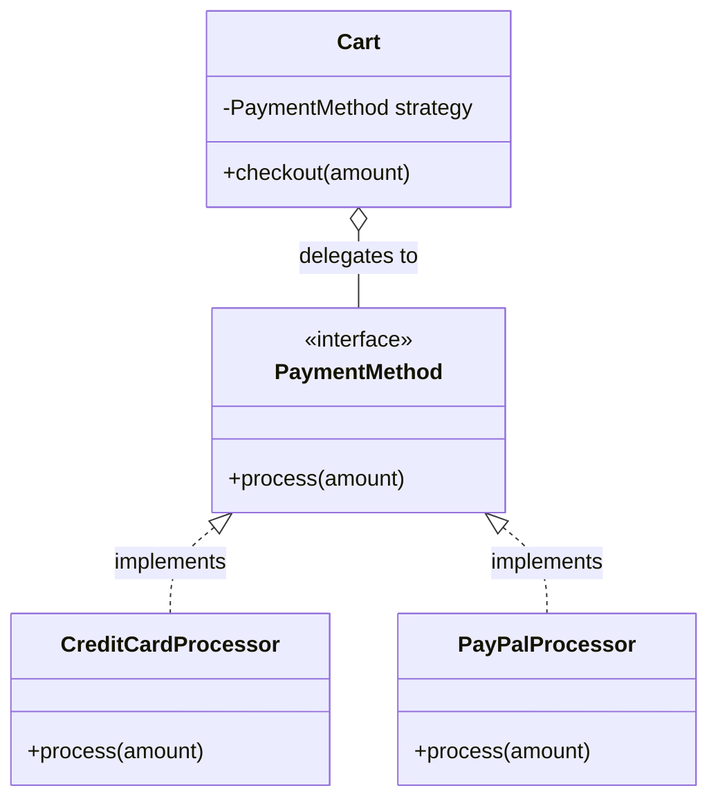

# 🧩 Guide: Design Patterns

## 📝 Overview
Design patterns are reusable building blocks for solving common design problems. They serve as names for structural solutions that naturally emerge when you follow solid object-oriented design principles. While the original Gang of Four (GoF) catalog defined 23 patterns in 1994, modern languages have built-in features that replaced many of them; in today's Low-Level Design (LLD) interviews, you only need to focus on a select few that actively solve modern architectural challenges.

!!! info "Why This Matters?"
    - **Core Skill:** Recognizing when to decouple logic, manage object creation, or structure complex relationships cleanly.
    - **Interview Relevance:** Interviewers look for your ability to apply these patterns to solve specific constraints (e.g., adding multiple payment methods or supporting complex state transitions). 
    - **Real-world Use:** These patterns are fundamental to building extensible, production-ready codebases that can absorb new requirements without massive rewrites.
    - **Common Mistake:** Forcing a pattern where it doesn't belong (over-engineering). Most interview-ready designs use no patterns, or at most one or two.

---

## 🗂️ Pattern Classification

Patterns fit cleanly into three distinct categories based on their primary purpose:
1. **Creational Patterns:** Control how objects are created. They hide construction details and keep code from being tightly coupled to specific classes.
2. **Structural Patterns:** Deal with how objects connect to each other. They help build flexible relationships without creating messy dependencies.
3. **Behavioral Patterns:** Control the flow of communication and distribute responsibilities between objects.

---

## 🧠 Core Concepts

### 🔑 Strategy (Behavioral)
- **Definition:** Replaces conditional logic (like `if/else` or `switch` statements) with polymorphism.
- **Key Idea:** Encapsulate different ways of doing the same thing into separate classes so you can swap them out at runtime. 
- **Example:** A `Cart` holds a reference to a `PaymentMethod` interface. It delegates the payment to concrete strategies like `CreditCardProcessor` or `PayPalProcessor`.
- **When to Use:** When you have interchangeable behaviors or variations of a business rule. It is the single most common pattern in LLD interviews.
- **When NOT to Use:** When there is only one way to execute an action and no foreseeable variations.

### 🔑 Observer (Behavioral)
- **Definition:** Lets objects subscribe to events and get notified when a state change happens.
- **Key Idea:** The subject maintains a list of observers and notifies them automatically, decoupling the source of the event from the systems that react to it.
- **Example:** A stock price changes, triggering automatic updates to multiple displays. 
- **When to Use:** When a change in one object requires updates in others, especially if you see words like "notify" or "update multiple components" in the prompt.

### 🔑 Factory Method (Creational)
- **Definition:** A helper that makes the right kind of object for you so you don't have to decide which one to create inline.
- **Key Idea:** Centralizes creation logic, keeping the rest of your code flexible when exact types change.
- **Example:** `notificationFactory.create(type)` returning either an `EmailNotification` or `SMSNotification`.
- **When to Use:** When requirements demand supporting different types of similar objects (e.g., "multiple payment methods") and you want to hide the instantiation logic.

### 🔑 State Machine (Behavioral)
- **Definition:** Encapsulates state-specific behavior into separate classes to handle complex state transitions cleanly.
- **Key Idea:** Eliminates scattered conditional checks for an object's current state by letting each state object govern its own valid actions and transitions.
- **Example:** A Vending Machine or Document Workflow where behavior differs drastically if the system is `Idle`, `Processing`, or `Completed`.
- **When to Use:** When the word "state" appears heavily in requirements and transitions get messy.

### 🔑 Decorator (Structural)
- **Definition:** Adds behavior to an object at runtime without changing its class.
- **Key Idea:** Wraps an object with another object that implements the same interface, layering on extra functionality.
- **Example:** Wrapping a base network request with logging, and then wrapping that again with encryption.
- **When to Use:** When you see words like "optional features", "stack behaviors", or need to combine enhancements without a subclass explosion.

### 🔑 Builder (Creational)
- **Definition:** Lets you create a complex object step by step.
- **Key Idea:** Handles objects with many optional parts or messy construction details, keeping constructors clean.
- **Example:** Building an HTTP request or configuration object.
- **When to Use:** When constructing a domain object requires 5+ parameters, many of which are optional.

---

## 🏗️ Mental Models & Intuition

Think of design patterns as a vocabulary for good design, not as a mandatory checklist. **Patterns arise from good design decisions rather than driving them**. If you follow the Open/Closed Principle and separate your concerns, you will naturally end up writing Strategies and Factories without even trying. 

> 💡 **Rule of Thumb:** If you're reaching for three or more patterns in a single 35-minute interview, you are almost certainly over-engineering. Focus on solving the problem cleanly and name the pattern afterward if it fits.

### 📐 Structure Diagram: Strategy Pattern


---

## ⚙️ Practical Examples

### 🪶 Simple Example: Factory & Strategy Combined
Here is how the Factory and Strategy patterns often work together to eliminate conditional bloat:

```python
# Strategy Interface & Implementations
class PaymentMethod(Protocol):
    def process(self, amount: float): pass

class CreditCard(PaymentMethod):
    def process(self, amount: float): print(f"Charging {amount} to CC")

class PayPal(PaymentMethod):
    def process(self, amount: float): print(f"Charging {amount} to PayPal")

# Factory hiding the creation logic
class PaymentFactory:
    @staticmethod
    def create(method_type: str) -> PaymentMethod:
        if method_type == "credit":
            return CreditCard()
        if method_type == "paypal":
            return PayPal()
        raise ValueError("Unknown method")

# The Orchestrator using the Strategy
class Cart:
    def checkout(self, amount: float, method_type: str):
        # Factory creates the strategy; Cart executes it (Strategy pattern)
        strategy = PaymentFactory.create(method_type)
        strategy.process(amount)
```

### 🏢 Real-World Example
In complex systems like an Amazon Locker or Connect Four game, the **Facade** pattern is naturally applied. Your `Game` or `Locker` class acts as a Facade: it orchestrates multiple components (the `Board`, `Player`, `Compartment`, `AccessToken`) behind a clean, simple API. You coordinate the subsystems internally so the caller doesn't have to navigate the complexity.

---

## ⚖️ Trade-offs & Limitations

| Aspect | Pros | Cons / Limitations |
| :--- | :--- | :--- |
| **Strategy** | Eliminates large `switch`/`if` blocks; highly extensible. | Adds multiple small classes which can spread out logic and increase cognitive load. |
| **Singleton** | Ensures exactly one shared resource (like a DB connection pool). | Hides dependencies, creates global state, and makes unit testing much harder. Interviewers generally dislike it. |
| **Observer** | Decouples the event producer from the event consumers. | Can lead to unpredictable cascading updates and memory leaks if observers aren't properly deregistered. |
| **Factory** | Centralizes instantiation; caller code doesn't change when new types are added. | Can be seen as over-engineering in some cultures if the creation logic is trivial. |

---

## 🔄 Comparison / Related Concepts

| Concept | Difference |
| :--- | :--- |
| **Decorator vs. Subclassing** | Subclassing fixes behavior at *compile-time* and creates a rigid hierarchy. Decorator allows layering optional behaviors dynamically at *runtime*. |
| **Strategy vs. State** | Both rely on composition and interfaces. **Strategy** swaps out an algorithm to perform a specific task. **State** allows an object to completely alter its behavior when its internal state changes, often handling its own transitions. |

---

## 🎤 Interview Focus

* **Definition Check:** Can you clearly explain that patterns are just established names for applying OOP principles (like Open/Closed and Dependency Inversion)?
* **Deep Dive:** Why is the Singleton pattern dangerous? (Answer: Global state, hidden dependencies, hard to test).
* **Application:** Transforming a heavily conditional prompt (e.g., "Support 5 different pricing rules") into a clean Strategy pattern.
* **Gotcha (Regional Differences):** In US Big Tech, interviewers rarely ask you to name patterns directly; they evaluate the design itself. In India/Asia, interviewers are more likely to ask you to explicitly identify and apply specific patterns. 

---

## 🚀 How to Apply This

1. **Start with KISS:** Read the prompt. Outline your entities and build the simplest working design first. Do not start by picking a pattern.
2. **Look for Variations:** If the prompt explicitly asks to "support multiple types" (notifications, vehicles, payment processors), apply the **Strategy** and **Factory** patterns.
3. **Look for Reactions:** If an action must trigger multiple downstream effects (e.g., "when an order is placed, notify inventory, email, and analytics"), apply the **Observer** pattern.
4. **Look for Lifecycle phases:** If an entity goes through distinct phases with different rules (e.g., `Draft` -> `Review` -> `Published`), sketch out a **State Machine**.

---

## 🔗 Related Topics

* **Design Principles** — The underlying rules (KISS, SOLID) that design patterns attempt to codify.
* **OOP Concepts** — Mechanisms like Polymorphism and Encapsulation that make implementing patterns like Strategy and Observer possible.
