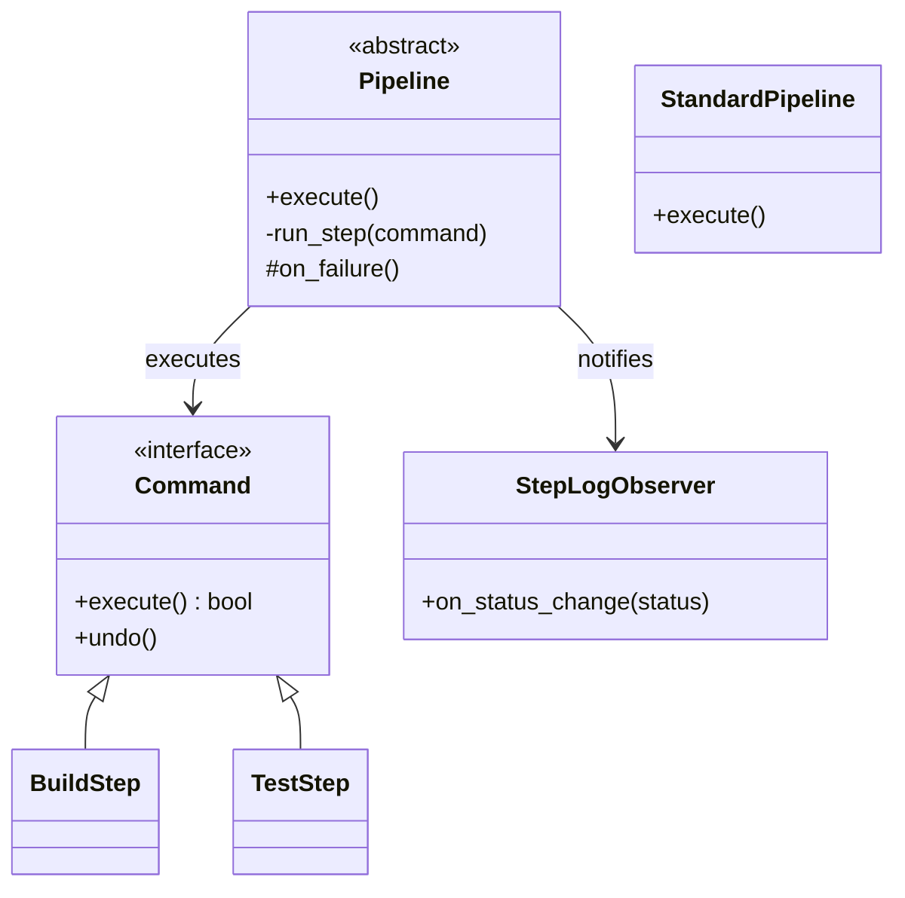

# 🏗️ Machine Coding: Custom CI/CD Pipeline Engine

## 📝 Overview
A **CI/CD (Continuous Integration / Continuous Deployment) Pipeline Engine** automates the lifecycle of software delivery—from code pull and testing to building and final deployment. This challenge focuses on building a modular, transactional engine that executes a series of sequential validation and deployment steps with high reliability.

!!! info "Why This Challenge?"
    - **Operational Reliability:** Mastery of building systems that automate mission-critical processes with zero tolerance for partial failure.
    - **Transactional Step Execution:** Evaluates your ability to encapsulate individual steps as commands, allowing for retries and clean rollbacks.
    - **Advanced Pattern Composition:** Mastery of combining the Template Method, Command, and Chain of Responsibility patterns into a cohesive workflow.

---

## 🏭 The Scenario & Requirements

### 😡 The Problem (The Villain)
**"The Brittle Deployment Script."** A single 2,000-line bash script that handles everything. If the `npm test` step fails, the script continues anyway and deploys broken code to the production server. One minor network glitch in the middle leaves the server in a "Half-Deployed" state, forcing a manual, high-pressure cleanup at 2 AM.

### 🦸 The System (The Hero)
**"The Transactional Pipeline."** An orchestration engine that treats every step (Build, Test, Deploy) as a **Durable Command**. It uses a **Template Method** to enforce a strict invariant sequence. If any step fails, the pipeline halts immediately and triggers an automated **Rollback Command** to restore the system to its last known good state.

### 📜 Requirements & Constraints
1.  **Functional:**
    -   **Sequential Workflow:** Define a fixed sequence (Pull $\rightarrow$ Build $\rightarrow$ Test $\rightarrow$ Deploy).
    -   **Validation Gates:** Use a "Chain of Responsibility" to ensure every quality gate (Syntax, Unit Tests) is passed before proceeding.
    -   **Fail-Fast Mechanism:** Immediately halt the pipeline upon the first step failure.
    -   **Observability:** Stream real-time logs and status updates (SUCCESS/FAILURE) to observers.
2.  **Technical:**
    -   **Modular Steps:** Each step must be an independent object for testability.
    -   **Error Propagation:** Transparently capture and report error codes from underlying OS processes.
    -   **Execution Context:** Maintain a shared state (e.g., artifact paths) that is passed between steps.

---

## 🏗️ Design & Architecture

### 🧠 Thinking Process
To ensure reliability, we combine three behavioral patterns:
1.  **Template Method:** Defines the skeleton (invariant) of the pipeline. Subclasses can override specific steps but cannot change the order.
2.  **Command Pattern:** Encapsulates each step (e.g., `GitPullCommand`, `DockerBuildCommand`) to manage execution and undo logic.
3.  **Chain of Responsibility:** Acts as the "Pre-flight" check, ensuring the environment is ready before expensive build steps begin.

### 🧩 Class Diagram


### ⚙️ Design Patterns Applied
- **Template Method Pattern**: To define the rigid skeleton of the CI/CD lifecycle (Invariant: sequence; Variant: implementation).
- **Command Pattern**: Encapsulating each build action as a command that can be retried or rolled back.
- **Chain of Responsibility Pattern**: For sequential "Quality Gates" where each gate must pass for the next to trigger.
- **Observer Pattern**: To stream real-time logs and build notifications to developers (Slack/CLI).

---

## 💻 Solution Implementation

???+ success "The Code"
    ```python
    --8<-- "machine_coding/real_world_systems/ci_cd_pipeline/ci_cd_pipeline.py"
    ```

### 🔬 Why This Works (Evaluation)
The engine separates **Workflow Management** from **Command Execution**. The `Pipeline` class handles the control flow (loops, error catching), while `Command` classes handle the interaction with the operating system. This decoupling allows you to swap a `MavenBuild` for a `DockerBuild` simply by changing the injected command, without touching the core orchestration logic.

---

## ⚖️ Trade-offs & Limitations

| Decision | Pros | Cons / Limitations |
| :--- | :--- | :--- |
| **Strict Sequential Execution** | Guaranteed consistency; easiest to reason about. | Cannot run independent tests in parallel, increasing total build time. |
| **Template Method (Inheritance)** | Enforces organizational standards across all teams. | Rigid structure; hard to add a "One-off" step without creating a new subclass. |
| **Synchronous Logging** | Immediate feedback in the terminal. | Can slow down the build if the logging target (e.g., a slow API) is unresponsive. |

---

## 🎤 Interview Toolkit

- **Concurrency Probe:** How would you run 5 test suites in parallel? (Discuss using a **Composite Command** that manages a thread pool of sub-commands).
- **Persistence:** How would you resume a failed build? (Save the `StepIndex` and `Context` to a database; resume from `StepIndex + 1`).
- **Isolation:** How do you ensure one build doesn't mess with another's files? (Mention running each `Command` inside a dedicated **Docker Container**).

## 🔗 Related Challenges
- [Workflow Orchestrator](../../distributed/workflow_orchestrator/PROBLEM.md) — For more complex, non-linear dependency graphs.
- [Persistent Pub-Sub](../../distributed/pub_sub/PROBLEM.md) — To trigger pipelines automatically based on Git Webhook events.
