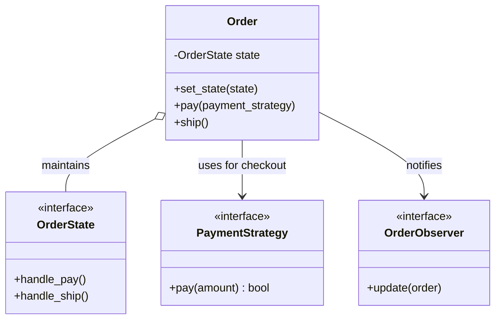

# 🛒 Machine Coding: E-Commerce Order Processing Engine

## 📝 Overview
An **Order Processing Engine** is the core of any e-commerce platform. It coordinates complex, transactional workflows involving state management, payment processing, inventory updates, and fulfillment logistics. This challenge serves as a masterclass in composing multiple design patterns to manage a critical object lifecycle.

!!! info "Why This Challenge?"
    - **Advanced Pattern Orchestration:** Mastery of combining the State, Strategy, and Observer patterns into a single, cohesive system.
    - **Finite State Machine Design:** Evaluates your ability to manage complex object lifecycles without brittle, nested `if-else` logic.
    - **Reactive Systems Architecture:** Tests your understanding of event-driven patterns to decouple core logic from side-effects (e.g., notifications, stock updates).

---

## 🏭 The Scenario & Requirements

### 😡 The Problem (The Villain)
**"The State Machine Spaghetti."** Managing order transitions with nested `if-else` blocks. Adding a new "Partially Refunded" status requires modifying 50 different functions, leading to bugs where "Cancelled" orders are still being shipped. Payment logic is tightly coupled to the UI, making it impossible to switch from Stripe to PayPal without a complete rewrite.

### 🦸 The System (The Hero)
**"The Pattern Orchestrator."** A modular order engine that uses the **State Pattern** to strictly enforce lifecycle transitions. It leverages the **Strategy Pattern** to swap payment gateways at runtime and the **Observer Pattern** to trigger asynchronous tasks (Inventory updates, Emails) automatically, ensuring a clean and extensible architecture.

### 📜 Requirements & Constraints
1.  **Functional:**
    -   **Lifecycle Transitions:** Manage an order through `PENDING` $\rightarrow$ `PAID` $\rightarrow$ `SHIPPED` $\rightarrow$ `DELIVERED`.
    -   **Interchangeable Payments:** Support multiple payment methods (Credit Card, UPI, PayPal) via a common interface.
    -   **Automated Side-Effects:** Automatically update inventory and notify users on state changes.
    -   **Transactional Consistency:** Ensure that inventory is only deducted *after* payment is confirmed.
2.  **Technical:**
    -   **Extensibility:** New states (e.g., `RETURNED`) should be added with minimal code changes.
    -   **Error Handling:** Gracefully handle payment failures and out-of-stock scenarios.
    -   **Auditability:** Every state change must be logged and traceable.

---

## 🏗️ Design & Architecture

### 🧠 Thinking Process
To handle these requirements, we adopt a triple-pattern design:     
1.  **State Pattern:** Encapsulates behavior for each order status (e.g., `PaidOrder` can ship, but `PendingOrder` cannot).     
2.  **Strategy Pattern:** Decouples "Payment Logic" from "Order Management."    
3.  **Observer Pattern:** Acts as a "Pub-Sub" mechanism, notifying other services when an order moves to a new state.

### 🧩 Class Diagram


### ⚙️ Design Patterns Applied
- **State Pattern**: To manage the transitions and valid actions for an order at each stage of its lifecycle.
- **Strategy Pattern**: To allow switching between different payment gateways and shipping calculators dynamically.
- **Observer Pattern**: To decouple the order status updates from secondary tasks like email notifications and inventory sync.
- **Factory Method**: (Potential) To create the correct `PaymentStrategy` based on user selection.

---

## 💻 Solution Implementation

???+ success "The Code"
    ```python
    --8<-- "machine_coding/real_world_systems/e_commerce_order_system/order_processing_engine.py"
    ```

### 🔬 Why This Works (Evaluation)
The system eliminates complex branching logic by delegating behavior to the current `OrderState`. For example, a `CancelledState` object would simply throw an error if the `ship()` method is called. The **Strategy Pattern** ensures the engine is "Payment Agnostic"—adding a new provider like Apple Pay requires zero changes to the `Order` class.

---

## ⚖️ Trade-offs & Limitations

| Decision | Pros | Cons / Limitations |
| :--- | :--- | :--- |
| **Heavy use of Patterns** | High extensibility and modularity; easy for large teams. | Initial "Boilerplate" is high for very simple order flows. |
| **Observer Pattern** | Decouples core logic from side-effects. | Harder to debug the order of operations if too many observers are added. |
| **In-Memory State** | Near-instant transitions. | State must be persisted to a database on every transition to handle server crashes. |

---

## 🎤 Interview Toolkit

- **Transactional Consistency:** How would you ensure inventory is reserved *before* payment? (Mention the **Reserve-Commit-Rollback** or **Saga Pattern**).
- **Concurrency:** How would you handle a "Flash Sale"? (Discuss using a **Distributed Queue** (Kafka) for order processing and **Optimistic Locking** on inventory).
- **Scale:** If you have 1 million orders/day, how do you handle state updates? (Mention **Event Sourcing** or a highly-available **KV Store** for state).

## 🔗 Related Challenges
- [Ride-Sharing Backend](../ride_sharing_service/PROBLEM.md) — For another complex workflow involving matching and payments.
- [Distributed Rate Limiter](../../distributed/rate_limiter/PROBLEM.md) — To protect the checkout API from massive surges during sales.
