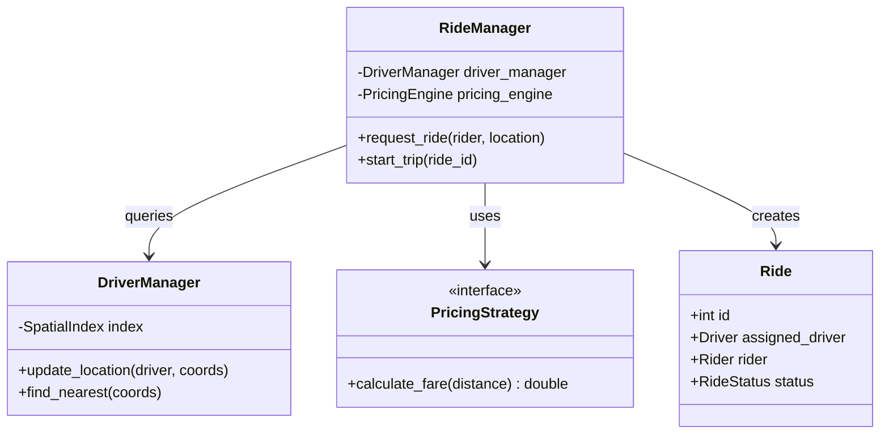

# 🚗 Machine Coding: Ride-Sharing Backend (Uber Lite)

## 📝 Overview
A **Ride-Sharing Service** is a complex system that matches demand (riders) with supply (drivers) in real-time. This challenge focuses on orchestrating location tracking, spatial matching algorithms, and dynamic pricing strategies within a highly concurrent environment.

!!! info "Why This Challenge?"
    - **Real-Time Orchestration:** Evaluates your ability to manage highly dynamic state (driver locations, ride requests) under high concurrency.
    - **Spatial Matching Logic:** Tests your implementation of efficient discovery algorithms to connect riders with nearby drivers in sub-millisecond time.
    - **Dynamic Pricing Systems:** Mastery of implementing complex business rules (Surge Pricing) that respond to real-time supply and demand.

---

## 🏭 The Scenario & Requirements

### 😡 The Problem (The Villain)
**"The Double-Assigned Driver."** Two riders in the same area request a ride at the same millisecond. Without atomic checks, the system assigns the same driver to both. One rider is left stranded, the driver is confused, and the backend crashes trying to handle two overlapping "Start Trip" events. Meanwhile, 100 drivers are idling while riders 500 meters away see "No Cars Available" due to inefficient spatial lookup.

### 🦸 The System (The Hero)
**"The Spatial Matchmaker."** A low-latency backend that uses **Geo-hashing** for lightning-fast spatial discovery. It implements a **Transactional Matching Engine** that ensures a driver is atomically locked during the assignment process, and uses a **Surge Pricing Strategy** to rebalance the market when demand spikes.

### 📜 Requirements & Constraints
1.  **Functional:**
    -   **Real-Time Driver Registry:** Track hundreds of thousands of drivers with their coordinates and status (IDLE, BUSY).
    -   **Spatial Matching:** Find the "Nearest 5" available drivers for a given rider location.
    -   **Ride Lifecycle:** Manage transitions from `REQUESTED` $\rightarrow$ `ACCEPTED` $\rightarrow$ `STARTED` $\rightarrow$ `COMPLETED`.
    -   **Surge Pricing:** Automatically adjust fares based on the current supply/demand ratio in a specific city zone.
2.  **Technical:**
    -   **Concurrency Control:** Matching must be atomic to prevent multiple assignments.
    -   **Efficiency:** Spatial discovery must be $O(\log N)$ or better (e.g., using Quad-trees or Geohash).
    -   **Scalability:** The system must handle frequent location updates (pings) without locking the main thread.

---

## 🏗️ Design & Architecture

### 🧠 Thinking Process
To handle the dynamic nature of ride-sharing, we use four key modules:
1.  **Driver Manager:** Maintains the spatial index of all active drivers.
2.  **Ride Manager:** Orchestrates the matching logic and trip lifecycle.
3.  **Pricing Engine:** Implements strategies to calculate fares based on distance, time, and demand.
4.  **Observer (Notification):** Broadcasts requests to drivers in the matching radius.

### 🧩 Class Diagram


### ⚙️ Design Patterns Applied
- **Strategy Pattern**: To implement different driver matching algorithms and dynamic pricing models (Standard vs. Surge).
- **Observer Pattern**: To notify all available drivers within a certain radius about a new `RideRequest`.
- **State Pattern**: To strictly manage the transition of a ride through its various stages.
- **Singleton Pattern**: For the central `RideManager` to ensure a consistent global state.

---

## 💻 Solution Implementation

???+ success "The Code"
    ```python
    --8<-- "machine_coding/real_world_systems/ride_sharing_service/ride_sharing_service.py"
    ```

### 🔬 Why This Works (Evaluation)
The system uses the **Strategy Pattern** for the "Matching Algorithm." By default, it might use simple Euclidean distance, but it can be easily swapped for a "Pro-Driver" strategy that prioritizes those with long idle times. Using the **State Pattern** for the `Ride` object prevents impossible actions—like trying to "Cancel" a trip that has already "Started"—at the code level.

---

## ⚖️ Trade-offs & Limitations

| Decision | Pros | Cons / Limitations |
| :--- | :--- | :--- |
| **Centralized Matching** | Simple to ensure atomic driver assignment. | Becomes a bottleneck for millions of requests; requires partitioning by city. |
| **Pull-based Notifications** | Reduces load on the driver's mobile client. | Latency between a request being created and a driver "seeing" it. |
| **In-Memory Spatial Index** | Sub-millisecond matching time. | Index must be rebuilt if the server crashes; requires persistent backup. |

---

## 🎤 Interview Toolkit

- **Spatial Scalability:** How would you find drivers in 0.1ms among 1 million candidates? (Mention **Geo-hashing** or **S2 Geometry** library).
- **Surge Calculation:** How do you define a "Zone" for surge pricing? (Mention **Hexagonal Grids** (H3) for uniform area coverage).
- **Exactly-Once Assignment:** How do you prevent two riders from getting the same driver? (Use **Distributed Locks** (Redlock) or a **Compare-and-Swap** database update on the driver's status).

## 🔗 Related Challenges
- [E-Commerce Order System](../e_commerce_order_system/PROBLEM.md) — For another complex state-driven transactional workflow.
- [High-Concurrency Parking Lot](../../systems/parking_lot/PROBLEM.md) — For managing a shared pool of resources similar to a driver pool.
