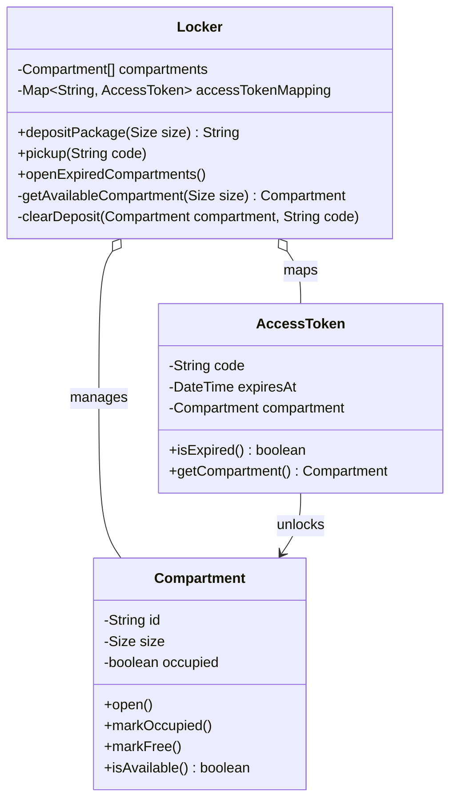

# 📦 Machine Coding: Amazon Locker Low-Level Design

## 📝 Overview
Amazon Locker is a self-service package pickup system where delivery drivers deposit packages and customers retrieve them using generated access codes. This system design models the orchestration of assigning correctly sized compartments, managing physical state, and securely validating timed access tokens.

!!! info "Why This Challenge?"
    - **Boundary Enforcement:** Tests your ability to establish clean boundaries between system orchestration (`Locker`) and physical state (`Compartment`).
    - **Entity Filtering:** Evaluates whether you can recognize that a `Package` is merely an input parameter (size), rather than a full entity needing its own class.
    - **Lifecycle Management:** Requires managing the expiration and cleanup of transient objects like access tokens.

---

## 🏭 The Scenario & Requirements

### 😡 The Problem (The Villain)
Delivery drivers need secure drop-off locations, but managing physical space allocation, tracking which package is in which box, and ensuring codes expire safely can quickly turn into a tangled "god class" of mapping logic. If a driver places a small package in a large locker prematurely, or an expired package isn't cleared, the system grinds to a halt.

### 🦸 The System (The Hero)
An object-oriented engine that completely separates the physical compartment state from the logical access tokens, ensuring secure deposits, timed pickups, and clean cleanup routines. 

### 📜 Requirements & Constraints
1.  **(Functional):** The system must assign an available compartment matching the exact requested package size (Small, Medium, Large). 
2.  **(Functional):** Upon successful deposit, an access token is generated and returned; this token expires after exactly 7 days.
3.  **(Functional):** Customers retrieve packages by entering the token code, which validates the code, opens the compartment, and clears the deposit.
4.  **(Functional):** Staff can trigger a command to open all compartments containing expired packages to manually remove them and return them to the sender.
5.  **(Technical):** The system should strictly reject invalid or expired tokens without locking the user out, and reject deposits if no matching compartments are available.

---

## 🏗️ Design & Architecture

### 🧠 Thinking Process
When determining the system's entities, we look for the nouns that maintain changing state or enforce rules. 
*   **`Package`:** We only care about its size to allocate a compartment, so it does not need to be an entity in our system. 
*   **`Compartment`:** Represents a physical locker slot with a size, ID, and occupancy state. 
*   **`AccessToken`:** A bearer token representing the right to open a specific compartment, which tracks its own 7-day expiration timestamp. 
*   **`Locker`:** Acts as the orchestrator and public API, holding the compartments and a map of active access tokens.

### 🧩 Class Diagram
*(The Object-Oriented Blueprint. Who owns what?)*


### ⚙️ Design Patterns Applied
- **Information Expert (Tell, Don't Ask):** Rules are kept with the entity that owns the relevant state. The `AccessToken` owns its expiration timestamp and exposes `isExpired()`, rather than the `Locker` extracting the timestamp to calculate it. 
- **Encapsulation:** `Compartment` manages its own physical `occupied` state and hardware mechanisms (`open()`) instead of the `Locker` directly manipulating boolean arrays.

---

## 💻 Solution Implementation

???+ success "The Code"
    ```python
    import uuid
    from datetime import datetime, timedelta
    from enum import Enum

    class Size(Enum):
        SMALL = 1
        MEDIUM = 2
        LARGE = 3

    class Compartment:
        def __init__(self, id: str, size: Size):
            self.id = id
            self.size = size
            self.occupied = False

        def open(self):
            print(f"Compartment {self.id} door opening...")

        def mark_occupied(self):
            self.occupied = True

        def mark_free(self):
            self.occupied = False

        def is_available(self) -> bool:
            return not self.occupied

    class AccessToken:
        def __init__(self, code: str, compartment: Compartment):
            self.code = code
            self.compartment = compartment
            self.expires_at = datetime.now() + timedelta(days=7)

        def is_expired(self) -> bool:
            return datetime.now() > self.expires_at

        def get_compartment(self) -> Compartment:
            return self.compartment

    class Locker:
        def __init__(self, compartments: list[Compartment]):
            self.compartments = compartments
            self.access_token_mapping = {}

        def deposit_package(self, size: Size) -> str:
            compartment = self._get_available_compartment(size)
            if not compartment:
                return ""  # Or throw an exception

            compartment.open()
            code = str(uuid.uuid4())
            token = AccessToken(code, compartment)
            
            compartment.mark_occupied()
            self.access_token_mapping[code] = token
            
            return code

        def pickup(self, code: str):
            token = self.access_token_mapping.get(code)
            
            if not token:
                raise ValueError("Invalid access token code")
                
            if token.is_expired():
                raise ValueError("Access token has expired")

            compartment = token.get_compartment()
            compartment.open()
            self._clear_deposit(compartment, code)

        def open_expired_compartments(self):
            for code, token in self.access_token_mapping.items():
                if token.is_expired():
                    token.get_compartment().open()
                    # Do NOT clear deposit here; staff must physically remove packages first

        def _clear_deposit(self, compartment: Compartment, code: str):
            compartment.mark_free()
            del self.access_token_mapping[code]

        def _get_available_compartment(self, size: Size) -> Compartment:
            for compartment in self.compartments:
                if compartment.size == size and compartment.is_available():
                    return compartment
            return None
    ```

### 🔬 Why This Works (Evaluation)
This implementation ensures clean separation of concerns: the `Locker` handles mapping and allocation, the `AccessToken` handles temporal logic, and the `Compartment` handles physical logic. 

A critical detail is how we handle expired tokens during pickup. If a customer tries to pick up an expired package, the token stays in the mapping and the compartment remains occupied because the package is still physically sitting in the locker. Staff must use `open_expired_compartments()` to physically retrieve the package before a separate cleanup method frees the compartment.

---

## ⚖️ Trade-offs & Limitations

| Decision | Pros | Cons / Limitations |
| :--- | :--- | :--- |
| **Occupancy inside `Compartment`** | Encapsulates physical state accurately since presence is intrinsic to the compartment itself. | Iterating over all compartments is $O(N)$. Tracking an `occupiedCompartments` Set in `Locker` would provide faster lookup. |
| **Fire-and-forget Deposit** | Extremely simple; unlocking and marking occupied happens in one synchronous method. | Assumes the driver actually deposits the package after opening the door. If they walk away, an empty compartment is locked and occupied. |
| **Specific exception handling on `pickup`** | Provides actionable feedback ("Expired" vs. "Invalid"), alerting the customer to contact support. | Requires keeping used/invalid codes distinguishable from expired ones in state. |

---

## 🎤 Interview Toolkit

- **Extensibility (Size Fallback):** *What if small compartments are full, but large ones are available?* 
  Change `_get_available_compartment` to scan iteratively through larger sizes (SMALL -> MEDIUM -> LARGE) if an exact match isn't found, instead of immediately failing.
- **Extensibility (Broken Compartments):** *How do you handle maintenance?*
  Replace the binary `occupied` boolean in `Compartment` with a `Status` enum (`AVAILABLE`, `OCCUPIED`, `OUT_OF_SERVICE`). The allocation logic automatically skips offline compartments.
- **Concurrency / Reliability:** *How do we ensure the driver didn't just walk away?*
  Split the `deposit` method into a **Two-Phase Commit**: `reserve_compartment()` (opens door) and `confirm_deposit()` (generates token). If `confirm` isn't called within 3 minutes, a timeout auto-cancels the reservation and frees the compartment.

## 🔗 Related Challenges
- [Parking Lot LLD](../parking_lot/PROBLEM.md) — Highly similar resource-allocation problem emphasizing spot tracking, capacities, and temporal fee generation instead of token expiration.
