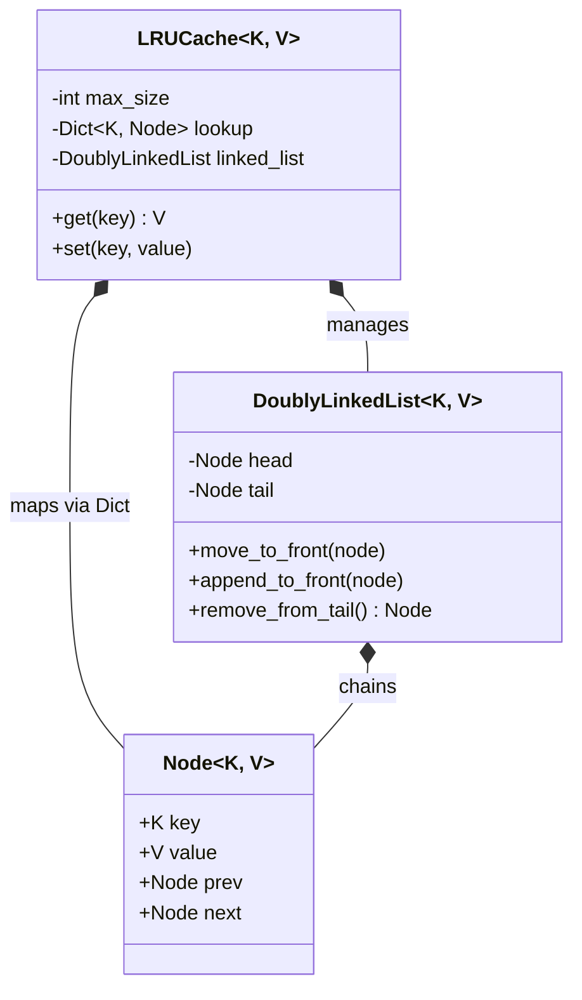

# ⚡ Machine Coding: LRU Cache (Least Recently Used)

## 📝 Overview
Design and implement a highly optimized, generic **In-Memory Cache** with a fixed capacity. This challenge focuses on advanced data structure composition to achieve strict $O(1)$ constant-time performance for both retrieval and eviction operations.

!!! info "Why This Challenge?"
    - **Data Structure Composition:** Evaluates your ability to combine Hash Maps and Doubly Linked Lists to bypass the limitations of each individual structure.
    - **Pointer Manipulation:** Tests your precision in managing `prev` and `next` memory pointers without creating orphaned nodes or memory leaks.
    - **Generics & Typing:** Demonstrates how to build highly reusable, type-safe data structures using Python's `Generic` and `TypeVar`.

---

## 🏭 The Scenario & Requirements

### 😡 The Problem (The Villain)
**"The $O(N)$ Eviction."** A naive cache implementation uses a standard array or list to track usage history. As the cache grows to millions of items, finding the "Least Recently Used" item to evict requires scanning the entire list or array shifting, causing massive latency spikes during high-traffic bursts.

### 🦸 The System (The Hero)
**"The Hybrid Store."** A lightning-fast cache that uses a **Hash Map** for $O(1)$ lookups and a **Doubly Linked List** to maintain access order in $O(1)$. By decoupling the key-value storage from the chronological eviction logic, the system handles massive throughput with deterministic, sub-millisecond latency.

### 📜 Requirements & Constraints
1.  **(Functional):** Implement `get(key)` to retrieve an item and mark it as recently used.
2.  **(Functional):** Implement `set(key, value)` to insert or update an item, marking it as recently used.
3.  **(Functional):** When the cache reaches its maximum capacity, it must automatically evict the Least Recently Used item before inserting a new one.
4.  **(Technical):** Both `get` and `set` must execute in strictly $O(1)$ time complexity.
5.  **(Technical):** The data structure must be generic and accept any hashable key type.

---

## 🏗️ Design & Architecture

### 🧠 Thinking Process
To achieve $O(1)$ for both lookup and eviction, we must combine two structures:     
1.  **Hash Map (`lookup`):** Stores `key -> Node` mapping for instant memory access to any item in the cache.   
2.  **Doubly Linked List:** Stores the actual nodes in order of recency. The Most Recently Used (MRU) nodes are moved to the `head`, and the Least Recently Used (LRU) node sits at the `tail`. 
3.  **Sentinel Nodes:** To prevent messy `if node.prev is None` edge cases during pointer manipulation, we initialize the linked list with a "dummy" `head` and `tail` node. All real data lives safely between them.

### 🧩 Class Diagram
*(The Object-Oriented Blueprint. Who owns what?)*


### ⚙️ Design Patterns Applied

  - **Structural Composition:** Fusing a Hash Map and a Linked List into a single cohesive facade.
  - **Sentinel Pattern:** Using dummy head and tail nodes to simplify structural boundary conditions and eliminate null-pointer checks during node extraction.

-----

## 💻 Solution Implementation

???+ success "The Code"
    ```python
    --8<-- "machine_coding/systems/cache/cache.py"
    ```

### 🔬 Why This Works (Evaluation)

The combination of the **Hash Map** and **Doubly Linked List** is the algorithmic key. When an item is accessed via `get`, the map provides the exact memory reference to the `Node` in $O(1)$. We then "pluck" the node from its current position by bridging its `prev` and `next` pointers, and move it to the front of the list in $O(1)$ (which is only possible because a doubly linked list allows us to look backward). Eviction is simply popping the node immediately preceding the dummy `tail` and deleting its key from the Hash Map.

-----

## ⚖️ Trade-offs & Limitations

| Decision | Pros | Cons / Limitations |
| :--- | :--- | :--- |
| **Doubly Linked List** | $O(1)$ extraction and reordering from the middle of the list. | High memory overhead (requires allocating 2 extra pointers per entry). |
| **Algorithmic Purity (No Locks)** | Maximum single-thread performance without context-switching overhead. | **Not Thread-Safe.** If multiple threads call `set()` concurrently, the linked list pointers will become corrupted. |
| **In-Memory Only** | Sub-millisecond latency. | Data is lost on server restart; cannot scale beyond the physical RAM of a single machine. |

-----

## 🎤 Interview Toolkit

  - **Concurrency Probe:** "This code isn't thread-safe. How would you modify it to safely handle 10,000 concurrent requests per second?" -\> *(Add a `threading.Lock()` around the `get` and `set` operations. For extreme throughput, implement **Striped Locking**—hashing keys into different segments and locking only the specific segment being modified).*
  - **Extensibility:** "How would you add a Time-To-Live (TTL) feature so keys expire after 5 minutes?" -\> *(Add a `timestamp` to the `Node`. Implement "Lazy Eviction" by checking the timestamp during a `get()` call and returning `None` if expired. Optionally, run a background 'janitor' thread to clean up stale nodes periodically).*
  - **Algorithm Pivot:** "What if we wanted an LFU (Least Frequently Used) cache instead?" -\> *(You would need to change the underlying structure, typically requiring two Hash Maps: one mapping `key -> value/frequency`, and another mapping `frequency -> DoublyLinkedList of nodes` to resolve ties).*

## 🔗 Related Challenges

  - [Hash Map (Dictionary)](../hash_map/PROBLEM.md) — The underlying foundation of the `lookup` dictionary used in this challenge.
  - [Distributed Rate Limiter](../../distributed/rate_limiter/PROBLEM.md) — Uses a cache-like structural approach for tracking requests and evicting old timestamps via Sliding Windows.
