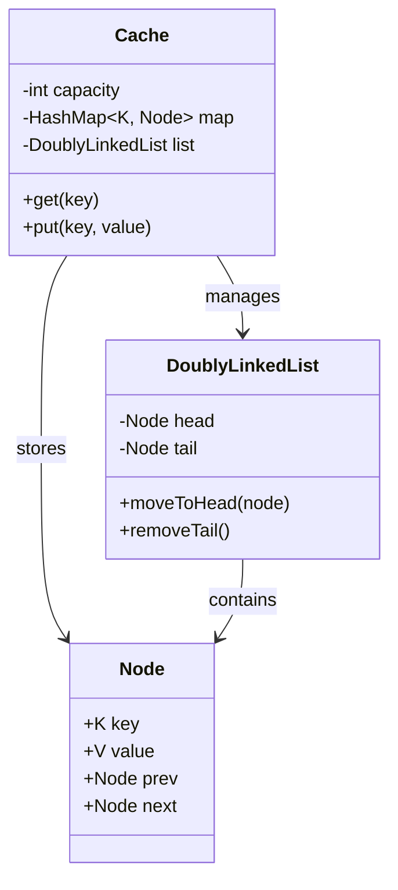

# ⚡ Machine Coding: High-Performance In-Memory Cache

## 📝 Overview
Design and implement a thread-safe, **In-Memory Cache** with a fixed capacity. This challenge focuses on data structure optimization and concurrency control to achieve constant-time performance for both retrieval and eviction operations.

!!! info "Why This Challenge?"
    - **Data Structure Composition:** Evaluates your ability to combine HashMaps and Doubly Linked Lists to achieve $O(1)$ performance for multiple operations.
    - **Concurrency Control:** Tests your mastery of thread-safe access to shared in-memory state without compromising on performance.
    - **Eviction Algorithm Implementation:** Deep dives into the mechanics of LRU (Least Recently Used) and LFU (Least Frequently Used) policies.

---

## 🏭 The Scenario & Requirements

### 😡 The Problem (The Villain)
**"The $O(N)$ Eviction."** A naive cache implementation that uses a simple list to track usage. As the cache grows, finding the "Least Recently Used" item to evict requires scanning the entire list, causing massive latency spikes during high traffic. Under high concurrency, the cache becomes corrupted due to lack of synchronization.

### 🦸 The System (The Hero)
**"The Hybrid Store."** A lightning-fast cache that uses a **HashMap** for $O(1)$ lookups and a **Doubly Linked List** to maintain access order in $O(1)$. By decoupling storage from eviction logic and using granular locking, the system handles thousands of requests per second with deterministic latency.

### 📜 Requirements & Constraints
1.  **Functional:**
    -   **Core API:** Implement `get(key)` and `put(key, value)`.
    -   **Eviction Policy:** Support `LRU` (Least Recently Used) by default.
    -   **Fixed Capacity:** Automatically evict items when the limit is reached.
2.  **Technical:**
    -   **Constant Time:** Both `get` and `put` must be $O(1)$ complexity.
    -   **Thread Safety:** Must be safe for concurrent access from multiple threads.
    -   **Memory Efficiency:** Avoid excessive object creation and pointer overhead.

---

## 🏗️ Design & Architecture

### 🧠 Thinking Process
To achieve $O(1)$ for both lookup and eviction, we must combine two structures:
1.  **HashMap:** Stores `key -> Node` mapping for instant access to any item.
2.  **Doubly Linked List:** Stores nodes in order of recency. Most recently used nodes move to the `head`, and least recently used are at the `tail`.
3.  **Synchronization:** Use a Reentrant Lock to protect the shared data structures during modifications.

### 🧩 Class Diagram


### ⚙️ Design Patterns Applied
- **Strategy Pattern**: For swapping between different eviction policies (LRU, LFU, FIFO).
- **Singleton Pattern**: To ensure a single global cache instance if needed.
- **Decorator Pattern**: (Potential) To add metrics, logging, or TTL (Time-To-Live) features to the base cache.

---

## 💻 Solution Implementation

!!! success "The Code"
    ```python
    --8<-- "machine_coding/systems/cache_system/cache.py"
    ```

### 🔬 Why This Works (Evaluation)
The combination of a **HashMap** and **Doubly Linked List** is the key. When an item is accessed via `get`, the map provides the node in $O(1)$. We then "pluck" the node from its current position in the list and move it to the head in $O(1)$ (possible only because it's a doubly linked list). Eviction is simply removing the `tail` node and its corresponding entry in the map, also in $O(1)$.

---

## ⚖️ Trade-offs & Limitations

| Decision | Pros | Cons / Limitations |
| :--- | :--- | :--- |
| **Doubly Linked List** | $O(1)$ reordering and deletion. | High pointer overhead (2-3 pointers per entry). |
| **Global Lock** | Guaranteed thread safety and consistency. | Can become a bottleneck under extremely high concurrency (10k+ qps). |
| **In-Memory Only** | Sub-millisecond latency. | Data lost on restart; not suitable for large datasets (exceeding RAM). |

---

## 🎤 Interview Toolkit

- **Concurrency Probe:** How would you avoid a global lock to increase throughput? (Mention **Striped Locking** or **ConcurrentHashMap**-like partitioning).
- **Extensibility:** How would you implement TTL (Time-To-Live)? (Store timestamps and use a background "janitor" thread or lazy-eviction on `get`).
- **Data Persistence:** If we move to disk-backed storage, what changes? (Implement **Write-Ahead Logging** or a **Log-Structured Merge Tree** approach).

## 🔗 Related Challenges
- [Distributed Rate Limiter](../../distributed/rate_limiter/PROBLEM.md) — Uses a cache-like structure for counting requests globally.
- [Instagram-Lite Social Feed](../instagram/PROBLEM.md) — For caching pre-computed personalized timelines.
