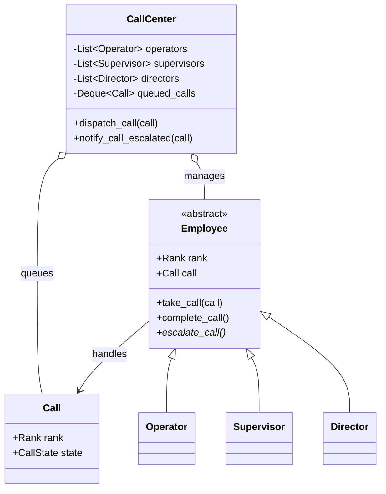

# 📞 Machine Coding: Call Center Dispatch System

## 📝 Overview
A multi-tiered call center dispatch system that routes incoming customer calls to the lowest available employee level. It handles dynamic escalation of calls through a hierarchy of operators, supervisors, and directors, safely queuing requests when staff are unavailable.

!!! info "Why This Challenge?"
    - **Resource Pool Management:** Evaluates your skills in managing pools of shared resources (employees) and handling pending task queues.
    - **Hierarchical Escalation:** Tests your ability to implement chain-of-responsibility-like logic for escalating tasks when conditions aren't met.
    - **Object-Oriented Design:** A strong test of encapsulation, inheritance, and decoupling business rules from entity state.

---

## 🏭 The Scenario & Requirements

### 😡 The Problem (The Villain)
**"The Infinite Hold Loop."** In a chaotic, poorly designed call center, calls are routed randomly. Customers needing a simple password reset are sent to a busy Director, while Tier-1 Operators sit idle. If a call is too complex for an Operator, they have no systematic way to hand it off, resulting in dropped calls, lost context, and frustrated customers.

### 🦸 The System (The Hero)
**"The Tiered Dispatcher."** An automated routing engine that groups employees into distinct ranks. It always attempts to assign calls to the lowest tier (Operator) first to optimize payroll efficiency. If unresolved, it cleanly elevates the call's required rank and pushes it back to the dispatcher for escalation. If the entire center is at capacity, calls are safely held in a FIFO queue.

### 📜 Requirements & Constraints
1.  **(Functional):** Must handle 3 distinct levels of employees: Operator, Supervisor, Director.
2.  **(Functional):** Calls must be dispatched to the lowest available rank that can handle them, but a higher rank can take a lower-rank call if necessary.
3.  **(Functional):** Employees must be able to escalate calls to the next tier if they cannot resolve them.
4.  **(Technical):** If no suitable employee is available, calls must be queued and automatically dispatched when an employee finishes their current call.

---

## 🏗️ Design & Architecture

### 🧠 Thinking Process
To decouple the workers from the routing logic, we model three primary entities:    
1.  **Call:** The fundamental unit of work. It maintains its own state (`READY`, `IN_PROGRESS`) and tracks the minimum `Rank` required to handle it.    
2.  **Employee:** An abstract base class providing core methods like `take_call` and `complete_call`. Concrete subclasses (`Operator`, `Supervisor`) define what happens during an `escalate_call`.     
3.  **CallCenter:** The central orchestrator that maintains the lists of employees and the `queued_calls` deque. It acts as the single source of truth for dispatching.

### 🧩 Class Diagram
*(The Object-Oriented Blueprint. Who owns what?)*


### ⚙️ Design Patterns Applied

  - **Chain of Responsibility (Conceptual)**: Calls logically escalate up the hierarchy (Operator $\rightarrow$ Supervisor $\rightarrow$ Director) if a lower rank cannot handle the request.
  - **State Pattern (Simplified)**: The `Call` object transitions through specific lifecycle states (`READY`, `IN_PROGRESS`, `COMPLETE`).
  - **Dependency Inversion**: The `CallCenter` routing mechanism depends on the abstract `Employee` interface to assign work, rather than hardcoding assignments to specific roles.

-----

## 💻 Solution Implementation

???+ success "The Code"
    ```python
    --8<-- "machine_coding/systems/call_center/call_center.py"
    ```

### 🔬 Why This Works (Evaluation)

The system excels because of its **Decoupled Escalation Protocol**. When an `Operator` escalates a call, they do *not* directly search for a `Supervisor`. Instead, they increment the call's required `Rank`, transition the state back to `READY`, and trigger `CallCenter.notify_call_escalated()`. This pushes the routing responsibility back to the `CallCenter`, keeping the `Employee` classes strictly focused on their own state and preventing spaghetti dependencies.

-----

## ⚖️ Trade-offs & Limitations

| Decision | Pros | Cons / Limitations |
| :--- | :--- | :--- |
| **Centralized Dispatcher (`CallCenter`)** | Simple, predictable logic with a single source of truth for routing. | Becomes a locking bottleneck in a highly concurrent, multi-threaded environment. |
| **Linear Search for Free Employee** | Extremely easy to implement and debug. | $O(N)$ time complexity per dispatch. Can be slow if there are thousands of employees. |
| **Simple FIFO Queue** | Guarantees fairness for waiting customers. | Ignores call priority; a VIP customer or emergency call cannot skip the line. |

-----

## 🎤 Interview Toolkit

  - **Concurrency Probe:** How would you handle 500 calls arriving concurrently across multiple threads? *(Use a thread-safe `queue.Queue` for pending calls and implement a `threading.Lock` around the `_dispatch_to_group` method to prevent double-assigning an employee).*
  - **Extensibility:** How easily can we add a "Specialist" rank? *(Very easily: Add it to the `Rank` enum, create a `Specialist(Employee)` subclass, and add one routing block in `CallCenter.dispatch_call()`).*
  - **Optimization:** If you had 10,000 operators, how would you speed up finding a free one? *(Instead of iterating through a list, maintain a `Set` or `Queue` of specifically "Idle" employees, achieving $O(1)$ assignment).*

## 🔗 Related Challenges

  - [Elevator Management System](../elevator/PROBLEM.md) — For another resource allocation challenge involving state machines and dispatching.
  - [High-Concurrency Parking Lot](../parking_lot/PROBLEM.md) — For managing tiered resources where specific requests require specific slot types.
