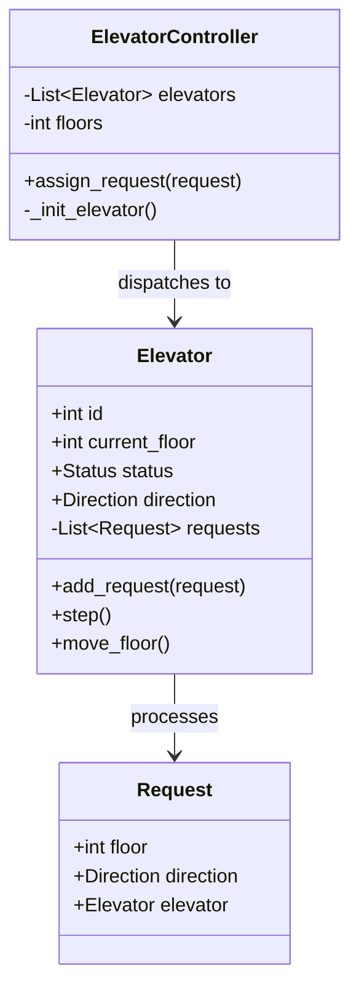

# 🛗 Machine Coding: Multi-Elevator Dispatcher

## 📝 Overview
Design and implement a robust **Elevator Management System** for a high-rise building. This challenge involves managing multiple interacting state machines (elevators) to efficiently handle real-time passenger requests while optimizing for wait time and energy consumption.

!!! info "Why This Challenge?"
    - **Complex State Management:** Evaluates your ability to manage multiple concurrent state machines that share a common request pool.
    - **Optimization Algorithms:** Tests your understanding of real-world scheduling (SCAN/LOOK) to maximize system throughput.
    - **Concurrency & Event Handling:** Challenges you to coordinate asynchronous requests from floor panels and cabin interfaces without race conditions.

---

## 🏭 The Scenario & Requirements

### 😡 The Problem (The Villain)
**"The Starvation Oscillation."** A poorly designed system where people on the 50th floor wait indefinitely because the elevators keep "short-cycling" between the lobby and the 5th floor to serve a high volume of local traffic. The elevators move inefficiently, frequently changing direction and wasting energy while passengers grow frustrated.

### 🦸 The System (The Hero)
**"The Smart Dispatcher."** A centralized controller that implements the **LOOK algorithm**, ensuring elevators move steadily in one direction until all pending requests in that path are satisfied. It intelligently assigns the "closest" or "most compatible" elevator to new floor requests to minimize global wait time.

### 📜 Requirements & Constraints
1.  **Functional:**
    -   **Multi-Elevator Coordination:** Efficiently manage $N$ elevators across $M$ floors.
    -   **Dual Request Handling:** Support "External" (floor panel) and "Internal" (cabin panel) requests.
    -   **Real-Time State:** Track floor position, movement direction (UP/DOWN/NONE), and status (MOVING/IDLE/STOPPED) for every unit.
2.  **Technical:**
    -   **Directional Priority:** Elevators must prioritize requests in their current direction to prevent "Ping-Ponging."
    -   **Load Balancing:** Avoid redundant assignments where multiple elevators respond to the same floor request.
    -   **Safety:** Doors must be fully closed before movement, and emergency stops must be supported.

---

## 🏗️ Design & Architecture

### 🧠 Thinking Process
To handle the complexity, we decouple the **Elevator** (the worker) from the **Controller** (the dispatcher).
1.  **Elevator:** A state machine that maintains its own sorted queue of `Request` objects.
2.  **Request:** Encapsulates the target floor and direction.
3.  **ElevatorController:** The "Brain" that receives external floor calls and delegates them to the most suitable elevator based on proximity and current trajectory.

### 🧩 Class Diagram


### ⚙️ Design Patterns Applied
- **State Pattern**: Manages the transitions between `IDLE`, `MOVING`, and `STOPPED` (door open) states.
- **Strategy Pattern**: The `assign_request` logic can be swapped between "Nearest Idle" and "Directional Compatibility" strategies.
- **Observer Pattern**: (Implicit) The controller "observes" floor button presses and notifies the elevator fleet.

---

## 💻 Solution Implementation

!!! success "The Code"
    ```python
    --8<-- "machine_coding/systems/elevator/elevator_management_system.py"
    ```

### 🔬 Why This Works (Evaluation)
The core logic resides in `Elevator.add_request`. Instead of a simple FIFO queue, it uses an **Insertion Sort** approach based on the current direction. If the elevator is moving **UP**, new requests are inserted into the queue such that the elevator stops at floors in increasing order, then handles "behind-it" requests on the way back down. This implements the **LOOK algorithm**, significantly reducing total travel distance.

---

## ⚖️ Trade-offs & Limitations

| Decision | Pros | Cons / Limitations |
| :--- | :--- | :--- |
| **Sorted Request Queue** | Prevents starvation and minimizes direction changes. | Higher complexity in the `add_request` logic ($O(N)$ insertion). |
| **Centralized Controller** | Perfect global knowledge for optimal dispatching. | Single point of failure; if the controller crashes, all elevators stop. |
| **In-Memory State** | Near-zero latency for dispatching decisions. | System state (current floors/queues) is lost on power failure without persistence. |

---

## 🎤 Interview Toolkit

- **Concurrency Probe:** How would you handle 100 people pressing floor buttons at the exact same time? (Use a `Lock` on the `Elevator.requests` list).
- **Extensibility:** How would you implement "VIP Mode"? (Add a `priority` field to `Request` and sort the queue primarily by priority).
- **Energy Optimization:** If two elevators are equally close to a request, which one do you pick? (Pick the one already moving in that direction to avoid "Starting/Stopping" costs of an IDLE elevator).

## 🔗 Related Challenges
- [High-Concurrency Parking Lot](../parking_lot/PROBLEM.md) — Another resource allocation challenge involving physical constraints.
- [Distributed Job Scheduler](../../distributed/job_scheduler/PROBLEM.md) — For mapping requests (jobs) to workers (elevators) at scale.
